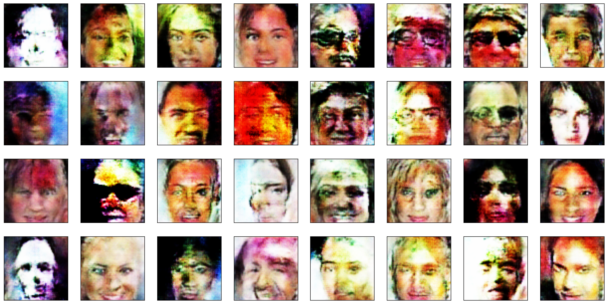
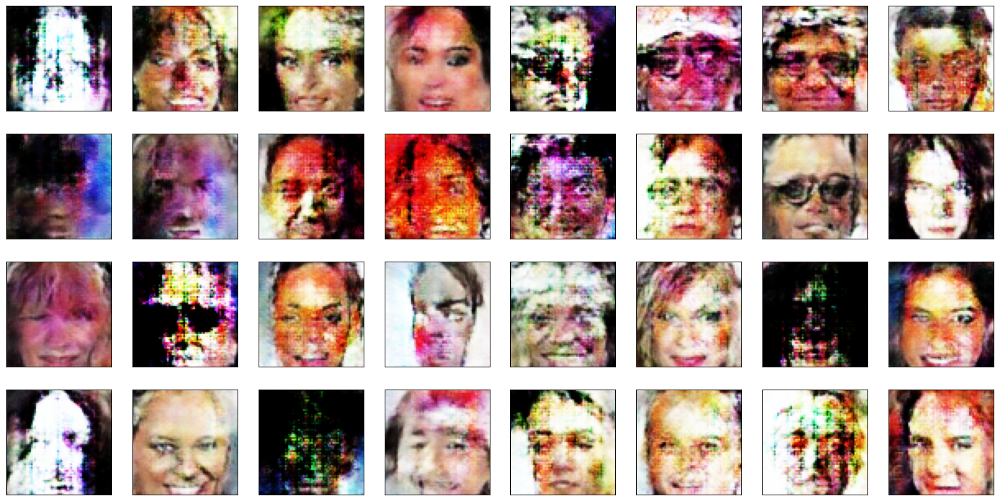

# Face Generation

In this project, you'll define and train a Generative Adverserial network of your own creation on a dataset of faces. Your goal is to get a generator network to generate *new* images of faces that look as realistic as possible!

The project will be broken down into a series of tasks from **defining new architectures training adversarial networks**. At the end of the notebook, you'll be able to visualize the results of your trained Generator to see how it performs; your generated samples should look like fairly realistic faces with small amounts of noise.

### Get the Data

You'll be using the [CelebFaces Attributes Dataset (CelebA)](http://mmlab.ie.cuhk.edu.hk/projects/CelebA.html) to train your adversarial networks.

This dataset has higher resolution images than datasets you have previously worked with (like MNIST or SVHN) you've been working with, and so, you should prepare to define deeper networks and train them for a longer time to get good results. It is suggested that you utilize a GPU for training.

### Pre-processed Data

Since the project's main focus is on building the GANs, we've done *some* of the pre-processing for you. Each of the CelebA images has been cropped to remove parts of the image that don't include a face, then resized down to 64x64x3 NumPy images. Some sample data is show below.


> If you are working locally, you can download this data [by clicking here](https://s3.amazonaws.com/video.udacity-data.com/topher/2018/November/5be7eb6f_processed-celeba-small/processed-celeba-small.zip)

This is a zip file that you'll need to extract in the home directory of this notebook for further loading and processing. After extracting the data, you should be left with a directory of data `processed-celeba-small/`.


```python
from glob import glob
from typing import Tuple, Callable, Dict

import matplotlib.pyplot as plt
import numpy as np
import torch
from PIL import Image
from torch.utils.data import DataLoader, Dataset
from torchvision.transforms import Compose, ToTensor, Resize, Normalize, RandomHorizontalFlip

import tests
```


```python
data_dir = 'processed_celeba_small/celeba/'
```

## Data pipeline

The [CelebA](http://mmlab.ie.cuhk.edu.hk/projects/CelebA.html) dataset contains over 200,000 celebrity images with annotations. Since you're going to be generating faces, you won't need the annotations, you'll only need the images. Note that these are color images with [3 color channels (RGB)](https://en.wikipedia.org/wiki/Channel_(digital_image)#RGB_Images) each.

### Pre-process and Load the Data

Since the project's main focus is on building the GANs, we've done *some* of the pre-processing for you. Each of the CelebA images has been cropped to remove parts of the image that don't include a face, then resized down to 64x64x3 NumPy images. This *pre-processed* dataset is a smaller subset of the very large CelebA dataset and contains roughly 30,000 images. 

Your first task consists in building the dataloader. To do so, you need to do the following:
* implement the get_transforms function
* create a custom Dataset class that reads the CelebA data

### Exercise: implement the get_transforms function

The `get_transforms` function should output a [`torchvision.transforms.Compose`](https://pytorch.org/vision/stable/generated/torchvision.transforms.Compose.html#torchvision.transforms.Compose) of different transformations. You have two constraints:
* the function takes a tuple of size as input and should **resize the images** to the input size
* the output images should have values **ranging from -1 to 1**


```python
def get_transforms(size: Tuple[int, int]) -> Callable:
    """ Transforms to apply to the image."""
    # TODO: edit this function by appening transforms to the below list
    transforms = [
        Resize(size),
        ToTensor(),
        RandomHorizontalFlip(),
        Normalize(mean=[0.5, 0.5, 0.5], std=[0.5, 0.5, 0.5])
    ]
    
    return Compose(transforms)
```

### Exercise: implement the DatasetDirectory class


The `DatasetDirectory` class is a torch Dataset that reads from the above data directory. The `__getitem__` method should output a transformed tensor and the `__len__` method should output the number of files in our dataset. You can look at [this custom dataset](https://pytorch.org/tutorials/beginner/basics/data_tutorial.html#creating-a-custom-dataset-for-your-files) for ideas. 


```python
class DatasetDirectory(Dataset):
    """
    A custom dataset class that loads images from folder.
    args:
    - directory: location of the images
    - transform: transform function to apply to the images
    - extension: file format
    """
    def __init__(self, 
                 directory: str, 
                 transforms: Callable = None, 
                 extension: str = '.jpg'):
        # TODO: implement the init method
        self.directory = directory
        self.transforms = transforms
        self.extension = extension

    def __len__(self) -> int:
        """ returns the number of items in the dataset """
        # TODO: return the number of elements in the dataset
        images = glob(self.directory + '*' + self.extension)
        return len(images)

    def __getitem__(self, index: int) -> torch.Tensor:
        """ load an image and apply transformation """
        # TODO: return the index-element of the dataset
        images = glob(self.directory + '*' + self.extension)
        image = Image.open(images[index])
        transformed_image = self.transforms(image)
        return transformed_image
```


```python
"""
DO NOT MODIFY ANYTHING IN THIS CELL
"""
# run this cell to verify your dataset implementation
dataset = DatasetDirectory(data_dir, get_transforms((64, 64)))
tests.check_dataset_outputs(dataset)
```

    Congrats, your dataset implementation passed all the tests


The functions below will help you visualize images from the dataset.


```python
"""
DO NOT MODIFY ANYTHING IN THIS CELL
"""

def denormalize(images):
    """Transform images from [-1.0, 1.0] to [0, 255] and cast them to uint8."""
    return ((images + 1.) / 2. * 255).astype(np.uint8)

# plot the images in the batch, along with the corresponding labels
fig = plt.figure(figsize=(20, 4))
plot_size=20
for idx in np.arange(plot_size):
    ax = fig.add_subplot(2, int(plot_size/2), idx+1, xticks=[], yticks=[])
    img = dataset[idx].numpy()
    img = np.transpose(img, (1, 2, 0))
    img = denormalize(img)
    ax.imshow(img)
```


    

    


## Model implementation

As you know, a GAN is comprised of two adversarial networks, a discriminator and a generator. Now that we have a working data pipeline, we need to implement the discriminator and the generator. 

Feel free to implement any additional class or function.

### Exercise: Create the discriminator

The discriminator's job is to score real and fake images. You have two constraints here:
* the discriminator takes as input a **batch of 64x64x3 images**
* the output should be a single value (=score)

Feel free to get inspiration from the different architectures we talked about in the course, such as DCGAN, WGAN-GP or DRAGAN.

#### Some tips
* To scale down from the input image, you can either use `Conv2d` layers with the correct hyperparameters or Pooling layers.
* If you plan on using gradient penalty, do not use Batch Normalization layers in the discriminator.


```python
from torch.nn import Module
import torch.nn as nn
```


```python
class ConvBlock(Module):
    """
    A convolutional block is made of 3 layers: Conv -> BatchNorm -> Activation.
    args:
    - in_channels: number of channels in the input to the conv layer
    - out_channels: number of filters in the conv layer
    - kernel_size: filter dimension of the conv layer
    - batch_norm: whether to use batch norm or not
    """
    def __init__(self, in_channels: int, out_channels: int, kernel_size: int, batch_norm: bool = True):
        super(ConvBlock, self).__init__()
        ####
        self.conv = nn.Conv2d(in_channels, out_channels, kernel_size, stride=2, padding=1, bias=False)
        self.batch_norm = batch_norm
        if self.batch_norm:
            self.bn = nn.BatchNorm2d(out_channels)
        self.activation = nn.LeakyReLU(0.2)
        ####
        
    def forward(self, x: torch.Tensor) -> torch.Tensor:
        ####
        x = self.conv(x)
        if self.batch_norm:
            x = self.bn(x)
        x = self.activation(x)
        ####
        return x
```


```python
class Discriminator(Module):
    def __init__(self):
        super(Discriminator, self).__init__()
        # TODO: instantiate the different layers
        self.conv1 = ConvBlock(3, 64, 4, batch_norm=False) # 3x64x64 -> 64x32x32
        self.conv2 = ConvBlock(64, 128, 4, batch_norm=True) # 64x32x32 -> 128x16x16
        self.conv3 = ConvBlock(128, 256, 4, batch_norm=True) # 128x16x16 -> 256x8x8
        self.conv4 = ConvBlock(256, 512, 4, batch_norm=True) # 256x8x8 -> 512x4x4
        self.flatten = nn.Flatten()
        self.fc = nn.Linear(512*4*4 , 1)
        
    def forward(self, x: torch.Tensor) -> torch.Tensor:
        # TODO: implement the forward method
        x = self.conv1(x)
        x = self.conv2(x)
        x = self.conv3(x)
        x = self.conv4(x)
        x = self.flatten(x)
        x = self.fc(x)
        return x.unsqueeze(2).unsqueeze(3)
```


```python
"""
DO NOT MODIFY ANYTHING IN THIS CELL
"""
# run this cell to check your discriminator implementation
discriminator = Discriminator()
tests.check_discriminator(discriminator)
```

    Congrats, your discriminator implementation passed all the tests


### Exercise: create the generator

The generator's job creates the "fake images" and learns the dataset distribution. You have three constraints here:
* the generator takes as input a vector of dimension `[batch_size, latent_dimension, 1, 1]`
* the generator must outputs **64x64x3 images**

Feel free to get inspiration from the different architectures we talked about in the course, such as DCGAN, WGAN-GP or DRAGAN.

#### Some tips:
* to scale up from the latent vector input, you can use `ConvTranspose2d` layers
* as often with Gan, **Batch Normalization** helps with training


```python
class DeconvBlock(nn.Module):
    """
    A "de-convolutional" block is made of 3 layers: ConvTranspose -> BatchNorm -> Activation.
    args:
    - in_channels: number of channels in the input to the conv layer
    - out_channels: number of filters in the conv layer
    - kernel_size: filter dimension of the conv layer
    - stride: stride of the conv layer
    - padding: padding of the conv layer
    - batch_norm: whether to use batch norm or not
    """
    def __init__(self, 
                 in_channels: int, 
                 out_channels: int, 
                 kernel_size: int, 
                 stride: int,
                 padding: int,
                 batch_norm: bool = True):
        ####
        super(DeconvBlock, self).__init__()
        self.conv_transpose = nn.ConvTranspose2d(in_channels, out_channels, kernel_size, stride, padding, bias=False)
        self.batch_norm = batch_norm
        if self.batch_norm:
            self.bn = nn.BatchNorm2d(out_channels)
        self.activation = nn.ReLU()
        ####
        
    def forward(self, x: torch.Tensor) -> torch.Tensor:
        ####
        x = self.conv_transpose(x)
        if self.batch_norm:
            x = self.bn(x)
        x = self.activation(x)
        ####
        return x
```


```python
class Generator(Module):
    def __init__(self, latent_dim: int):
        super(Generator, self).__init__()
        # TODO: instantiate the different layers
        self.deconv1 = DeconvBlock(latent_dim, 512, 4, 1, 0) # 512x4x4 -> 256x8x8
        self.deconv2 = DeconvBlock(512, 256, 4, 2, 1) # 256x8x8 -> 128x16x16
        self.deconv3 = DeconvBlock(256, 128, 4, 2, 1) # 128x16x16 -> 64x32x32
        self.deconv4 = DeconvBlock(128, 64, 4, 2, 1)
        self.deconv5 = nn.ConvTranspose2d(64, 3, 4, 2, 1)
        self.tanh = nn.Tanh()

    def forward(self, x: torch.Tensor) -> torch.Tensor:
        # TODO: implement the forward method
        x = self.deconv1(x)
        x = self.deconv2(x)
        x = self.deconv3(x)
        x = self.deconv4(x)
        x = self.deconv5(x)
        x = self.tanh(x)
        return x
```


```python
"""
DO NOT MODIFY ANYTHING IN THIS CELL
"""
# run this cell to verify your generator implementation
latent_dim = 128
generator = Generator(latent_dim)
tests.check_generator(generator, latent_dim)
```

    Congrats, your generator implementation passed all the tests


## Optimizer

In the following section, we create the optimizers for the generator and discriminator. You may want to experiment with different optimizers, learning rates and other hyperparameters as they tend to impact the output quality.

### Exercise: implement the optimizers


```python
import torch.optim as optim


def create_optimizers(generator: Module, discriminator: Module):
    """ This function should return the optimizers of the generator and the discriminator """
    # TODO: implement the generator and discriminator optimizers
    g_optimizer = optim.Adam(generator.parameters(), lr=2e-4, betas=(0.5, 0.3))
    d_optimizer = optim.Adam(discriminator.parameters(), lr=2e-4, betas=(0.5, 0.3))
    return g_optimizer, d_optimizer
```

## Losses implementation

In this section, we are going to implement the loss function for the generator and the discriminator. You can and should experiment with different loss function.

Some tips:
* You can choose the commonly used the binary cross entropy loss or select other losses we have discovered in the course, such as the Wasserstein distance.
* You may want to implement a gradient penalty function as discussed in the course. It is not required and the code will work whether you implement it or not.

### Exercise: implement the generator loss

The generator's goal is to get the discriminator to think its generated images (= "fake" images) are real.


```python
def generator_loss(fake_logits, criterion):
    """ Generator loss, takes the fake scores as inputs. """
    # TODO: implement the generator loss 
    if criterion == 'bce':
        labels = torch.ones_like(fake_logits).to(fake_logits.device)
        criterion = nn.BCEWithLogitsLoss()
        loss = criterion(fake_logits, labels)
    elif criterion == 'wgan':
        loss = -fake_logits.mean()
    return loss
```

### Exercise: implement the discriminator loss

We want the discriminator to give high scores to real images and low scores to fake ones and the discriminator loss should reflect that.


```python
def discriminator_loss(real_logits, fake_logits, criterion, smooth=False):
    """ Discriminator loss, takes the fake and real logits as inputs. """
    # TODO: implement the discriminator loss 
    if criterion == 'bce':
        if smooth:
            real_labels = torch.full_like(real_logits, 0.9).to(real_logits.device)  # Smoothed real labels (0.9)
        else:
            real_labels = torch.ones_like(real_logits).to(real_logits.device)
        fake_labels = torch.zeros_like(fake_logits).to(fake_logits.device)
        criterion = nn.BCEWithLogitsLoss()
        real_loss = criterion(real_logits, real_labels)
        fake_loss = criterion(fake_logits, fake_labels)
        loss = real_loss + fake_loss
    elif criterion == 'wgan':
        loss = fake_logits.mean() - real_logits.mean()
    return loss
```

### Exercise (Optional): Implement the gradient Penalty

In the course, we discussed the importance of gradient penalty in training certain types of Gans. Implementing this function is not required and depends on some of the design decision you made (discriminator architecture, loss functions).


```python
def gradient_penalty(discriminator, real_samples, fake_samples):
    """ This function enforces """
    gp = 0
    # TODO (Optional): implement the gradient penalty
    x = torch.rand(real_samples.shape).to(real_samples.device)
    x_hat = (x * real_samples + (1 - x) * fake_samples).requires_grad_(True)
    y_hat = discriminator(x_hat)
    grad_outputs = torch.ones_like(y_hat).to(real_samples.device)
    gradients = torch.autograd.grad(outputs=y_hat, inputs=x_hat, grad_outputs=grad_outputs, create_graph=True)[0]
    gp = (gradients.norm(2, dim=1) - 1).pow(2).mean()
    return gp
```

## Training


Training will involve alternating between training the discriminator and the generator. You'll use your functions real_loss and fake_loss to help you calculate the discriminator losses.

* You should train the discriminator by alternating on real and fake images
* Then the generator, which tries to trick the discriminator and should have an opposing loss function

### Exercise: implement the generator step and the discriminator step functions

Each function should do the following:
* calculate the loss
* backpropagate the gradient
* perform one optimizer step


```python
device = torch.device('cuda' if torch.cuda.is_available() else 'cpu')
```


```python
def add_noise_to_images(images, noise_std=0.1):
    """ Adds Gaussian noise to the input images. """
    noise = torch.randn_like(images) * noise_std
    noisy_images = images + noise
    noisy_images = torch.clamp(noisy_images, 0.0, 1.0)  # Ensure values are still between 0 and 1
    return noisy_images
```


```python
def generator_step(batch_size: int, latent_dim: int) -> Dict:
    """ One training step of the generator. """
    # TODO: implement the generator step (foward pass, loss calculation and backward pass)
    g_optimizer, _ = create_optimizers(generator, discriminator)
    # Learning rate scheduling
    g_optimizer.zero_grad()
    z = np.random.uniform(-1, 1, size=(batch_size, latent_dim, 1, 1))
    z = torch.from_numpy(z).float().to(device)
    
    fake_images = generator(z)
    fake_outputs = discriminator(fake_images)
    g_loss = generator_loss(fake_outputs, 'bce')
    
    g_loss.backward()
    g_optimizer.step()
    
    return {'loss': g_loss}


def discriminator_step(batch_size: int, latent_dim: int, real_images: torch.Tensor, add_noise=False) -> Dict:
    """ One training step of the discriminator. """
    # TODO: implement the discriminator step (foward pass, loss calculation and backward pass)
    _, d_optimizer = create_optimizers(generator, discriminator)

    d_optimizer.zero_grad()
    if add_noise:
        real_images = add_noise_to_images(real_images)
    real_outputs = discriminator(real_images)
    z = np.random.uniform(-1, 1, size=(batch_size, latent_dim, 1, 1))
    z = torch.from_numpy(z).float().to(device)

    fake_images = generator(z)
    
    fake_outputs = discriminator(fake_images)
    
    d_loss = discriminator_loss(real_outputs, fake_outputs, criterion='bce', smooth=True)
    gp = gradient_penalty(discriminator, real_images, fake_images)
    #lambda_gp = 10
    
    #d_loss += lambda_gp * gp
    
    d_loss.backward()
    d_optimizer.step()
    
    return {'loss': d_loss, 'gp': gp}
```

### Main training loop

You don't have to implement anything here but you can experiment with different hyperparameters.


```python
from datetime import datetime
```


```python
# you can experiment with different dimensions of latent spaces
latent_dim = 128

# update to cpu if you do not have access to a gpu
device = 'cuda'

# number of epochs to train your model
n_epochs = 30

# number of images in each batch
batch_size = 64
```


```python
"""
DO NOT MODIFY ANYTHING IN THIS CELL
"""
import os

print_every = 50

# Check if CUDA is available and set the device accordingly
device = torch.device(device if torch.cuda.is_available() else "cpu")

# Create optimizers for the discriminator D and generator G
generator = Generator(latent_dim).to(device)
discriminator = Discriminator().to(device)
g_optimizer, d_optimizer = create_optimizers(generator, discriminator)

if torch.cuda.device_count() > 1:
    generator = nn.DataParallel(generator, device_ids=[0, 1, 2, 3])
    discriminator = nn.DataParallel(discriminator, device_ids=[0, 1, 2, 3])


dataloader = DataLoader(dataset, 
                        batch_size=64, 
                        shuffle=True, 
                        num_workers=16,
                        drop_last=True, 
                        pin_memory=False)
```


```python
"""
DO NOT MODIFY ANYTHING IN THIS CELL
"""
'''
def display(fixed_latent_vector: torch.Tensor):
    """ helper function to display images during training """
    fig = plt.figure(figsize=(14, 4))
    plot_size = 16
    for idx in np.arange(plot_size):
        ax = fig.add_subplot(2, int(plot_size/2), idx+1, xticks=[], yticks=[])
        img = fixed_latent_vector[idx, ...].detach().cpu().numpy()
        img = np.transpose(img, (1, 2, 0))
        img = denormalize(img)
        ax.imshow(img)
    plt.show()'''
```


    '\ndef display(fixed_latent_vector: torch.Tensor):\n    """ helper function to display images during training """\n    fig = plt.figure(figsize=(14, 4))\n    plot_size = 16\n    for idx in np.arange(plot_size):\n        ax = fig.add_subplot(2, int(plot_size/2), idx+1, xticks=[], yticks=[])\n        img = fixed_latent_vector[idx, ...].detach().cpu().numpy()\n        img = np.transpose(img, (1, 2, 0))\n        img = denormalize(img)\n        ax.imshow(img)\n    plt.show()'


### Exercise: implement the training strategy

You should experiment with different training strategies. For example:

* train the generator more often than the discriminator. 
* added noise to the input image
* use label smoothing

Implement with your training strategy below.


```python
from torch.utils.tensorboard import SummaryWriter
exp_name = "DCGAN_label_smoothing"
writer = SummaryWriter(f'runs/{exp_name}')
```


```python
from torchvision.utils import make_grid
```


```python
import matplotlib.pyplot as plt
import numpy as np

def display(fixed_latent_vector: torch.Tensor, num_images: int = 32):
    """ Helper function to display images during training.
    
    Args:
    - fixed_latent_vector: A batch of latent vectors to generate images.
    - num_images: Number of images to display.
    """
    # Ensure that we don't exceed the number of images in the fixed_latent_vector
    plot_size = min(num_images, fixed_latent_vector.size(0))
    
    # Generate images using the generator
    with torch.no_grad():
        generated_images = generator(fixed_latent_vector[:plot_size])
    
    # Plot the images
    fig = plt.figure(figsize=(20, 10))
    for idx in range(plot_size):
        ax = fig.add_subplot(4, int(plot_size / 4), idx + 1, xticks=[], yticks=[])
        img = generated_images[idx, ...].detach().cpu().numpy()
        img = np.transpose(img, (1, 2, 0))  # Convert from (C, H, W) to (H, W, C)
        img = denormalize(img)  # Apply your denormalization function to bring the image values in range (0, 1)
        ax.imshow(img)
    
    plt.show()


```


```python
fixed_latent_vector = torch.randn(32, latent_dim, 1, 1).float().to(device)

losses = []
for epoch in range(n_epochs):
    for batch_i, real_images in enumerate(dataloader):
        real_images = real_images.to(device)
        
        ####################################
        
        # TODO: implement the training strategy
        
        d_loss = discriminator_step(batch_size, latent_dim, real_images, add_noise=False)
        
        for _ in range(5):
        
            g_loss = generator_step(batch_size, latent_dim)
        
        
        ####################################
        
        if batch_i % print_every == 0:
            # append discriminator loss and generator loss
            d = d_loss['loss'].item()
            g = g_loss['loss'].item()
            losses.append((d, g))
            # print discriminator and generator loss
            time = str(datetime.now()).split('.')[0]
            print(f'{time} | Epoch [{epoch+1}/{n_epochs}] | Batch {batch_i}/{len(dataloader)} | d_loss: {d:.4f} | g_loss: {g:.4f}')
            
            # Log to TensorBoard
            writer.add_scalar('Loss/Discriminator', d, epoch * len(dataloader) + batch_i)
            writer.add_scalar('Loss/Generator', g, epoch * len(dataloader) + batch_i)
            
    
    # Display and log images
    generator.eval()
    with torch.no_grad():
        # Regular generation
        generated_images = generator(fixed_latent_vector[:32])
        grid = make_grid(generated_images, nrow=8, normalize=True)
        writer.add_image(f'Generated Images - Epoch {epoch}', grid, global_step=epoch)
    display(fixed_latent_vector, num_images=32)
    generator.train()
```

    2024-11-21 10:33:17 | Epoch [1/30] | Batch 0/509 | d_loss: 1.2914 | g_loss: 0.0039
    2024-11-21 10:33:44 | Epoch [1/30] | Batch 50/509 | d_loss: 2.3328 | g_loss: 0.4561
    2024-11-21 10:34:11 | Epoch [1/30] | Batch 100/509 | d_loss: 1.6783 | g_loss: 0.7019
    2024-11-21 10:34:38 | Epoch [1/30] | Batch 150/509 | d_loss: 1.6248 | g_loss: 0.8711
    2024-11-21 10:35:06 | Epoch [1/30] | Batch 200/509 | d_loss: 1.4670 | g_loss: 0.6125
    2024-11-21 10:35:33 | Epoch [1/30] | Batch 250/509 | d_loss: 1.4880 | g_loss: 0.7403
    2024-11-21 10:36:00 | Epoch [1/30] | Batch 300/509 | d_loss: 1.4540 | g_loss: 0.6536
    2024-11-21 10:36:27 | Epoch [1/30] | Batch 350/509 | d_loss: 1.4718 | g_loss: 0.6262
    2024-11-21 10:36:54 | Epoch [1/30] | Batch 400/509 | d_loss: 1.4510 | g_loss: 0.6105
    2024-11-21 10:37:21 | Epoch [1/30] | Batch 450/509 | d_loss: 1.5143 | g_loss: 0.8800
    2024-11-21 10:37:42 | Epoch [1/30] | Batch 500/509 | d_loss: 1.4502 | g_loss: 0.6589


    

    


    2024-11-21 10:37:55 | Epoch [2/30] | Batch 0/509 | d_loss: 1.4823 | g_loss: 0.9068
    2024-11-21 10:38:27 | Epoch [2/30] | Batch 50/509 | d_loss: 1.4599 | g_loss: 0.6878
    2024-11-21 10:38:54 | Epoch [2/30] | Batch 100/509 | d_loss: 1.4278 | g_loss: 0.6324
    2024-11-21 10:39:21 | Epoch [2/30] | Batch 150/509 | d_loss: 1.4211 | g_loss: 0.8001
    2024-11-21 10:39:48 | Epoch [2/30] | Batch 200/509 | d_loss: 1.4064 | g_loss: 0.6327
    2024-11-21 10:40:16 | Epoch [2/30] | Batch 250/509 | d_loss: 1.4510 | g_loss: 0.7785
    2024-11-21 10:40:43 | Epoch [2/30] | Batch 300/509 | d_loss: 1.4199 | g_loss: 0.7092
    2024-11-21 10:41:10 | Epoch [2/30] | Batch 350/509 | d_loss: 1.4009 | g_loss: 0.7674
    2024-11-21 10:41:37 | Epoch [2/30] | Batch 400/509 | d_loss: 1.4424 | g_loss: 0.8742
    2024-11-21 10:42:05 | Epoch [2/30] | Batch 450/509 | d_loss: 1.4331 | g_loss: 0.8623
    2024-11-21 10:42:26 | Epoch [2/30] | Batch 500/509 | d_loss: 1.4137 | g_loss: 0.7952


    

    


    2024-11-21 10:42:38 | Epoch [3/30] | Batch 0/509 | d_loss: 1.4216 | g_loss: 0.6219
    2024-11-21 10:43:11 | Epoch [3/30] | Batch 50/509 | d_loss: 1.4466 | g_loss: 0.7234
    2024-11-21 10:43:37 | Epoch [3/30] | Batch 100/509 | d_loss: 1.4450 | g_loss: 0.9387
    2024-11-21 10:44:05 | Epoch [3/30] | Batch 150/509 | d_loss: 1.4219 | g_loss: 0.9730
    2024-11-21 10:44:31 | Epoch [3/30] | Batch 200/509 | d_loss: 1.4283 | g_loss: 0.9549
    2024-11-21 10:44:58 | Epoch [3/30] | Batch 250/509 | d_loss: 1.4319 | g_loss: 0.6862
    2024-11-21 10:45:25 | Epoch [3/30] | Batch 300/509 | d_loss: 1.4203 | g_loss: 0.6328
    2024-11-21 10:45:52 | Epoch [3/30] | Batch 350/509 | d_loss: 1.4420 | g_loss: 0.9124
    2024-11-21 10:46:20 | Epoch [3/30] | Batch 400/509 | d_loss: 1.4493 | g_loss: 0.7915
    2024-11-21 10:46:47 | Epoch [3/30] | Batch 450/509 | d_loss: 1.4377 | g_loss: 0.7622
    2024-11-21 10:47:08 | Epoch [3/30] | Batch 500/509 | d_loss: 1.4317 | g_loss: 0.9535


    

    


    2024-11-21 10:47:21 | Epoch [4/30] | Batch 0/509 | d_loss: 1.4176 | g_loss: 0.6388
    2024-11-21 10:47:53 | Epoch [4/30] | Batch 50/509 | d_loss: 1.4025 | g_loss: 0.8762
    2024-11-21 10:48:20 | Epoch [4/30] | Batch 100/509 | d_loss: 1.4354 | g_loss: 0.7669
    2024-11-21 10:48:48 | Epoch [4/30] | Batch 150/509 | d_loss: 1.4256 | g_loss: 0.6357
    2024-11-21 10:49:15 | Epoch [4/30] | Batch 200/509 | d_loss: 1.4142 | g_loss: 0.7037
    2024-11-21 10:49:42 | Epoch [4/30] | Batch 250/509 | d_loss: 1.4193 | g_loss: 0.9177
    2024-11-21 10:50:09 | Epoch [4/30] | Batch 300/509 | d_loss: 1.3944 | g_loss: 0.5849
    2024-11-21 10:50:36 | Epoch [4/30] | Batch 350/509 | d_loss: 1.4243 | g_loss: 0.8273
    2024-11-21 10:51:04 | Epoch [4/30] | Batch 400/509 | d_loss: 1.4588 | g_loss: 0.8998
    2024-11-21 10:51:30 | Epoch [4/30] | Batch 450/509 | d_loss: 1.4085 | g_loss: 0.6480
    2024-11-21 10:51:51 | Epoch [4/30] | Batch 500/509 | d_loss: 1.4112 | g_loss: 0.6596


    

    


    2024-11-21 10:52:04 | Epoch [5/30] | Batch 0/509 | d_loss: 1.4419 | g_loss: 0.9308
    2024-11-21 10:52:36 | Epoch [5/30] | Batch 50/509 | d_loss: 1.4489 | g_loss: 0.8609
    2024-11-21 10:53:03 | Epoch [5/30] | Batch 100/509 | d_loss: 1.4150 | g_loss: 0.6327
    2024-11-21 10:53:30 | Epoch [5/30] | Batch 150/509 | d_loss: 1.4543 | g_loss: 0.9441
    2024-11-21 10:53:57 | Epoch [5/30] | Batch 200/509 | d_loss: 1.4242 | g_loss: 0.8793
    2024-11-21 10:54:24 | Epoch [5/30] | Batch 250/509 | d_loss: 1.4118 | g_loss: 0.9365
    2024-11-21 10:54:50 | Epoch [5/30] | Batch 300/509 | d_loss: 1.4532 | g_loss: 0.8232
    2024-11-21 10:55:17 | Epoch [5/30] | Batch 350/509 | d_loss: 1.4258 | g_loss: 0.9772
    2024-11-21 10:55:44 | Epoch [5/30] | Batch 400/509 | d_loss: 1.4130 | g_loss: 0.9262
    2024-11-21 10:56:11 | Epoch [5/30] | Batch 450/509 | d_loss: 1.4497 | g_loss: 0.8611
    2024-11-21 10:56:32 | Epoch [5/30] | Batch 500/509 | d_loss: 1.3964 | g_loss: 0.6221


    

    


    2024-11-21 10:56:45 | Epoch [6/30] | Batch 0/509 | d_loss: 1.4595 | g_loss: 0.9403
    2024-11-21 10:57:17 | Epoch [6/30] | Batch 50/509 | d_loss: 1.4245 | g_loss: 0.6549
    2024-11-21 10:57:43 | Epoch [6/30] | Batch 100/509 | d_loss: 1.4160 | g_loss: 1.0329
    2024-11-21 10:58:11 | Epoch [6/30] | Batch 150/509 | d_loss: 1.4068 | g_loss: 0.6185
    2024-11-21 10:58:38 | Epoch [6/30] | Batch 200/509 | d_loss: 1.3785 | g_loss: 0.5991
    2024-11-21 10:59:05 | Epoch [6/30] | Batch 250/509 | d_loss: 1.4288 | g_loss: 0.6670
    2024-11-21 10:59:32 | Epoch [6/30] | Batch 300/509 | d_loss: 1.4086 | g_loss: 0.9948
    2024-11-21 11:00:00 | Epoch [6/30] | Batch 350/509 | d_loss: 1.4516 | g_loss: 0.9387
    2024-11-21 11:00:27 | Epoch [6/30] | Batch 400/509 | d_loss: 1.3986 | g_loss: 0.9396
    2024-11-21 11:00:54 | Epoch [6/30] | Batch 450/509 | d_loss: 1.4813 | g_loss: 0.8980
    2024-11-21 11:01:15 | Epoch [6/30] | Batch 500/509 | d_loss: 1.4039 | g_loss: 0.9897


    

    


    2024-11-21 11:01:28 | Epoch [7/30] | Batch 0/509 | d_loss: 1.3941 | g_loss: 0.6331
    2024-11-21 11:02:00 | Epoch [7/30] | Batch 50/509 | d_loss: 1.4018 | g_loss: 0.5874
    2024-11-21 11:02:27 | Epoch [7/30] | Batch 100/509 | d_loss: 1.4329 | g_loss: 0.6921
    2024-11-21 11:02:54 | Epoch [7/30] | Batch 150/509 | d_loss: 1.4043 | g_loss: 0.6581
    2024-11-21 11:03:21 | Epoch [7/30] | Batch 200/509 | d_loss: 1.4020 | g_loss: 0.6541
    2024-11-21 11:03:49 | Epoch [7/30] | Batch 250/509 | d_loss: 1.4133 | g_loss: 0.8053
    2024-11-21 11:04:16 | Epoch [7/30] | Batch 300/509 | d_loss: 1.3914 | g_loss: 0.5938
    2024-11-21 11:04:43 | Epoch [7/30] | Batch 350/509 | d_loss: 1.3715 | g_loss: 0.6519
    2024-11-21 11:05:10 | Epoch [7/30] | Batch 400/509 | d_loss: 1.4130 | g_loss: 1.0732
    2024-11-21 11:05:37 | Epoch [7/30] | Batch 450/509 | d_loss: 1.3874 | g_loss: 1.1062
    2024-11-21 11:05:58 | Epoch [7/30] | Batch 500/509 | d_loss: 1.4544 | g_loss: 1.1412


    

    


    2024-11-21 11:06:11 | Epoch [8/30] | Batch 0/509 | d_loss: 1.3808 | g_loss: 0.6439
    2024-11-21 11:06:43 | Epoch [8/30] | Batch 50/509 | d_loss: 1.3905 | g_loss: 0.6906
    2024-11-21 11:07:09 | Epoch [8/30] | Batch 100/509 | d_loss: 1.3877 | g_loss: 0.6715
    2024-11-21 11:07:36 | Epoch [8/30] | Batch 150/509 | d_loss: 1.3755 | g_loss: 0.7007
    2024-11-21 11:08:02 | Epoch [8/30] | Batch 200/509 | d_loss: 1.3587 | g_loss: 0.6819
    2024-11-21 11:08:29 | Epoch [8/30] | Batch 250/509 | d_loss: 1.3480 | g_loss: 0.6996
    2024-11-21 11:08:55 | Epoch [8/30] | Batch 300/509 | d_loss: 1.3637 | g_loss: 0.6764
    2024-11-21 11:09:22 | Epoch [8/30] | Batch 350/509 | d_loss: 1.3271 | g_loss: 0.6909
    2024-11-21 11:09:48 | Epoch [8/30] | Batch 400/509 | d_loss: 1.3060 | g_loss: 0.5986
    2024-11-21 11:10:15 | Epoch [8/30] | Batch 450/509 | d_loss: 1.3426 | g_loss: 0.6958
    2024-11-21 11:10:35 | Epoch [8/30] | Batch 500/509 | d_loss: 1.2908 | g_loss: 0.8293


    

    


    2024-11-21 11:10:48 | Epoch [9/30] | Batch 0/509 | d_loss: 1.3001 | g_loss: 1.4847
    2024-11-21 11:11:19 | Epoch [9/30] | Batch 50/509 | d_loss: 1.3113 | g_loss: 1.5521
    2024-11-21 11:11:45 | Epoch [9/30] | Batch 100/509 | d_loss: 1.3251 | g_loss: 1.8011
    2024-11-21 11:12:12 | Epoch [9/30] | Batch 150/509 | d_loss: 1.2927 | g_loss: 1.7274
    2024-11-21 11:12:38 | Epoch [9/30] | Batch 200/509 | d_loss: 1.2860 | g_loss: 1.8366
    2024-11-21 11:13:05 | Epoch [9/30] | Batch 250/509 | d_loss: 1.1770 | g_loss: 1.8276
    2024-11-21 11:13:31 | Epoch [9/30] | Batch 300/509 | d_loss: 1.3819 | g_loss: 1.6557
    2024-11-21 11:13:57 | Epoch [9/30] | Batch 350/509 | d_loss: 1.2527 | g_loss: 1.8338
    2024-11-21 11:14:24 | Epoch [9/30] | Batch 400/509 | d_loss: 1.3050 | g_loss: 1.8735
    2024-11-21 11:14:51 | Epoch [9/30] | Batch 450/509 | d_loss: 1.2690 | g_loss: 1.8913
    2024-11-21 11:15:11 | Epoch [9/30] | Batch 500/509 | d_loss: 1.1871 | g_loss: 1.8968


    

    


    2024-11-21 11:15:24 | Epoch [10/30] | Batch 0/509 | d_loss: 1.1686 | g_loss: 0.7776
    2024-11-21 11:15:55 | Epoch [10/30] | Batch 50/509 | d_loss: 1.1730 | g_loss: 0.8369
    2024-11-21 11:16:21 | Epoch [10/30] | Batch 100/509 | d_loss: 1.3132 | g_loss: 0.7917
    2024-11-21 11:16:48 | Epoch [10/30] | Batch 150/509 | d_loss: 1.3255 | g_loss: 0.8419
    2024-11-21 11:17:14 | Epoch [10/30] | Batch 200/509 | d_loss: 1.2066 | g_loss: 0.7234
    2024-11-21 11:17:41 | Epoch [10/30] | Batch 250/509 | d_loss: 1.3128 | g_loss: 0.7912
    2024-11-21 11:18:07 | Epoch [10/30] | Batch 300/509 | d_loss: 1.2516 | g_loss: 0.5778
    2024-11-21 11:18:34 | Epoch [10/30] | Batch 350/509 | d_loss: 1.1879 | g_loss: 0.9332
    2024-11-21 11:19:00 | Epoch [10/30] | Batch 400/509 | d_loss: 1.3812 | g_loss: 0.9856
    2024-11-21 11:19:27 | Epoch [10/30] | Batch 450/509 | d_loss: 1.2559 | g_loss: 0.8705
    2024-11-21 11:19:47 | Epoch [10/30] | Batch 500/509 | d_loss: 1.2753 | g_loss: 0.8722


    

    


    2024-11-21 11:20:00 | Epoch [11/30] | Batch 0/509 | d_loss: 1.1796 | g_loss: 2.0798
    2024-11-21 11:20:31 | Epoch [11/30] | Batch 50/509 | d_loss: 1.0757 | g_loss: 2.2593
    2024-11-21 11:20:58 | Epoch [11/30] | Batch 100/509 | d_loss: 1.1843 | g_loss: 2.2085
    2024-11-21 11:21:25 | Epoch [11/30] | Batch 150/509 | d_loss: 1.2499 | g_loss: 2.1516
    2024-11-21 11:21:51 | Epoch [11/30] | Batch 200/509 | d_loss: 1.1883 | g_loss: 2.0209
    2024-11-21 11:22:18 | Epoch [11/30] | Batch 250/509 | d_loss: 0.9058 | g_loss: 2.2713
    2024-11-21 11:22:45 | Epoch [11/30] | Batch 300/509 | d_loss: 1.2913 | g_loss: 2.2729
    2024-11-21 11:23:12 | Epoch [11/30] | Batch 350/509 | d_loss: 1.0459 | g_loss: 2.4781
    2024-11-21 11:23:38 | Epoch [11/30] | Batch 400/509 | d_loss: 1.2094 | g_loss: 2.2311
    2024-11-21 11:24:05 | Epoch [11/30] | Batch 450/509 | d_loss: 1.2180 | g_loss: 2.1639
    2024-11-21 11:24:25 | Epoch [11/30] | Batch 500/509 | d_loss: 1.0967 | g_loss: 2.4511


    

    


    2024-11-21 11:24:38 | Epoch [12/30] | Batch 0/509 | d_loss: 1.0737 | g_loss: 0.8864
    2024-11-21 11:25:09 | Epoch [12/30] | Batch 50/509 | d_loss: 1.0999 | g_loss: 1.0151
    2024-11-21 11:25:35 | Epoch [12/30] | Batch 100/509 | d_loss: 1.1395 | g_loss: 1.0305
    2024-11-21 11:26:02 | Epoch [12/30] | Batch 150/509 | d_loss: 1.1249 | g_loss: 0.8725
    2024-11-21 11:26:29 | Epoch [12/30] | Batch 200/509 | d_loss: 0.9514 | g_loss: 0.9247
    2024-11-21 11:26:55 | Epoch [12/30] | Batch 250/509 | d_loss: 1.2193 | g_loss: 1.0592
    2024-11-21 11:27:22 | Epoch [12/30] | Batch 300/509 | d_loss: 1.3470 | g_loss: 0.9031
    2024-11-21 11:27:49 | Epoch [12/30] | Batch 350/509 | d_loss: 1.1265 | g_loss: 0.9655
    2024-11-21 11:28:16 | Epoch [12/30] | Batch 400/509 | d_loss: 1.0481 | g_loss: 0.9800
    2024-11-21 11:28:43 | Epoch [12/30] | Batch 450/509 | d_loss: 1.3296 | g_loss: 1.0138
    2024-11-21 11:29:04 | Epoch [12/30] | Batch 500/509 | d_loss: 1.0332 | g_loss: 1.1453


    

    


    2024-11-21 11:29:17 | Epoch [13/30] | Batch 0/509 | d_loss: 1.2214 | g_loss: 2.4135
    2024-11-21 11:29:48 | Epoch [13/30] | Batch 50/509 | d_loss: 0.9959 | g_loss: 2.7087
    2024-11-21 11:30:15 | Epoch [13/30] | Batch 100/509 | d_loss: 1.3690 | g_loss: 2.4194
    2024-11-21 11:30:42 | Epoch [13/30] | Batch 150/509 | d_loss: 1.3259 | g_loss: 2.3674
    2024-11-21 11:31:09 | Epoch [13/30] | Batch 200/509 | d_loss: 0.8966 | g_loss: 2.5318
    2024-11-21 11:31:36 | Epoch [13/30] | Batch 250/509 | d_loss: 1.3335 | g_loss: 2.4855
    2024-11-21 11:32:03 | Epoch [13/30] | Batch 300/509 | d_loss: 1.1840 | g_loss: 2.5298
    2024-11-21 11:32:30 | Epoch [13/30] | Batch 350/509 | d_loss: 1.0265 | g_loss: 2.4077
    2024-11-21 11:32:56 | Epoch [13/30] | Batch 400/509 | d_loss: 1.1460 | g_loss: 2.6229
    2024-11-21 11:33:24 | Epoch [13/30] | Batch 450/509 | d_loss: 1.2666 | g_loss: 2.6459
    2024-11-21 11:33:44 | Epoch [13/30] | Batch 500/509 | d_loss: 1.0024 | g_loss: 2.6984


    

    


    2024-11-21 11:33:58 | Epoch [14/30] | Batch 0/509 | d_loss: 1.1055 | g_loss: 0.9994
    2024-11-21 11:34:29 | Epoch [14/30] | Batch 50/509 | d_loss: 0.9367 | g_loss: 0.9090
    2024-11-21 11:34:56 | Epoch [14/30] | Batch 100/509 | d_loss: 0.9022 | g_loss: 0.8766
    2024-11-21 11:35:23 | Epoch [14/30] | Batch 150/509 | d_loss: 0.9428 | g_loss: 1.1596
    2024-11-21 11:35:50 | Epoch [14/30] | Batch 200/509 | d_loss: 1.0013 | g_loss: 0.8670
    2024-11-21 11:36:17 | Epoch [14/30] | Batch 250/509 | d_loss: 1.0396 | g_loss: 0.8300
    2024-11-21 11:36:44 | Epoch [14/30] | Batch 300/509 | d_loss: 1.2388 | g_loss: 0.9451
    2024-11-21 11:37:11 | Epoch [14/30] | Batch 350/509 | d_loss: 0.9741 | g_loss: 0.9342
    2024-11-21 11:37:38 | Epoch [14/30] | Batch 400/509 | d_loss: 0.9797 | g_loss: 0.6917
    2024-11-21 11:38:05 | Epoch [14/30] | Batch 450/509 | d_loss: 1.2353 | g_loss: 1.0721
    2024-11-21 11:38:25 | Epoch [14/30] | Batch 500/509 | d_loss: 1.3350 | g_loss: 1.1928


    

    


    2024-11-21 11:38:39 | Epoch [15/30] | Batch 0/509 | d_loss: 0.8732 | g_loss: 2.7419
    2024-11-21 11:39:10 | Epoch [15/30] | Batch 50/509 | d_loss: 1.0494 | g_loss: 2.7264
    2024-11-21 11:39:37 | Epoch [15/30] | Batch 100/509 | d_loss: 1.0245 | g_loss: 3.0393
    2024-11-21 11:40:04 | Epoch [15/30] | Batch 150/509 | d_loss: 1.0197 | g_loss: 3.0423
    2024-11-21 11:40:31 | Epoch [15/30] | Batch 200/509 | d_loss: 0.9246 | g_loss: 2.9670
    2024-11-21 11:40:57 | Epoch [15/30] | Batch 250/509 | d_loss: 0.9103 | g_loss: 2.9323
    2024-11-21 11:41:25 | Epoch [15/30] | Batch 300/509 | d_loss: 0.9093 | g_loss: 2.8825
    2024-11-21 11:41:51 | Epoch [15/30] | Batch 350/509 | d_loss: 0.8670 | g_loss: 3.3613
    2024-11-21 11:42:18 | Epoch [15/30] | Batch 400/509 | d_loss: 0.9439 | g_loss: 3.3970
    2024-11-21 11:42:45 | Epoch [15/30] | Batch 450/509 | d_loss: 0.9796 | g_loss: 2.9463
    2024-11-21 11:43:06 | Epoch [15/30] | Batch 500/509 | d_loss: 0.8524 | g_loss: 3.1782


    

    


    2024-11-21 11:43:19 | Epoch [16/30] | Batch 0/509 | d_loss: 0.7628 | g_loss: 0.9406
    2024-11-21 11:43:50 | Epoch [16/30] | Batch 50/509 | d_loss: 1.0395 | g_loss: 0.9937
    2024-11-21 11:44:17 | Epoch [16/30] | Batch 100/509 | d_loss: 0.9040 | g_loss: 0.9779
    2024-11-21 11:44:44 | Epoch [16/30] | Batch 150/509 | d_loss: 0.9529 | g_loss: 1.1126
    2024-11-21 11:45:11 | Epoch [16/30] | Batch 200/509 | d_loss: 0.8753 | g_loss: 0.9339
    2024-11-21 11:45:38 | Epoch [16/30] | Batch 250/509 | d_loss: 1.0267 | g_loss: 0.8138
    2024-11-21 11:46:05 | Epoch [16/30] | Batch 300/509 | d_loss: 1.0857 | g_loss: 0.9842
    2024-11-21 11:46:32 | Epoch [16/30] | Batch 350/509 | d_loss: 0.9039 | g_loss: 1.0633
    2024-11-21 11:46:58 | Epoch [16/30] | Batch 400/509 | d_loss: 0.9486 | g_loss: 1.0559
    2024-11-21 11:47:26 | Epoch [16/30] | Batch 450/509 | d_loss: 1.1071 | g_loss: 0.9843
    2024-11-21 11:47:46 | Epoch [16/30] | Batch 500/509 | d_loss: 1.0236 | g_loss: 1.2028


    

    


    2024-11-21 11:47:59 | Epoch [17/30] | Batch 0/509 | d_loss: 0.9186 | g_loss: 3.4322
    2024-11-21 11:48:31 | Epoch [17/30] | Batch 50/509 | d_loss: 0.8938 | g_loss: 3.0195
    2024-11-21 11:48:58 | Epoch [17/30] | Batch 100/509 | d_loss: 0.8891 | g_loss: 2.9758
    2024-11-21 11:49:25 | Epoch [17/30] | Batch 150/509 | d_loss: 0.9754 | g_loss: 3.2039
    2024-11-21 11:49:52 | Epoch [17/30] | Batch 200/509 | d_loss: 0.9193 | g_loss: 3.2211
    2024-11-21 11:50:19 | Epoch [17/30] | Batch 250/509 | d_loss: 0.8811 | g_loss: 3.3206
    2024-11-21 11:50:46 | Epoch [17/30] | Batch 300/509 | d_loss: 0.9623 | g_loss: 3.1073
    2024-11-21 11:51:13 | Epoch [17/30] | Batch 350/509 | d_loss: 1.0235 | g_loss: 3.1690
    2024-11-21 11:51:40 | Epoch [17/30] | Batch 400/509 | d_loss: 0.9183 | g_loss: 3.2668
    2024-11-21 11:52:07 | Epoch [17/30] | Batch 450/509 | d_loss: 0.9324 | g_loss: 3.0797
    2024-11-21 11:52:27 | Epoch [17/30] | Batch 500/509 | d_loss: 0.8131 | g_loss: 3.5229


    

    


    2024-11-21 11:52:41 | Epoch [18/30] | Batch 0/509 | d_loss: 0.9210 | g_loss: 1.3136
    2024-11-21 11:53:12 | Epoch [18/30] | Batch 50/509 | d_loss: 0.7351 | g_loss: 1.0503
    2024-11-21 11:53:39 | Epoch [18/30] | Batch 100/509 | d_loss: 0.9506 | g_loss: 1.1313
    2024-11-21 11:54:06 | Epoch [18/30] | Batch 150/509 | d_loss: 1.0784 | g_loss: 1.0425
    2024-11-21 11:54:34 | Epoch [18/30] | Batch 200/509 | d_loss: 0.9827 | g_loss: 1.0974
    2024-11-21 11:55:01 | Epoch [18/30] | Batch 250/509 | d_loss: 0.9551 | g_loss: 1.2126
    2024-11-21 11:55:28 | Epoch [18/30] | Batch 300/509 | d_loss: 0.8307 | g_loss: 1.2701
    2024-11-21 11:55:55 | Epoch [18/30] | Batch 350/509 | d_loss: 0.9502 | g_loss: 0.9475
    2024-11-21 11:56:23 | Epoch [18/30] | Batch 400/509 | d_loss: 0.8718 | g_loss: 1.1479
    2024-11-21 11:56:50 | Epoch [18/30] | Batch 450/509 | d_loss: 1.0538 | g_loss: 1.2293
    2024-11-21 11:57:11 | Epoch [18/30] | Batch 500/509 | d_loss: 0.8678 | g_loss: 1.0026


    

    


    2024-11-21 11:57:24 | Epoch [19/30] | Batch 0/509 | d_loss: 0.8795 | g_loss: 3.3057
    2024-11-21 11:57:56 | Epoch [19/30] | Batch 50/509 | d_loss: 0.9233 | g_loss: 3.5180
    2024-11-21 11:58:23 | Epoch [19/30] | Batch 100/509 | d_loss: 0.8315 | g_loss: 3.6590
    2024-11-21 11:58:50 | Epoch [19/30] | Batch 150/509 | d_loss: 0.8508 | g_loss: 3.0514
    2024-11-21 11:59:17 | Epoch [19/30] | Batch 200/509 | d_loss: 0.8960 | g_loss: 3.4805
    2024-11-21 11:59:43 | Epoch [19/30] | Batch 250/509 | d_loss: 0.9617 | g_loss: 3.2926
    2024-11-21 12:00:11 | Epoch [19/30] | Batch 300/509 | d_loss: 0.9471 | g_loss: 3.2895
    2024-11-21 12:00:37 | Epoch [19/30] | Batch 350/509 | d_loss: 0.9244 | g_loss: 3.2500
    2024-11-21 12:01:04 | Epoch [19/30] | Batch 400/509 | d_loss: 0.9825 | g_loss: 3.4715
    2024-11-21 12:01:31 | Epoch [19/30] | Batch 450/509 | d_loss: 0.9156 | g_loss: 3.5554
    2024-11-21 12:01:51 | Epoch [19/30] | Batch 500/509 | d_loss: 0.9686 | g_loss: 3.3802


    

    


    2024-11-21 12:02:04 | Epoch [20/30] | Batch 0/509 | d_loss: 0.8435 | g_loss: 1.3348
    2024-11-21 12:02:36 | Epoch [20/30] | Batch 50/509 | d_loss: 1.1462 | g_loss: 1.1470
    2024-11-21 12:03:03 | Epoch [20/30] | Batch 100/509 | d_loss: 0.9691 | g_loss: 1.2429
    2024-11-21 12:03:30 | Epoch [20/30] | Batch 150/509 | d_loss: 0.8779 | g_loss: 1.0048
    2024-11-21 12:03:56 | Epoch [20/30] | Batch 200/509 | d_loss: 1.1171 | g_loss: 1.0973
    2024-11-21 12:04:23 | Epoch [20/30] | Batch 250/509 | d_loss: 0.7897 | g_loss: 0.6449
    2024-11-21 12:04:50 | Epoch [20/30] | Batch 300/509 | d_loss: 1.0908 | g_loss: 1.1310
    2024-11-21 12:05:17 | Epoch [20/30] | Batch 350/509 | d_loss: 0.9093 | g_loss: 1.0146
    2024-11-21 12:05:44 | Epoch [20/30] | Batch 400/509 | d_loss: 0.8945 | g_loss: 1.0902
    2024-11-21 12:06:11 | Epoch [20/30] | Batch 450/509 | d_loss: 0.8704 | g_loss: 1.2199
    2024-11-21 12:06:32 | Epoch [20/30] | Batch 500/509 | d_loss: 0.8236 | g_loss: 1.1799


    

    


    2024-11-21 12:06:45 | Epoch [21/30] | Batch 0/509 | d_loss: 0.8502 | g_loss: 3.3617
    2024-11-21 12:07:16 | Epoch [21/30] | Batch 50/509 | d_loss: 0.9205 | g_loss: 3.3989
    2024-11-21 12:07:43 | Epoch [21/30] | Batch 100/509 | d_loss: 0.8541 | g_loss: 3.3590
    2024-11-21 12:08:10 | Epoch [21/30] | Batch 150/509 | d_loss: 0.8702 | g_loss: 3.2104
    2024-11-21 12:08:37 | Epoch [21/30] | Batch 200/509 | d_loss: 0.8642 | g_loss: 3.2406
    2024-11-21 12:09:04 | Epoch [21/30] | Batch 250/509 | d_loss: 1.0001 | g_loss: 3.2277
    2024-11-21 12:09:31 | Epoch [21/30] | Batch 300/509 | d_loss: 0.8487 | g_loss: 3.5481
    2024-11-21 12:09:57 | Epoch [21/30] | Batch 350/509 | d_loss: 0.9442 | g_loss: 3.1854
    2024-11-21 12:10:25 | Epoch [21/30] | Batch 400/509 | d_loss: 0.8029 | g_loss: 3.6705
    2024-11-21 12:10:52 | Epoch [21/30] | Batch 450/509 | d_loss: 1.1217 | g_loss: 3.1171
    2024-11-21 12:11:13 | Epoch [21/30] | Batch 500/509 | d_loss: 1.0251 | g_loss: 3.2226


    

    


    2024-11-21 12:11:26 | Epoch [22/30] | Batch 0/509 | d_loss: 0.9506 | g_loss: 1.2248
    2024-11-21 12:11:58 | Epoch [22/30] | Batch 50/509 | d_loss: 1.0588 | g_loss: 1.1586
    2024-11-21 12:12:25 | Epoch [22/30] | Batch 100/509 | d_loss: 0.8522 | g_loss: 1.2241
    2024-11-21 12:12:51 | Epoch [22/30] | Batch 150/509 | d_loss: 0.8634 | g_loss: 0.9004
    2024-11-21 12:13:19 | Epoch [22/30] | Batch 200/509 | d_loss: 0.8546 | g_loss: 1.3312
    2024-11-21 12:13:46 | Epoch [22/30] | Batch 250/509 | d_loss: 0.8837 | g_loss: 1.4696
    2024-11-21 12:14:13 | Epoch [22/30] | Batch 300/509 | d_loss: 1.0572 | g_loss: 1.0710
    2024-11-21 12:14:39 | Epoch [22/30] | Batch 350/509 | d_loss: 0.9558 | g_loss: 1.0425
    2024-11-21 12:15:06 | Epoch [22/30] | Batch 400/509 | d_loss: 0.9443 | g_loss: 1.4325
    2024-11-21 12:15:33 | Epoch [22/30] | Batch 450/509 | d_loss: 1.0722 | g_loss: 1.0687
    2024-11-21 12:15:54 | Epoch [22/30] | Batch 500/509 | d_loss: 1.0088 | g_loss: 1.3453


    

    


    2024-11-21 12:16:07 | Epoch [23/30] | Batch 0/509 | d_loss: 1.0345 | g_loss: 3.2797
    2024-11-21 12:16:39 | Epoch [23/30] | Batch 50/509 | d_loss: 0.7591 | g_loss: 3.3517
    2024-11-21 12:17:06 | Epoch [23/30] | Batch 100/509 | d_loss: 1.0524 | g_loss: 3.7708
    2024-11-21 12:17:32 | Epoch [23/30] | Batch 150/509 | d_loss: 1.0084 | g_loss: 3.1915
    2024-11-21 12:17:59 | Epoch [23/30] | Batch 200/509 | d_loss: 0.8485 | g_loss: 3.3895
    2024-11-21 12:18:26 | Epoch [23/30] | Batch 250/509 | d_loss: 0.9241 | g_loss: 3.6783
    2024-11-21 12:18:53 | Epoch [23/30] | Batch 300/509 | d_loss: 0.8398 | g_loss: 3.2832
    2024-11-21 12:19:20 | Epoch [23/30] | Batch 350/509 | d_loss: 0.9829 | g_loss: 3.4805
    2024-11-21 12:19:46 | Epoch [23/30] | Batch 400/509 | d_loss: 0.8434 | g_loss: 3.0031
    2024-11-21 12:20:14 | Epoch [23/30] | Batch 450/509 | d_loss: 0.8724 | g_loss: 3.3172
    2024-11-21 12:20:34 | Epoch [23/30] | Batch 500/509 | d_loss: 0.8928 | g_loss: 3.5323


    

    


    2024-11-21 12:20:48 | Epoch [24/30] | Batch 0/509 | d_loss: 0.8772 | g_loss: 1.2048
    2024-11-21 12:21:19 | Epoch [24/30] | Batch 50/509 | d_loss: 0.9217 | g_loss: 1.5122
    2024-11-21 12:21:46 | Epoch [24/30] | Batch 100/509 | d_loss: 0.9038 | g_loss: 1.2133
    2024-11-21 12:22:13 | Epoch [24/30] | Batch 150/509 | d_loss: 0.8593 | g_loss: 1.3150
    2024-11-21 12:22:40 | Epoch [24/30] | Batch 200/509 | d_loss: 0.8350 | g_loss: 1.3447
    2024-11-21 12:23:07 | Epoch [24/30] | Batch 250/509 | d_loss: 0.7689 | g_loss: 1.4412
    2024-11-21 12:23:34 | Epoch [24/30] | Batch 300/509 | d_loss: 0.9089 | g_loss: 1.3503
    2024-11-21 12:24:01 | Epoch [24/30] | Batch 350/509 | d_loss: 1.0590 | g_loss: 1.3294
    2024-11-21 12:24:27 | Epoch [24/30] | Batch 400/509 | d_loss: 0.9394 | g_loss: 1.0601
    2024-11-21 12:24:55 | Epoch [24/30] | Batch 450/509 | d_loss: 0.6885 | g_loss: 1.4187
    2024-11-21 12:25:15 | Epoch [24/30] | Batch 500/509 | d_loss: 0.8696 | g_loss: 1.1261


    

    


    2024-11-21 12:25:29 | Epoch [25/30] | Batch 0/509 | d_loss: 0.8724 | g_loss: 3.8897
    2024-11-21 12:26:00 | Epoch [25/30] | Batch 50/509 | d_loss: 0.9103 | g_loss: 3.1551
    2024-11-21 12:26:27 | Epoch [25/30] | Batch 100/509 | d_loss: 0.7602 | g_loss: 3.4638
    2024-11-21 12:26:54 | Epoch [25/30] | Batch 150/509 | d_loss: 0.7778 | g_loss: 4.3003
    2024-11-21 12:27:21 | Epoch [25/30] | Batch 200/509 | d_loss: 0.9883 | g_loss: 3.4050
    2024-11-21 12:27:48 | Epoch [25/30] | Batch 250/509 | d_loss: 0.8954 | g_loss: 3.8272
    2024-11-21 12:28:15 | Epoch [25/30] | Batch 300/509 | d_loss: 0.8726 | g_loss: 3.4200
    2024-11-21 12:28:42 | Epoch [25/30] | Batch 350/509 | d_loss: 0.9425 | g_loss: 3.4003
    2024-11-21 12:29:09 | Epoch [25/30] | Batch 400/509 | d_loss: 0.8053 | g_loss: 3.9414
    2024-11-21 12:29:36 | Epoch [25/30] | Batch 450/509 | d_loss: 0.9092 | g_loss: 3.8264
    2024-11-21 12:29:57 | Epoch [25/30] | Batch 500/509 | d_loss: 0.7820 | g_loss: 3.5520


    

    


    2024-11-21 12:30:10 | Epoch [26/30] | Batch 0/509 | d_loss: 0.7822 | g_loss: 1.0033
    2024-11-21 12:30:42 | Epoch [26/30] | Batch 50/509 | d_loss: 0.8367 | g_loss: 1.5061
    2024-11-21 12:31:08 | Epoch [26/30] | Batch 100/509 | d_loss: 0.8339 | g_loss: 1.1774
    2024-11-21 12:31:35 | Epoch [26/30] | Batch 150/509 | d_loss: 0.8118 | g_loss: 1.1135
    2024-11-21 12:32:02 | Epoch [26/30] | Batch 200/509 | d_loss: 0.9570 | g_loss: 1.5140
    2024-11-21 12:32:28 | Epoch [26/30] | Batch 250/509 | d_loss: 0.6675 | g_loss: 1.3558
    2024-11-21 12:32:55 | Epoch [26/30] | Batch 300/509 | d_loss: 0.8408 | g_loss: 1.2407
    2024-11-21 12:33:22 | Epoch [26/30] | Batch 350/509 | d_loss: 0.7589 | g_loss: 0.8581
    2024-11-21 12:33:49 | Epoch [26/30] | Batch 400/509 | d_loss: 0.9682 | g_loss: 0.8781
    2024-11-21 12:34:17 | Epoch [26/30] | Batch 450/509 | d_loss: 0.8500 | g_loss: 1.6929
    2024-11-21 12:34:37 | Epoch [26/30] | Batch 500/509 | d_loss: 0.7706 | g_loss: 1.1713


    

    


    2024-11-21 12:34:51 | Epoch [27/30] | Batch 0/509 | d_loss: 0.8615 | g_loss: 3.8979
    2024-11-21 12:35:23 | Epoch [27/30] | Batch 50/509 | d_loss: 0.8224 | g_loss: 3.2295
    2024-11-21 12:35:50 | Epoch [27/30] | Batch 100/509 | d_loss: 0.8305 | g_loss: 3.5747
    2024-11-21 12:36:17 | Epoch [27/30] | Batch 150/509 | d_loss: 0.9482 | g_loss: 3.5043
    2024-11-21 12:36:44 | Epoch [27/30] | Batch 200/509 | d_loss: 0.7650 | g_loss: 4.2569
    2024-11-21 12:37:11 | Epoch [27/30] | Batch 250/509 | d_loss: 0.8270 | g_loss: 3.6066
    2024-11-21 12:37:38 | Epoch [27/30] | Batch 300/509 | d_loss: 0.7691 | g_loss: 3.3052
    2024-11-21 12:38:05 | Epoch [27/30] | Batch 350/509 | d_loss: 0.9666 | g_loss: 4.1485
    2024-11-21 12:38:32 | Epoch [27/30] | Batch 400/509 | d_loss: 0.8247 | g_loss: 3.5500
    2024-11-21 12:38:59 | Epoch [27/30] | Batch 450/509 | d_loss: 0.9787 | g_loss: 3.4832
    2024-11-21 12:39:20 | Epoch [27/30] | Batch 500/509 | d_loss: 0.7809 | g_loss: 3.5871


    

    


    2024-11-21 12:39:33 | Epoch [28/30] | Batch 0/509 | d_loss: 0.8204 | g_loss: 1.1286
    2024-11-21 12:40:06 | Epoch [28/30] | Batch 50/509 | d_loss: 0.7657 | g_loss: 1.7341
    2024-11-21 12:40:33 | Epoch [28/30] | Batch 100/509 | d_loss: 0.7313 | g_loss: 1.6229
    2024-11-21 12:41:00 | Epoch [28/30] | Batch 150/509 | d_loss: 0.7322 | g_loss: 1.3133
    2024-11-21 12:41:27 | Epoch [28/30] | Batch 200/509 | d_loss: 0.8542 | g_loss: 1.1868
    2024-11-21 12:41:54 | Epoch [28/30] | Batch 250/509 | d_loss: 0.8581 | g_loss: 1.4685
    2024-11-21 12:42:21 | Epoch [28/30] | Batch 300/509 | d_loss: 1.0597 | g_loss: 1.4408
    2024-11-21 12:42:48 | Epoch [28/30] | Batch 350/509 | d_loss: 0.9292 | g_loss: 1.2062
    2024-11-21 12:43:15 | Epoch [28/30] | Batch 400/509 | d_loss: 0.8865 | g_loss: 1.6647
    2024-11-21 12:43:41 | Epoch [28/30] | Batch 450/509 | d_loss: 0.7809 | g_loss: 1.3182
    2024-11-21 12:44:02 | Epoch [28/30] | Batch 500/509 | d_loss: 0.7627 | g_loss: 1.2787


    

    


    2024-11-21 12:44:15 | Epoch [29/30] | Batch 0/509 | d_loss: 0.8189 | g_loss: 3.2806
    2024-11-21 12:44:47 | Epoch [29/30] | Batch 50/509 | d_loss: 0.9028 | g_loss: 3.6487
    2024-11-21 12:45:14 | Epoch [29/30] | Batch 100/509 | d_loss: 0.7009 | g_loss: 3.8529
    2024-11-21 12:45:41 | Epoch [29/30] | Batch 150/509 | d_loss: 0.6764 | g_loss: 3.7177
    2024-11-21 12:46:08 | Epoch [29/30] | Batch 200/509 | d_loss: 0.8697 | g_loss: 3.8915
    2024-11-21 12:46:35 | Epoch [29/30] | Batch 250/509 | d_loss: 0.6233 | g_loss: 3.4529
    2024-11-21 12:47:02 | Epoch [29/30] | Batch 300/509 | d_loss: 0.8897 | g_loss: 3.6370
    2024-11-21 12:47:29 | Epoch [29/30] | Batch 350/509 | d_loss: 0.8737 | g_loss: 3.5343
    2024-11-21 12:47:56 | Epoch [29/30] | Batch 400/509 | d_loss: 0.6909 | g_loss: 3.4629
    2024-11-21 12:48:23 | Epoch [29/30] | Batch 450/509 | d_loss: 0.8050 | g_loss: 3.8298
    2024-11-21 12:48:44 | Epoch [29/30] | Batch 500/509 | d_loss: 0.8092 | g_loss: 4.0517


    

    


    2024-11-21 12:48:57 | Epoch [30/30] | Batch 0/509 | d_loss: 0.8520 | g_loss: 1.4008
    2024-11-21 12:49:29 | Epoch [30/30] | Batch 50/509 | d_loss: 0.7680 | g_loss: 1.1796
    2024-11-21 12:49:56 | Epoch [30/30] | Batch 100/509 | d_loss: 0.7323 | g_loss: 1.2245
    2024-11-21 12:50:23 | Epoch [30/30] | Batch 150/509 | d_loss: 0.8935 | g_loss: 1.5361
    2024-11-21 12:50:50 | Epoch [30/30] | Batch 200/509 | d_loss: 0.9264 | g_loss: 1.8106
    2024-11-21 12:51:16 | Epoch [30/30] | Batch 250/509 | d_loss: 0.7500 | g_loss: 1.5062
    2024-11-21 12:51:44 | Epoch [30/30] | Batch 300/509 | d_loss: 0.9817 | g_loss: 1.6253
    2024-11-21 12:52:10 | Epoch [30/30] | Batch 350/509 | d_loss: 0.8036 | g_loss: 1.7070
    2024-11-21 12:52:37 | Epoch [30/30] | Batch 400/509 | d_loss: 0.9795 | g_loss: 2.0086
    2024-11-21 12:53:05 | Epoch [30/30] | Batch 450/509 | d_loss: 0.9245 | g_loss: 1.5114
    2024-11-21 12:53:25 | Epoch [30/30] | Batch 500/509 | d_loss: 0.8430 | g_loss: 2.1991


    

    


### Training losses

Plot the training losses for the generator and discriminator.


```python
"""
DO NOT MODIFY ANYTHING IN THIS CELL
"""
fig, ax = plt.subplots()
losses = np.array(losses)
plt.plot(losses.T[0], label='Discriminator', alpha=0.5)
plt.plot(losses.T[1], label='Generator', alpha=0.5)
plt.title("Training Losses")
plt.legend()
```


    <matplotlib.legend.Legend at 0x7f835c56bfd0>


    

    


### Question: What do you notice about your generated samples and how might you improve this model?
When you answer this question, consider the following factors:
* The dataset is biased; it is made of "celebrity" faces that are mostly white
* Model size; larger models have the opportunity to learn more features in a data feature space
* Optimization strategy; optimizers and number of epochs affect your final result
* Loss functions

**Answer:** (Write your answer in this cell)

### Submitting This Project
When submitting this project, make sure to run all the cells before saving the notebook. Save the notebook file as "dlnd_face_generation.ipynb".  

Submit the notebook using the ***SUBMIT*** button in the bottom right corner of the Project Workspace.


```python

```
