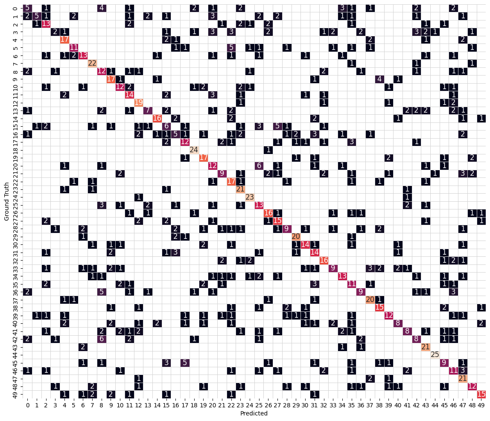

# Convolutional Neural Networks

## Project: Write an Algorithm for Landmark Classification


### Introduction

The project folder has the following structure:

* In the main directory you have this notebook, `cnn_from_scratch.ipynb`, that contains the instruction and some questions you will have to answer. Follow this notebook and complete the required sections in order.

* In the `src/` directory you have several source files. As instructed in this notebook, you will open and complete those files, then come back to this notebook to execute some tests that will verify what you have done. While these tests don't guarantee that your work is bug-free, they will help you finding the most obvious problems so you will be able to proceed to the next step with confidence.

* Sometimes you will need to restart the notebook. If you do so, remember to execute also the cells containing the code you have already completed starting from the top, before you move on.

>  Once you have completed all the code implementations, you need to finalize your work by exporting the Jupyter Notebook as an HTML document. Before exporting the notebook to HTML, all the code cells need to have been run so that reviewers can see the final implementation and output. You can then export the notebook by using the menu above and navigating to **File -> Download as -> HTML (.html)**. If you are using Jupyter Lab, you can use **File -> Export Notebook as -> Export Notebook to HTML**. Include the finished document along with this notebook as your submission.

In addition to implementing code, there will be questions that you must answer which relate to the project and your implementation. Each section where you will answer a question is preceded by a **'Question'** header. Carefully read each question and provide thorough answers in the following text boxes that begin with **'Answer:'**. Your project submission will be evaluated based on your answers to each of the questions and the implementation you provide.

>  Code and Markdown cells can be executed using the **Shift + Enter** keyboard shortcut.  Markdown cells can be edited by double-clicking the cell to enter edit mode.

The rubric contains _optional_ "Stand Out Suggestions" for enhancing the project beyond the minimum requirements. If you decide to pursue the "Stand Out Suggestions", you should include the code in this Jupyter notebook.

### Designing and training a CNN from scratch

In this notebook, you will create a CNN that classifies landmarks.  You must create your CNN _from scratch_ (so, you can't use transfer learning _yet_!), and you must attain a test accuracy of at least 50%.

Although 50% may seem low at first glance, it seems more reasonable after realizing how difficult of a problem this is. Many times, an image that is taken at a landmark captures a fairly mundane image of an animal or plant, like in the following picture.


Just by looking at that image alone, would you have been able to guess that it was taken at the Haleakalā National Park in Hawaii?

An accuracy of 50% is significantly better than random guessing, which would provide an accuracy of just 2% (100% / 50 classes). In Step 2 of this notebook, you will have the opportunity to greatly improve accuracy by using transfer learning to create a CNN.

Experiment with different architectures, hyperparameters, training strategies, and trust your intuition.  And, of course, have fun!

---
## " style="width:50px"/> Step 0: Setting up

The following cells make sure that your environment is setup correctly, download the data if you don't have it already, and also check that your GPU is available and ready to go. You have to execute them every time you restart your notebook.


```python
# Install requirements
!pip install -r requirements.txt | grep -v "already satisfied"
```

    Collecting opencv-python-headless==4.5.3.56 (from -r requirements.txt (line 1))
      Using cached opencv-python-headless-4.5.3.56.tar.gz (89.2 MB)
      Installing build dependencies: started
      Installing build dependencies: still running...
      Installing build dependencies: still running...
      Installing build dependencies: finished with status 'error'
      error: subprocess-exited-with-error
      
      × pip subprocess to install build dependencies did not run successfully.
      │ exit code: 1
      ╰─> [1095 lines of output]
          Ignoring numpy: markers 'python_version == "3.6" and platform_machine != "aarch64" and platform_machine != "arm64"' don't match your environment
          Ignoring numpy: markers 'python_version >= "3.6" and sys_platform == "linux" and platform_machine == "aarch64"' don't match your environment
          Ignoring numpy: markers 'python_version >= "3.6" and sys_platform == "darwin" and platform_machine == "arm64"' don't match your environment
          Ignoring numpy: markers 'python_version == "3.7" and platform_machine != "aarch64" and platform_machine != "arm64"' don't match your environment
          Ignoring numpy: markers 'python_version == "3.8" and platform_machine != "aarch64" and platform_machine != "arm64"' don't match your environment
          Collecting setuptools
            Using cached setuptools-75.2.0-py3-none-any.whl.metadata (6.9 kB)
          Collecting wheel
            Using cached wheel-0.44.0-py3-none-any.whl.metadata (2.3 kB)
          Collecting scikit-build
            Using cached scikit_build-0.18.1-py3-none-any.whl.metadata (18 kB)
          Collecting cmake
            Using cached cmake-3.30.5-py3-none-manylinux_2_17_x86_64.manylinux2014_x86_64.whl.metadata (6.4 kB)
          Collecting pip
            Using cached pip-24.2-py3-none-any.whl.metadata (3.6 kB)
          Collecting numpy==1.19.3
            Using cached numpy-1.19.3.zip (7.3 MB)
            Installing build dependencies: started
            Installing build dependencies: finished with status 'done'
            Getting requirements to build wheel: started
            Getting requirements to build wheel: finished with status 'done'
            Preparing metadata (pyproject.toml): started
            Preparing metadata (pyproject.toml): finished with status 'done'
          Collecting distro (from scikit-build)
            Using cached distro-1.9.0-py3-none-any.whl.metadata (6.8 kB)
          Collecting packaging (from scikit-build)
            Using cached packaging-24.1-py3-none-any.whl.metadata (3.2 kB)
          Using cached setuptools-75.2.0-py3-none-any.whl (1.2 MB)
          Using cached wheel-0.44.0-py3-none-any.whl (67 kB)
          Using cached scikit_build-0.18.1-py3-none-any.whl (85 kB)
          Using cached cmake-3.30.5-py3-none-manylinux_2_17_x86_64.manylinux2014_x86_64.whl (26.9 MB)
          Using cached pip-24.2-py3-none-any.whl (1.8 MB)
          Using cached distro-1.9.0-py3-none-any.whl (20 kB)
          Using cached packaging-24.1-py3-none-any.whl (53 kB)
          Building wheels for collected packages: numpy
            Building wheel for numpy (pyproject.toml): started
            Building wheel for numpy (pyproject.toml): still running...
            Building wheel for numpy (pyproject.toml): still running...
            Building wheel for numpy (pyproject.toml): finished with status 'error'
            error: subprocess-exited-with-error
          
            × Building wheel for numpy (pyproject.toml) did not run successfully.
            │ exit code: 1
            ╰─> [1044 lines of output]
                setup.py:67: RuntimeWarning: NumPy 1.19.3 may not yet support Python 3.11.
                  warnings.warn(
                Running from numpy source directory.
                Cythonizing sources
                numpy/random/_bounded_integers.pxd.in has not changed
                numpy/random/bit_generator.pyx has not changed
                numpy/random/_bounded_integers.pyx.in has not changed
                numpy/random/_philox.pyx has not changed
                Processing numpy/random/_bounded_integers.pyx
                numpy/random/_generator.pyx has not changed
                numpy/random/_mt19937.pyx has not changed
                numpy/random/mtrand.pyx has not changed
                numpy/random/_pcg64.pyx has not changed
                numpy/random/_sfc64.pyx has not changed
                numpy/random/_common.pyx has not changed
                blas_opt_info:
                blas_mkl_info:
                customize UnixCCompiler
                  libraries mkl_rt not found in ['/home/carlospujades/.pyenv/versions/3.11.0/envs/udacity_gcp/lib', '/usr/local/lib', '/usr/lib64', '/usr/lib', '/usr/lib/x86_64-linux-gnu']
                  NOT AVAILABLE
               
                blis_info:
                  libraries blis not found in ['/home/carlospujades/.pyenv/versions/3.11.0/envs/udacity_gcp/lib', '/usr/local/lib', '/usr/lib64', '/usr/lib', '/usr/lib/x86_64-linux-gnu']
                  NOT AVAILABLE
               
                openblas_info:
                  libraries openblas not found in ['/home/carlospujades/.pyenv/versions/3.11.0/envs/udacity_gcp/lib', '/usr/local/lib', '/usr/lib64', '/usr/lib', '/usr/lib/x86_64-linux-gnu']
                  NOT AVAILABLE
               
                atlas_3_10_blas_threads_info:
                Setting PTATLAS=ATLAS
                  libraries tatlas not found in ['/home/carlospujades/.pyenv/versions/3.11.0/envs/udacity_gcp/lib', '/usr/local/lib', '/usr/lib64', '/usr/lib', '/usr/lib/x86_64-linux-gnu']
                  NOT AVAILABLE
               
                atlas_3_10_blas_info:
                  libraries satlas not found in ['/home/carlospujades/.pyenv/versions/3.11.0/envs/udacity_gcp/lib', '/usr/local/lib', '/usr/lib64', '/usr/lib', '/usr/lib/x86_64-linux-gnu']
                  NOT AVAILABLE
               
                atlas_blas_threads_info:
                Setting PTATLAS=ATLAS
                  libraries ptf77blas,ptcblas,atlas not found in ['/home/carlospujades/.pyenv/versions/3.11.0/envs/udacity_gcp/lib', '/usr/local/lib', '/usr/lib64', '/usr/lib', '/usr/lib/x86_64-linux-gnu']
                  NOT AVAILABLE
               
                atlas_blas_info:
                  libraries f77blas,cblas,atlas not found in ['/home/carlospujades/.pyenv/versions/3.11.0/envs/udacity_gcp/lib', '/usr/local/lib', '/usr/lib64', '/usr/lib', '/usr/lib/x86_64-linux-gnu']
                  NOT AVAILABLE
               
                accelerate_info:
                  NOT AVAILABLE
               
                /var/tmp/pip-install-9fep70ff/numpy_366eef7435cc4fafba61820c89940f23/numpy/distutils/system_info.py:1914: UserWarning:
                    Optimized (vendor) Blas libraries are not found.
                    Falls back to netlib Blas library which has worse performance.
                    A better performance should be easily gained by switching
                    Blas library.
                  if self._calc_info(blas):
                blas_info:
                  libraries blas not found in ['/home/carlospujades/.pyenv/versions/3.11.0/envs/udacity_gcp/lib', '/usr/local/lib', '/usr/lib64', '/usr/lib', '/usr/lib/x86_64-linux-gnu']
                  NOT AVAILABLE
               
                /var/tmp/pip-install-9fep70ff/numpy_366eef7435cc4fafba61820c89940f23/numpy/distutils/system_info.py:1914: UserWarning:
                    Blas (http://www.netlib.org/blas/) libraries not found.
                    Directories to search for the libraries can be specified in the
                    numpy/distutils/site.cfg file (section [blas]) or by setting
                    the BLAS environment variable.
                  if self._calc_info(blas):
                blas_src_info:
                  NOT AVAILABLE
               
                /var/tmp/pip-install-9fep70ff/numpy_366eef7435cc4fafba61820c89940f23/numpy/distutils/system_info.py:1914: UserWarning:
                    Blas (http://www.netlib.org/blas/) sources not found.
                    Directories to search for the sources can be specified in the
                    numpy/distutils/site.cfg file (section [blas_src]) or by setting
                    the BLAS_SRC environment variable.
                  if self._calc_info(blas):
                  NOT AVAILABLE
               
                non-existing path in 'numpy/distutils': 'site.cfg'
                lapack_opt_info:
                lapack_mkl_info:
                  libraries mkl_rt not found in ['/home/carlospujades/.pyenv/versions/3.11.0/envs/udacity_gcp/lib', '/usr/local/lib', '/usr/lib64', '/usr/lib', '/usr/lib/x86_64-linux-gnu']
                  NOT AVAILABLE
               
                openblas_lapack_info:
                  libraries openblas not found in ['/home/carlospujades/.pyenv/versions/3.11.0/envs/udacity_gcp/lib', '/usr/local/lib', '/usr/lib64', '/usr/lib', '/usr/lib/x86_64-linux-gnu']
                  NOT AVAILABLE
               
                openblas_clapack_info:
                  libraries openblas,lapack not found in ['/home/carlospujades/.pyenv/versions/3.11.0/envs/udacity_gcp/lib', '/usr/local/lib', '/usr/lib64', '/usr/lib', '/usr/lib/x86_64-linux-gnu']
                  NOT AVAILABLE
               
                flame_info:
                  libraries flame not found in ['/home/carlospujades/.pyenv/versions/3.11.0/envs/udacity_gcp/lib', '/usr/local/lib', '/usr/lib64', '/usr/lib', '/usr/lib/x86_64-linux-gnu']
                  NOT AVAILABLE
               
                atlas_3_10_threads_info:
                Setting PTATLAS=ATLAS
                  libraries lapack_atlas not found in /home/carlospujades/.pyenv/versions/3.11.0/envs/udacity_gcp/lib
                  libraries tatlas,tatlas not found in /home/carlospujades/.pyenv/versions/3.11.0/envs/udacity_gcp/lib
                  libraries lapack_atlas not found in /usr/local/lib
                  libraries tatlas,tatlas not found in /usr/local/lib
                  libraries lapack_atlas not found in /usr/lib64
                  libraries tatlas,tatlas not found in /usr/lib64
                  libraries lapack_atlas not found in /usr/lib
                  libraries tatlas,tatlas not found in /usr/lib
                  libraries lapack_atlas not found in /usr/lib/x86_64-linux-gnu
                  libraries tatlas,tatlas not found in /usr/lib/x86_64-linux-gnu
                <class 'numpy.distutils.system_info.atlas_3_10_threads_info'>
                  NOT AVAILABLE
               
                atlas_3_10_info:
                  libraries lapack_atlas not found in /home/carlospujades/.pyenv/versions/3.11.0/envs/udacity_gcp/lib
                  libraries satlas,satlas not found in /home/carlospujades/.pyenv/versions/3.11.0/envs/udacity_gcp/lib
                  libraries lapack_atlas not found in /usr/local/lib
                  libraries satlas,satlas not found in /usr/local/lib
                  libraries lapack_atlas not found in /usr/lib64
                  libraries satlas,satlas not found in /usr/lib64
                  libraries lapack_atlas not found in /usr/lib
                  libraries satlas,satlas not found in /usr/lib
                  libraries lapack_atlas not found in /usr/lib/x86_64-linux-gnu
                  libraries satlas,satlas not found in /usr/lib/x86_64-linux-gnu
                <class 'numpy.distutils.system_info.atlas_3_10_info'>
                  NOT AVAILABLE
               
                atlas_threads_info:
                Setting PTATLAS=ATLAS
                  libraries lapack_atlas not found in /home/carlospujades/.pyenv/versions/3.11.0/envs/udacity_gcp/lib
                  libraries ptf77blas,ptcblas,atlas not found in /home/carlospujades/.pyenv/versions/3.11.0/envs/udacity_gcp/lib
                  libraries lapack_atlas not found in /usr/local/lib
                  libraries ptf77blas,ptcblas,atlas not found in /usr/local/lib
                  libraries lapack_atlas not found in /usr/lib64
                  libraries ptf77blas,ptcblas,atlas not found in /usr/lib64
                  libraries lapack_atlas not found in /usr/lib
                  libraries ptf77blas,ptcblas,atlas not found in /usr/lib
                  libraries lapack_atlas not found in /usr/lib/x86_64-linux-gnu
                  libraries ptf77blas,ptcblas,atlas not found in /usr/lib/x86_64-linux-gnu
                <class 'numpy.distutils.system_info.atlas_threads_info'>
                  NOT AVAILABLE
               
                atlas_info:
                  libraries lapack_atlas not found in /home/carlospujades/.pyenv/versions/3.11.0/envs/udacity_gcp/lib
                  libraries f77blas,cblas,atlas not found in /home/carlospujades/.pyenv/versions/3.11.0/envs/udacity_gcp/lib
                  libraries lapack_atlas not found in /usr/local/lib
                  libraries f77blas,cblas,atlas not found in /usr/local/lib
                  libraries lapack_atlas not found in /usr/lib64
                  libraries f77blas,cblas,atlas not found in /usr/lib64
                  libraries lapack_atlas not found in /usr/lib
                  libraries f77blas,cblas,atlas not found in /usr/lib
                  libraries lapack_atlas not found in /usr/lib/x86_64-linux-gnu
                  libraries f77blas,cblas,atlas not found in /usr/lib/x86_64-linux-gnu
                <class 'numpy.distutils.system_info.atlas_info'>
                  NOT AVAILABLE
               
                lapack_info:
                  libraries lapack not found in ['/home/carlospujades/.pyenv/versions/3.11.0/envs/udacity_gcp/lib', '/usr/local/lib', '/usr/lib64', '/usr/lib', '/usr/lib/x86_64-linux-gnu']
                  NOT AVAILABLE
               
                /var/tmp/pip-install-9fep70ff/numpy_366eef7435cc4fafba61820c89940f23/numpy/distutils/system_info.py:1748: UserWarning:
                    Lapack (http://www.netlib.org/lapack/) libraries not found.
                    Directories to search for the libraries can be specified in the
                    numpy/distutils/site.cfg file (section [lapack]) or by setting
                    the LAPACK environment variable.
                  return getattr(self, '_calc_info_{}'.format(name))()
                lapack_src_info:
                  NOT AVAILABLE
               
                /var/tmp/pip-install-9fep70ff/numpy_366eef7435cc4fafba61820c89940f23/numpy/distutils/system_info.py:1748: UserWarning:
                    Lapack (http://www.netlib.org/lapack/) sources not found.
                    Directories to search for the sources can be specified in the
                    numpy/distutils/site.cfg file (section [lapack_src]) or by setting
                    the LAPACK_SRC environment variable.
                  return getattr(self, '_calc_info_{}'.format(name))()
                  NOT AVAILABLE
               
                numpy_linalg_lapack_lite:
                  FOUND:
                    language = c
                    define_macros = [('HAVE_BLAS_ILP64', None), ('BLAS_SYMBOL_SUFFIX', '64_')]
               
                /var/tmp/pip-build-env-k4wp29sz/overlay/lib/python3.11/site-packages/setuptools/_distutils/dist.py:275: UserWarning: Unknown distribution option: 'define_macros'
                  warnings.warn(msg)
                running bdist_wheel
                running build
                running config_cc
                unifing config_cc, config, build_clib, build_ext, build commands --compiler options
                running config_fc
                unifing config_fc, config, build_clib, build_ext, build commands --fcompiler options
                running build_src
                build_src
                building py_modules sources
                building library "npymath" sources
                Could not locate executable gfortran
                Could not locate executable f95
                Could not locate executable ifort
                Could not locate executable ifc
                Could not locate executable lf95
                Could not locate executable pgfortran
                Could not locate executable nvfortran
                Could not locate executable f90
                Could not locate executable f77
                Could not locate executable fort
                Could not locate executable efort
                Could not locate executable efc
                Could not locate executable g77
                Could not locate executable g95
                Could not locate executable pathf95
                Could not locate executable nagfor
                don't know how to compile Fortran code on platform 'posix'
                  adding 'build/src.linux-x86_64-3.11/numpy/core/src/npymath' to include_dirs.
                None - nothing done with h_files = ['build/src.linux-x86_64-3.11/numpy/core/src/npymath/npy_math_internal.h']
                building library "npysort" sources
                  adding 'build/src.linux-x86_64-3.11/numpy/core/src/common' to include_dirs.
                None - nothing done with h_files = ['build/src.linux-x86_64-3.11/numpy/core/src/common/npy_sort.h', 'build/src.linux-x86_64-3.11/numpy/core/src/common/npy_partition.h', 'build/src.linux-x86_64-3.11/numpy/core/src/common/npy_binsearch.h']
                building library "npyrandom" sources
                building extension "numpy.core._multiarray_tests" sources
                building extension "numpy.core._multiarray_umath" sources
                  adding 'build/src.linux-x86_64-3.11/numpy/core/src/umath' to include_dirs.
                  adding 'build/src.linux-x86_64-3.11/numpy/core/src/npymath' to include_dirs.
                  adding 'build/src.linux-x86_64-3.11/numpy/core/src/common' to include_dirs.
                numpy.core - nothing done with h_files = ['build/src.linux-x86_64-3.11/numpy/core/src/umath/funcs.inc', 'build/src.linux-x86_64-3.11/numpy/core/src/umath/simd.inc', 'build/src.linux-x86_64-3.11/numpy/core/src/umath/loops.h', 'build/src.linux-x86_64-3.11/numpy/core/src/umath/matmul.h', 'build/src.linux-x86_64-3.11/numpy/core/src/umath/clip.h', 'build/src.linux-x86_64-3.11/numpy/core/src/npymath/npy_math_internal.h', 'build/src.linux-x86_64-3.11/numpy/core/src/common/templ_common.h', 'build/src.linux-x86_64-3.11/numpy/core/include/numpy/config.h', 'build/src.linux-x86_64-3.11/numpy/core/include/numpy/_numpyconfig.h', 'build/src.linux-x86_64-3.11/numpy/core/include/numpy/__multiarray_api.h', 'build/src.linux-x86_64-3.11/numpy/core/include/numpy/__ufunc_api.h']
                building extension "numpy.core._umath_tests" sources
                building extension "numpy.core._rational_tests" sources
                building extension "numpy.core._struct_ufunc_tests" sources
                building extension "numpy.core._operand_flag_tests" sources
                building extension "numpy.fft._pocketfft_internal" sources
                building extension "numpy.linalg.lapack_lite" sources
                ### Warning:  Using unoptimized lapack ###
                building extension "numpy.linalg._umath_linalg" sources
                ### Warning:  Using unoptimized lapack ###
                building extension "numpy.random._mt19937" sources
                building extension "numpy.random._philox" sources
                building extension "numpy.random._pcg64" sources
                building extension "numpy.random._sfc64" sources
                building extension "numpy.random._common" sources
                building extension "numpy.random.bit_generator" sources
                building extension "numpy.random._generator" sources
                building extension "numpy.random._bounded_integers" sources
                building extension "numpy.random.mtrand" sources
                building data_files sources
                build_src: building npy-pkg config files
                running build_py
                creating build/lib.linux-x86_64-3.11
                creating build/lib.linux-x86_64-3.11/numpy
                copying numpy/_globals.py -> build/lib.linux-x86_64-3.11/numpy
                copying numpy/dual.py -> build/lib.linux-x86_64-3.11/numpy
                copying numpy/_pytesttester.py -> build/lib.linux-x86_64-3.11/numpy
                copying numpy/conftest.py -> build/lib.linux-x86_64-3.11/numpy
                copying numpy/matlib.py -> build/lib.linux-x86_64-3.11/numpy
                copying numpy/version.py -> build/lib.linux-x86_64-3.11/numpy
                copying numpy/setup.py -> build/lib.linux-x86_64-3.11/numpy
                copying numpy/ctypeslib.py -> build/lib.linux-x86_64-3.11/numpy
                copying numpy/__init__.py -> build/lib.linux-x86_64-3.11/numpy
                copying numpy/_distributor_init.py -> build/lib.linux-x86_64-3.11/numpy
                copying build/src.linux-x86_64-3.11/numpy/__config__.py -> build/lib.linux-x86_64-3.11/numpy
                creating build/lib.linux-x86_64-3.11/numpy/compat
                copying numpy/compat/py3k.py -> build/lib.linux-x86_64-3.11/numpy/compat
                copying numpy/compat/_inspect.py -> build/lib.linux-x86_64-3.11/numpy/compat
                copying numpy/compat/setup.py -> build/lib.linux-x86_64-3.11/numpy/compat
                copying numpy/compat/__init__.py -> build/lib.linux-x86_64-3.11/numpy/compat
                creating build/lib.linux-x86_64-3.11/numpy/compat/tests
                copying numpy/compat/tests/test_compat.py -> build/lib.linux-x86_64-3.11/numpy/compat/tests
                copying numpy/compat/tests/__init__.py -> build/lib.linux-x86_64-3.11/numpy/compat/tests
                creating build/lib.linux-x86_64-3.11/numpy/core
                copying numpy/core/_add_newdocs.py -> build/lib.linux-x86_64-3.11/numpy/core
                copying numpy/core/_string_helpers.py -> build/lib.linux-x86_64-3.11/numpy/core
                copying numpy/core/cversions.py -> build/lib.linux-x86_64-3.11/numpy/core
                copying numpy/core/_type_aliases.py -> build/lib.linux-x86_64-3.11/numpy/core
                copying numpy/core/records.py -> build/lib.linux-x86_64-3.11/numpy/core
                copying numpy/core/fromnumeric.py -> build/lib.linux-x86_64-3.11/numpy/core
                copying numpy/core/_ufunc_config.py -> build/lib.linux-x86_64-3.11/numpy/core
                copying numpy/core/einsumfunc.py -> build/lib.linux-x86_64-3.11/numpy/core
                copying numpy/core/arrayprint.py -> build/lib.linux-x86_64-3.11/numpy/core
                copying numpy/core/defchararray.py -> build/lib.linux-x86_64-3.11/numpy/core
                copying numpy/core/numerictypes.py -> build/lib.linux-x86_64-3.11/numpy/core
                copying numpy/core/setup_common.py -> build/lib.linux-x86_64-3.11/numpy/core
                copying numpy/core/multiarray.py -> build/lib.linux-x86_64-3.11/numpy/core
                copying numpy/core/function_base.py -> build/lib.linux-x86_64-3.11/numpy/core
                copying numpy/core/_exceptions.py -> build/lib.linux-x86_64-3.11/numpy/core
                copying numpy/core/umath_tests.py -> build/lib.linux-x86_64-3.11/numpy/core
                copying numpy/core/_dtype_ctypes.py -> build/lib.linux-x86_64-3.11/numpy/core
                copying numpy/core/overrides.py -> build/lib.linux-x86_64-3.11/numpy/core
                copying numpy/core/shape_base.py -> build/lib.linux-x86_64-3.11/numpy/core
                copying numpy/core/setup.py -> build/lib.linux-x86_64-3.11/numpy/core
                copying numpy/core/getlimits.py -> build/lib.linux-x86_64-3.11/numpy/core
                copying numpy/core/_internal.py -> build/lib.linux-x86_64-3.11/numpy/core
                copying numpy/core/umath.py -> build/lib.linux-x86_64-3.11/numpy/core
                copying numpy/core/__init__.py -> build/lib.linux-x86_64-3.11/numpy/core
                copying numpy/core/numeric.py -> build/lib.linux-x86_64-3.11/numpy/core
                copying numpy/core/machar.py -> build/lib.linux-x86_64-3.11/numpy/core
                copying numpy/core/_dtype.py -> build/lib.linux-x86_64-3.11/numpy/core
                copying numpy/core/_asarray.py -> build/lib.linux-x86_64-3.11/numpy/core
                copying numpy/core/memmap.py -> build/lib.linux-x86_64-3.11/numpy/core
                copying numpy/core/_methods.py -> build/lib.linux-x86_64-3.11/numpy/core
                copying numpy/core/code_generators/generate_numpy_api.py -> build/lib.linux-x86_64-3.11/numpy/core
                creating build/lib.linux-x86_64-3.11/numpy/core/tests
                copying numpy/core/tests/test_indexing.py -> build/lib.linux-x86_64-3.11/numpy/core/tests
                copying numpy/core/tests/test_scalarinherit.py -> build/lib.linux-x86_64-3.11/numpy/core/tests
                copying numpy/core/tests/test_indexerrors.py -> build/lib.linux-x86_64-3.11/numpy/core/tests
                copying numpy/core/tests/test_scalarbuffer.py -> build/lib.linux-x86_64-3.11/numpy/core/tests
                copying numpy/core/tests/test_extint128.py -> build/lib.linux-x86_64-3.11/numpy/core/tests
                copying numpy/core/tests/test_scalarmath.py -> build/lib.linux-x86_64-3.11/numpy/core/tests
                copying numpy/core/tests/test_records.py -> build/lib.linux-x86_64-3.11/numpy/core/tests
                copying numpy/core/tests/test_nditer.py -> build/lib.linux-x86_64-3.11/numpy/core/tests
                copying numpy/core/tests/test_deprecations.py -> build/lib.linux-x86_64-3.11/numpy/core/tests
                copying numpy/core/tests/test_umath.py -> build/lib.linux-x86_64-3.11/numpy/core/tests
                copying numpy/core/tests/test_half.py -> build/lib.linux-x86_64-3.11/numpy/core/tests
                copying numpy/core/tests/test_umath_complex.py -> build/lib.linux-x86_64-3.11/numpy/core/tests
                copying numpy/core/tests/test_conversion_utils.py -> build/lib.linux-x86_64-3.11/numpy/core/tests
                copying numpy/core/tests/test_memmap.py -> build/lib.linux-x86_64-3.11/numpy/core/tests
                copying numpy/core/tests/test_dtype.py -> build/lib.linux-x86_64-3.11/numpy/core/tests
                copying numpy/core/tests/test_errstate.py -> build/lib.linux-x86_64-3.11/numpy/core/tests
                copying numpy/core/tests/test_overrides.py -> build/lib.linux-x86_64-3.11/numpy/core/tests
                copying numpy/core/tests/test_scalar_ctors.py -> build/lib.linux-x86_64-3.11/numpy/core/tests
                copying numpy/core/tests/test_abc.py -> build/lib.linux-x86_64-3.11/numpy/core/tests
                copying numpy/core/tests/test_protocols.py -> build/lib.linux-x86_64-3.11/numpy/core/tests
                copying numpy/core/tests/test_getlimits.py -> build/lib.linux-x86_64-3.11/numpy/core/tests
                copying numpy/core/tests/test_ufunc.py -> build/lib.linux-x86_64-3.11/numpy/core/tests
                copying numpy/core/tests/test__exceptions.py -> build/lib.linux-x86_64-3.11/numpy/core/tests
                copying numpy/core/tests/test_unicode.py -> build/lib.linux-x86_64-3.11/numpy/core/tests
                copying numpy/core/tests/_locales.py -> build/lib.linux-x86_64-3.11/numpy/core/tests
                copying numpy/core/tests/test_arrayprint.py -> build/lib.linux-x86_64-3.11/numpy/core/tests
                copying numpy/core/tests/test_umath_accuracy.py -> build/lib.linux-x86_64-3.11/numpy/core/tests
                copying numpy/core/tests/test_defchararray.py -> build/lib.linux-x86_64-3.11/numpy/core/tests
                copying numpy/core/tests/test_cpu_features.py -> build/lib.linux-x86_64-3.11/numpy/core/tests
                copying numpy/core/tests/test_datetime.py -> build/lib.linux-x86_64-3.11/numpy/core/tests
                copying numpy/core/tests/test_scalar_methods.py -> build/lib.linux-x86_64-3.11/numpy/core/tests
                copying numpy/core/tests/test_longdouble.py -> build/lib.linux-x86_64-3.11/numpy/core/tests
                copying numpy/core/tests/test_machar.py -> build/lib.linux-x86_64-3.11/numpy/core/tests
                copying numpy/core/tests/test_function_base.py -> build/lib.linux-x86_64-3.11/numpy/core/tests
                copying numpy/core/tests/test_numerictypes.py -> build/lib.linux-x86_64-3.11/numpy/core/tests
                copying numpy/core/tests/test_regression.py -> build/lib.linux-x86_64-3.11/numpy/core/tests
                copying numpy/core/tests/test_scalarprint.py -> build/lib.linux-x86_64-3.11/numpy/core/tests
                copying numpy/core/tests/test_item_selection.py -> build/lib.linux-x86_64-3.11/numpy/core/tests
                copying numpy/core/tests/__init__.py -> build/lib.linux-x86_64-3.11/numpy/core/tests
                copying numpy/core/tests/test_einsum.py -> build/lib.linux-x86_64-3.11/numpy/core/tests
                copying numpy/core/tests/test_api.py -> build/lib.linux-x86_64-3.11/numpy/core/tests
                copying numpy/core/tests/test_numeric.py -> build/lib.linux-x86_64-3.11/numpy/core/tests
                copying numpy/core/tests/test_mem_overlap.py -> build/lib.linux-x86_64-3.11/numpy/core/tests
                copying numpy/core/tests/test_multiarray.py -> build/lib.linux-x86_64-3.11/numpy/core/tests
                copying numpy/core/tests/test_shape_base.py -> build/lib.linux-x86_64-3.11/numpy/core/tests
                copying numpy/core/tests/test_print.py -> build/lib.linux-x86_64-3.11/numpy/core/tests
                creating build/lib.linux-x86_64-3.11/numpy/distutils
                copying numpy/distutils/mingw32ccompiler.py -> build/lib.linux-x86_64-3.11/numpy/distutils
                copying numpy/distutils/msvccompiler.py -> build/lib.linux-x86_64-3.11/numpy/distutils
                copying numpy/distutils/cpuinfo.py -> build/lib.linux-x86_64-3.11/numpy/distutils
                copying numpy/distutils/conv_template.py -> build/lib.linux-x86_64-3.11/numpy/distutils
                copying numpy/distutils/msvc9compiler.py -> build/lib.linux-x86_64-3.11/numpy/distutils
                copying numpy/distutils/from_template.py -> build/lib.linux-x86_64-3.11/numpy/distutils
                copying numpy/distutils/misc_util.py -> build/lib.linux-x86_64-3.11/numpy/distutils
                copying numpy/distutils/ccompiler.py -> build/lib.linux-x86_64-3.11/numpy/distutils
                copying numpy/distutils/unixccompiler.py -> build/lib.linux-x86_64-3.11/numpy/distutils
                copying numpy/distutils/system_info.py -> build/lib.linux-x86_64-3.11/numpy/distutils
                copying numpy/distutils/line_endings.py -> build/lib.linux-x86_64-3.11/numpy/distutils
                copying numpy/distutils/lib2def.py -> build/lib.linux-x86_64-3.11/numpy/distutils
                copying numpy/distutils/exec_command.py -> build/lib.linux-x86_64-3.11/numpy/distutils
                copying numpy/distutils/setup.py -> build/lib.linux-x86_64-3.11/numpy/distutils
                copying numpy/distutils/core.py -> build/lib.linux-x86_64-3.11/numpy/distutils
                copying numpy/distutils/extension.py -> build/lib.linux-x86_64-3.11/numpy/distutils
                copying numpy/distutils/__init__.py -> build/lib.linux-x86_64-3.11/numpy/distutils
                copying numpy/distutils/numpy_distribution.py -> build/lib.linux-x86_64-3.11/numpy/distutils
                copying numpy/distutils/npy_pkg_config.py -> build/lib.linux-x86_64-3.11/numpy/distutils
                copying numpy/distutils/_shell_utils.py -> build/lib.linux-x86_64-3.11/numpy/distutils
                copying numpy/distutils/intelccompiler.py -> build/lib.linux-x86_64-3.11/numpy/distutils
                copying numpy/distutils/log.py -> build/lib.linux-x86_64-3.11/numpy/distutils
                copying numpy/distutils/pathccompiler.py -> build/lib.linux-x86_64-3.11/numpy/distutils
                copying build/src.linux-x86_64-3.11/numpy/distutils/__config__.py -> build/lib.linux-x86_64-3.11/numpy/distutils
                creating build/lib.linux-x86_64-3.11/numpy/distutils/command
                copying numpy/distutils/command/install.py -> build/lib.linux-x86_64-3.11/numpy/distutils/command
                copying numpy/distutils/command/bdist_rpm.py -> build/lib.linux-x86_64-3.11/numpy/distutils/command
                copying numpy/distutils/command/autodist.py -> build/lib.linux-x86_64-3.11/numpy/distutils/command
                copying numpy/distutils/command/config.py -> build/lib.linux-x86_64-3.11/numpy/distutils/command
                copying numpy/distutils/command/build_py.py -> build/lib.linux-x86_64-3.11/numpy/distutils/command
                copying numpy/distutils/command/build_scripts.py -> build/lib.linux-x86_64-3.11/numpy/distutils/command
                copying numpy/distutils/command/build_ext.py -> build/lib.linux-x86_64-3.11/numpy/distutils/command
                copying numpy/distutils/command/install_clib.py -> build/lib.linux-x86_64-3.11/numpy/distutils/command
                copying numpy/distutils/command/build.py -> build/lib.linux-x86_64-3.11/numpy/distutils/command
                copying numpy/distutils/command/egg_info.py -> build/lib.linux-x86_64-3.11/numpy/distutils/command
                copying numpy/distutils/command/develop.py -> build/lib.linux-x86_64-3.11/numpy/distutils/command
                copying numpy/distutils/command/sdist.py -> build/lib.linux-x86_64-3.11/numpy/distutils/command
                copying numpy/distutils/command/install_data.py -> build/lib.linux-x86_64-3.11/numpy/distutils/command
                copying numpy/distutils/command/__init__.py -> build/lib.linux-x86_64-3.11/numpy/distutils/command
                copying numpy/distutils/command/config_compiler.py -> build/lib.linux-x86_64-3.11/numpy/distutils/command
                copying numpy/distutils/command/build_src.py -> build/lib.linux-x86_64-3.11/numpy/distutils/command
                copying numpy/distutils/command/build_clib.py -> build/lib.linux-x86_64-3.11/numpy/distutils/command
                copying numpy/distutils/command/install_headers.py -> build/lib.linux-x86_64-3.11/numpy/distutils/command
                creating build/lib.linux-x86_64-3.11/numpy/distutils/fcompiler
                copying numpy/distutils/fcompiler/hpux.py -> build/lib.linux-x86_64-3.11/numpy/distutils/fcompiler
                copying numpy/distutils/fcompiler/compaq.py -> build/lib.linux-x86_64-3.11/numpy/distutils/fcompiler
                copying numpy/distutils/fcompiler/ibm.py -> build/lib.linux-x86_64-3.11/numpy/distutils/fcompiler
                copying numpy/distutils/fcompiler/gnu.py -> build/lib.linux-x86_64-3.11/numpy/distutils/fcompiler
                copying numpy/distutils/fcompiler/nv.py -> build/lib.linux-x86_64-3.11/numpy/distutils/fcompiler
                copying numpy/distutils/fcompiler/intel.py -> build/lib.linux-x86_64-3.11/numpy/distutils/fcompiler
                copying numpy/distutils/fcompiler/absoft.py -> build/lib.linux-x86_64-3.11/numpy/distutils/fcompiler
                copying numpy/distutils/fcompiler/g95.py -> build/lib.linux-x86_64-3.11/numpy/distutils/fcompiler
                copying numpy/distutils/fcompiler/environment.py -> build/lib.linux-x86_64-3.11/numpy/distutils/fcompiler
                copying numpy/distutils/fcompiler/mips.py -> build/lib.linux-x86_64-3.11/numpy/distutils/fcompiler
                copying numpy/distutils/fcompiler/pathf95.py -> build/lib.linux-x86_64-3.11/numpy/distutils/fcompiler
                copying numpy/distutils/fcompiler/__init__.py -> build/lib.linux-x86_64-3.11/numpy/distutils/fcompiler
                copying numpy/distutils/fcompiler/vast.py -> build/lib.linux-x86_64-3.11/numpy/distutils/fcompiler
                copying numpy/distutils/fcompiler/nag.py -> build/lib.linux-x86_64-3.11/numpy/distutils/fcompiler
                copying numpy/distutils/fcompiler/pg.py -> build/lib.linux-x86_64-3.11/numpy/distutils/fcompiler
                copying numpy/distutils/fcompiler/none.py -> build/lib.linux-x86_64-3.11/numpy/distutils/fcompiler
                copying numpy/distutils/fcompiler/lahey.py -> build/lib.linux-x86_64-3.11/numpy/distutils/fcompiler
                copying numpy/distutils/fcompiler/sun.py -> build/lib.linux-x86_64-3.11/numpy/distutils/fcompiler
                creating build/lib.linux-x86_64-3.11/numpy/distutils/tests
                copying numpy/distutils/tests/test_mingw32ccompiler.py -> build/lib.linux-x86_64-3.11/numpy/distutils/tests
                copying numpy/distutils/tests/test_system_info.py -> build/lib.linux-x86_64-3.11/numpy/distutils/tests
                copying numpy/distutils/tests/test_fcompiler_gnu.py -> build/lib.linux-x86_64-3.11/numpy/distutils/tests
                copying numpy/distutils/tests/test_fcompiler.py -> build/lib.linux-x86_64-3.11/numpy/distutils/tests
                copying numpy/distutils/tests/test_shell_utils.py -> build/lib.linux-x86_64-3.11/numpy/distutils/tests
                copying numpy/distutils/tests/test_misc_util.py -> build/lib.linux-x86_64-3.11/numpy/distutils/tests
                copying numpy/distutils/tests/test_npy_pkg_config.py -> build/lib.linux-x86_64-3.11/numpy/distutils/tests
                copying numpy/distutils/tests/test_from_template.py -> build/lib.linux-x86_64-3.11/numpy/distutils/tests
                copying numpy/distutils/tests/test_fcompiler_intel.py -> build/lib.linux-x86_64-3.11/numpy/distutils/tests
                copying numpy/distutils/tests/__init__.py -> build/lib.linux-x86_64-3.11/numpy/distutils/tests
                copying numpy/distutils/tests/test_fcompiler_nagfor.py -> build/lib.linux-x86_64-3.11/numpy/distutils/tests
                copying numpy/distutils/tests/test_exec_command.py -> build/lib.linux-x86_64-3.11/numpy/distutils/tests
                creating build/lib.linux-x86_64-3.11/numpy/doc
                copying numpy/doc/broadcasting.py -> build/lib.linux-x86_64-3.11/numpy/doc
                copying numpy/doc/misc.py -> build/lib.linux-x86_64-3.11/numpy/doc
                copying numpy/doc/structured_arrays.py -> build/lib.linux-x86_64-3.11/numpy/doc
                copying numpy/doc/subclassing.py -> build/lib.linux-x86_64-3.11/numpy/doc
                copying numpy/doc/indexing.py -> build/lib.linux-x86_64-3.11/numpy/doc
                copying numpy/doc/ufuncs.py -> build/lib.linux-x86_64-3.11/numpy/doc
                copying numpy/doc/constants.py -> build/lib.linux-x86_64-3.11/numpy/doc
                copying numpy/doc/byteswapping.py -> build/lib.linux-x86_64-3.11/numpy/doc
                copying numpy/doc/dispatch.py -> build/lib.linux-x86_64-3.11/numpy/doc
                copying numpy/doc/internals.py -> build/lib.linux-x86_64-3.11/numpy/doc
                copying numpy/doc/creation.py -> build/lib.linux-x86_64-3.11/numpy/doc
                copying numpy/doc/glossary.py -> build/lib.linux-x86_64-3.11/numpy/doc
                copying numpy/doc/__init__.py -> build/lib.linux-x86_64-3.11/numpy/doc
                copying numpy/doc/basics.py -> build/lib.linux-x86_64-3.11/numpy/doc
                creating build/lib.linux-x86_64-3.11/numpy/f2py
                copying numpy/f2py/common_rules.py -> build/lib.linux-x86_64-3.11/numpy/f2py
                copying numpy/f2py/auxfuncs.py -> build/lib.linux-x86_64-3.11/numpy/f2py
                copying numpy/f2py/rules.py -> build/lib.linux-x86_64-3.11/numpy/f2py
                copying numpy/f2py/f90mod_rules.py -> build/lib.linux-x86_64-3.11/numpy/f2py
                copying numpy/f2py/crackfortran.py -> build/lib.linux-x86_64-3.11/numpy/f2py
                copying numpy/f2py/diagnose.py -> build/lib.linux-x86_64-3.11/numpy/f2py
                copying numpy/f2py/use_rules.py -> build/lib.linux-x86_64-3.11/numpy/f2py
                copying numpy/f2py/__version__.py -> build/lib.linux-x86_64-3.11/numpy/f2py
                copying numpy/f2py/f2py_testing.py -> build/lib.linux-x86_64-3.11/numpy/f2py
                copying numpy/f2py/func2subr.py -> build/lib.linux-x86_64-3.11/numpy/f2py
                copying numpy/f2py/capi_maps.py -> build/lib.linux-x86_64-3.11/numpy/f2py
                copying numpy/f2py/cfuncs.py -> build/lib.linux-x86_64-3.11/numpy/f2py
                copying numpy/f2py/setup.py -> build/lib.linux-x86_64-3.11/numpy/f2py
                copying numpy/f2py/__init__.py -> build/lib.linux-x86_64-3.11/numpy/f2py
                copying numpy/f2py/__main__.py -> build/lib.linux-x86_64-3.11/numpy/f2py
                copying numpy/f2py/f2py2e.py -> build/lib.linux-x86_64-3.11/numpy/f2py
                copying numpy/f2py/cb_rules.py -> build/lib.linux-x86_64-3.11/numpy/f2py
                creating build/lib.linux-x86_64-3.11/numpy/f2py/tests
                copying numpy/f2py/tests/test_return_logical.py -> build/lib.linux-x86_64-3.11/numpy/f2py/tests
                copying numpy/f2py/tests/test_mixed.py -> build/lib.linux-x86_64-3.11/numpy/f2py/tests
                copying numpy/f2py/tests/test_assumed_shape.py -> build/lib.linux-x86_64-3.11/numpy/f2py/tests
                copying numpy/f2py/tests/test_quoted_character.py -> build/lib.linux-x86_64-3.11/numpy/f2py/tests
                copying numpy/f2py/tests/test_parameter.py -> build/lib.linux-x86_64-3.11/numpy/f2py/tests
                copying numpy/f2py/tests/test_return_complex.py -> build/lib.linux-x86_64-3.11/numpy/f2py/tests
                copying numpy/f2py/tests/test_compile_function.py -> build/lib.linux-x86_64-3.11/numpy/f2py/tests
                copying numpy/f2py/tests/test_callback.py -> build/lib.linux-x86_64-3.11/numpy/f2py/tests
                copying numpy/f2py/tests/test_string.py -> build/lib.linux-x86_64-3.11/numpy/f2py/tests
                copying numpy/f2py/tests/test_return_integer.py -> build/lib.linux-x86_64-3.11/numpy/f2py/tests
                copying numpy/f2py/tests/test_common.py -> build/lib.linux-x86_64-3.11/numpy/f2py/tests
                copying numpy/f2py/tests/test_array_from_pyobj.py -> build/lib.linux-x86_64-3.11/numpy/f2py/tests
                copying numpy/f2py/tests/test_crackfortran.py -> build/lib.linux-x86_64-3.11/numpy/f2py/tests
                copying numpy/f2py/tests/test_return_character.py -> build/lib.linux-x86_64-3.11/numpy/f2py/tests
                copying numpy/f2py/tests/test_kind.py -> build/lib.linux-x86_64-3.11/numpy/f2py/tests
                copying numpy/f2py/tests/test_regression.py -> build/lib.linux-x86_64-3.11/numpy/f2py/tests
                copying numpy/f2py/tests/test_return_real.py -> build/lib.linux-x86_64-3.11/numpy/f2py/tests
                copying numpy/f2py/tests/__init__.py -> build/lib.linux-x86_64-3.11/numpy/f2py/tests
                copying numpy/f2py/tests/test_block_docstring.py -> build/lib.linux-x86_64-3.11/numpy/f2py/tests
                copying numpy/f2py/tests/test_size.py -> build/lib.linux-x86_64-3.11/numpy/f2py/tests
                copying numpy/f2py/tests/test_semicolon_split.py -> build/lib.linux-x86_64-3.11/numpy/f2py/tests
                copying numpy/f2py/tests/util.py -> build/lib.linux-x86_64-3.11/numpy/f2py/tests
                creating build/lib.linux-x86_64-3.11/numpy/fft
                copying numpy/fft/helper.py -> build/lib.linux-x86_64-3.11/numpy/fft
                copying numpy/fft/_pocketfft.py -> build/lib.linux-x86_64-3.11/numpy/fft
                copying numpy/fft/setup.py -> build/lib.linux-x86_64-3.11/numpy/fft
                copying numpy/fft/__init__.py -> build/lib.linux-x86_64-3.11/numpy/fft
                creating build/lib.linux-x86_64-3.11/numpy/fft/tests
                copying numpy/fft/tests/test_pocketfft.py -> build/lib.linux-x86_64-3.11/numpy/fft/tests
                copying numpy/fft/tests/test_helper.py -> build/lib.linux-x86_64-3.11/numpy/fft/tests
                copying numpy/fft/tests/__init__.py -> build/lib.linux-x86_64-3.11/numpy/fft/tests
                creating build/lib.linux-x86_64-3.11/numpy/lib
                copying numpy/lib/user_array.py -> build/lib.linux-x86_64-3.11/numpy/lib
                copying numpy/lib/arraypad.py -> build/lib.linux-x86_64-3.11/numpy/lib
                copying numpy/lib/nanfunctions.py -> build/lib.linux-x86_64-3.11/numpy/lib
                copying numpy/lib/type_check.py -> build/lib.linux-x86_64-3.11/numpy/lib
                copying numpy/lib/_iotools.py -> build/lib.linux-x86_64-3.11/numpy/lib
                copying numpy/lib/stride_tricks.py -> build/lib.linux-x86_64-3.11/numpy/lib
                copying numpy/lib/recfunctions.py -> build/lib.linux-x86_64-3.11/numpy/lib
                copying numpy/lib/function_base.py -> build/lib.linux-x86_64-3.11/numpy/lib
                copying numpy/lib/index_tricks.py -> build/lib.linux-x86_64-3.11/numpy/lib
                copying numpy/lib/ufunclike.py -> build/lib.linux-x86_64-3.11/numpy/lib
                copying numpy/lib/histograms.py -> build/lib.linux-x86_64-3.11/numpy/lib
                copying numpy/lib/npyio.py -> build/lib.linux-x86_64-3.11/numpy/lib
                copying numpy/lib/mixins.py -> build/lib.linux-x86_64-3.11/numpy/lib
                copying numpy/lib/_datasource.py -> build/lib.linux-x86_64-3.11/numpy/lib
                copying numpy/lib/arraysetops.py -> build/lib.linux-x86_64-3.11/numpy/lib
                copying numpy/lib/scimath.py -> build/lib.linux-x86_64-3.11/numpy/lib
                copying numpy/lib/arrayterator.py -> build/lib.linux-x86_64-3.11/numpy/lib
                copying numpy/lib/shape_base.py -> build/lib.linux-x86_64-3.11/numpy/lib
                copying numpy/lib/setup.py -> build/lib.linux-x86_64-3.11/numpy/lib
                copying numpy/lib/format.py -> build/lib.linux-x86_64-3.11/numpy/lib
                copying numpy/lib/twodim_base.py -> build/lib.linux-x86_64-3.11/numpy/lib
                copying numpy/lib/_version.py -> build/lib.linux-x86_64-3.11/numpy/lib
                copying numpy/lib/__init__.py -> build/lib.linux-x86_64-3.11/numpy/lib
                copying numpy/lib/financial.py -> build/lib.linux-x86_64-3.11/numpy/lib
                copying numpy/lib/polynomial.py -> build/lib.linux-x86_64-3.11/numpy/lib
                copying numpy/lib/utils.py -> build/lib.linux-x86_64-3.11/numpy/lib
                creating build/lib.linux-x86_64-3.11/numpy/lib/tests
                copying numpy/lib/tests/test_type_check.py -> build/lib.linux-x86_64-3.11/numpy/lib/tests
                copying numpy/lib/tests/test_twodim_base.py -> build/lib.linux-x86_64-3.11/numpy/lib/tests
                copying numpy/lib/tests/test_financial.py -> build/lib.linux-x86_64-3.11/numpy/lib/tests
                copying numpy/lib/tests/test_arraypad.py -> build/lib.linux-x86_64-3.11/numpy/lib/tests
                copying numpy/lib/tests/test_arrayterator.py -> build/lib.linux-x86_64-3.11/numpy/lib/tests
                copying numpy/lib/tests/test_nanfunctions.py -> build/lib.linux-x86_64-3.11/numpy/lib/tests
                copying numpy/lib/tests/test_io.py -> build/lib.linux-x86_64-3.11/numpy/lib/tests
                copying numpy/lib/tests/test_ufunclike.py -> build/lib.linux-x86_64-3.11/numpy/lib/tests
                copying numpy/lib/tests/test_arraysetops.py -> build/lib.linux-x86_64-3.11/numpy/lib/tests
                copying numpy/lib/tests/test_recfunctions.py -> build/lib.linux-x86_64-3.11/numpy/lib/tests
                copying numpy/lib/tests/test_polynomial.py -> build/lib.linux-x86_64-3.11/numpy/lib/tests
                copying numpy/lib/tests/test_mixins.py -> build/lib.linux-x86_64-3.11/numpy/lib/tests
                copying numpy/lib/tests/test__iotools.py -> build/lib.linux-x86_64-3.11/numpy/lib/tests
                copying numpy/lib/tests/test__version.py -> build/lib.linux-x86_64-3.11/numpy/lib/tests
                copying numpy/lib/tests/test_index_tricks.py -> build/lib.linux-x86_64-3.11/numpy/lib/tests
                copying numpy/lib/tests/test_stride_tricks.py -> build/lib.linux-x86_64-3.11/numpy/lib/tests
                copying numpy/lib/tests/test__datasource.py -> build/lib.linux-x86_64-3.11/numpy/lib/tests
                copying numpy/lib/tests/test_function_base.py -> build/lib.linux-x86_64-3.11/numpy/lib/tests
                copying numpy/lib/tests/test_histograms.py -> build/lib.linux-x86_64-3.11/numpy/lib/tests
                copying numpy/lib/tests/test_regression.py -> build/lib.linux-x86_64-3.11/numpy/lib/tests
                copying numpy/lib/tests/test_utils.py -> build/lib.linux-x86_64-3.11/numpy/lib/tests
                copying numpy/lib/tests/test_packbits.py -> build/lib.linux-x86_64-3.11/numpy/lib/tests
                copying numpy/lib/tests/__init__.py -> build/lib.linux-x86_64-3.11/numpy/lib/tests
                copying numpy/lib/tests/test_shape_base.py -> build/lib.linux-x86_64-3.11/numpy/lib/tests
                copying numpy/lib/tests/test_format.py -> build/lib.linux-x86_64-3.11/numpy/lib/tests
                creating build/lib.linux-x86_64-3.11/numpy/linalg
                copying numpy/linalg/linalg.py -> build/lib.linux-x86_64-3.11/numpy/linalg
                copying numpy/linalg/setup.py -> build/lib.linux-x86_64-3.11/numpy/linalg
                copying numpy/linalg/__init__.py -> build/lib.linux-x86_64-3.11/numpy/linalg
                creating build/lib.linux-x86_64-3.11/numpy/linalg/tests
                copying numpy/linalg/tests/test_build.py -> build/lib.linux-x86_64-3.11/numpy/linalg/tests
                copying numpy/linalg/tests/test_deprecations.py -> build/lib.linux-x86_64-3.11/numpy/linalg/tests
                copying numpy/linalg/tests/test_linalg.py -> build/lib.linux-x86_64-3.11/numpy/linalg/tests
                copying numpy/linalg/tests/test_regression.py -> build/lib.linux-x86_64-3.11/numpy/linalg/tests
                copying numpy/linalg/tests/__init__.py -> build/lib.linux-x86_64-3.11/numpy/linalg/tests
                creating build/lib.linux-x86_64-3.11/numpy/ma
                copying numpy/ma/timer_comparison.py -> build/lib.linux-x86_64-3.11/numpy/ma
                copying numpy/ma/bench.py -> build/lib.linux-x86_64-3.11/numpy/ma
                copying numpy/ma/testutils.py -> build/lib.linux-x86_64-3.11/numpy/ma
                copying numpy/ma/mrecords.py -> build/lib.linux-x86_64-3.11/numpy/ma
                copying numpy/ma/extras.py -> build/lib.linux-x86_64-3.11/numpy/ma
                copying numpy/ma/setup.py -> build/lib.linux-x86_64-3.11/numpy/ma
                copying numpy/ma/core.py -> build/lib.linux-x86_64-3.11/numpy/ma
                copying numpy/ma/__init__.py -> build/lib.linux-x86_64-3.11/numpy/ma
                creating build/lib.linux-x86_64-3.11/numpy/ma/tests
                copying numpy/ma/tests/test_subclassing.py -> build/lib.linux-x86_64-3.11/numpy/ma/tests
                copying numpy/ma/tests/test_deprecations.py -> build/lib.linux-x86_64-3.11/numpy/ma/tests
                copying numpy/ma/tests/test_core.py -> build/lib.linux-x86_64-3.11/numpy/ma/tests
                copying numpy/ma/tests/test_extras.py -> build/lib.linux-x86_64-3.11/numpy/ma/tests
                copying numpy/ma/tests/test_regression.py -> build/lib.linux-x86_64-3.11/numpy/ma/tests
                copying numpy/ma/tests/__init__.py -> build/lib.linux-x86_64-3.11/numpy/ma/tests
                copying numpy/ma/tests/test_old_ma.py -> build/lib.linux-x86_64-3.11/numpy/ma/tests
                copying numpy/ma/tests/test_mrecords.py -> build/lib.linux-x86_64-3.11/numpy/ma/tests
                creating build/lib.linux-x86_64-3.11/numpy/matrixlib
                copying numpy/matrixlib/defmatrix.py -> build/lib.linux-x86_64-3.11/numpy/matrixlib
                copying numpy/matrixlib/setup.py -> build/lib.linux-x86_64-3.11/numpy/matrixlib
                copying numpy/matrixlib/__init__.py -> build/lib.linux-x86_64-3.11/numpy/matrixlib
                creating build/lib.linux-x86_64-3.11/numpy/matrixlib/tests
                copying numpy/matrixlib/tests/test_defmatrix.py -> build/lib.linux-x86_64-3.11/numpy/matrixlib/tests
                copying numpy/matrixlib/tests/test_masked_matrix.py -> build/lib.linux-x86_64-3.11/numpy/matrixlib/tests
                copying numpy/matrixlib/tests/test_interaction.py -> build/lib.linux-x86_64-3.11/numpy/matrixlib/tests
                copying numpy/matrixlib/tests/test_matrix_linalg.py -> build/lib.linux-x86_64-3.11/numpy/matrixlib/tests
                copying numpy/matrixlib/tests/test_regression.py -> build/lib.linux-x86_64-3.11/numpy/matrixlib/tests
                copying numpy/matrixlib/tests/__init__.py -> build/lib.linux-x86_64-3.11/numpy/matrixlib/tests
                copying numpy/matrixlib/tests/test_numeric.py -> build/lib.linux-x86_64-3.11/numpy/matrixlib/tests
                copying numpy/matrixlib/tests/test_multiarray.py -> build/lib.linux-x86_64-3.11/numpy/matrixlib/tests
                creating build/lib.linux-x86_64-3.11/numpy/polynomial
                copying numpy/polynomial/_polybase.py -> build/lib.linux-x86_64-3.11/numpy/polynomial
                copying numpy/polynomial/hermite_e.py -> build/lib.linux-x86_64-3.11/numpy/polynomial
                copying numpy/polynomial/chebyshev.py -> build/lib.linux-x86_64-3.11/numpy/polynomial
                copying numpy/polynomial/legendre.py -> build/lib.linux-x86_64-3.11/numpy/polynomial
                copying numpy/polynomial/polyutils.py -> build/lib.linux-x86_64-3.11/numpy/polynomial
                copying numpy/polynomial/setup.py -> build/lib.linux-x86_64-3.11/numpy/polynomial
                copying numpy/polynomial/__init__.py -> build/lib.linux-x86_64-3.11/numpy/polynomial
                copying numpy/polynomial/laguerre.py -> build/lib.linux-x86_64-3.11/numpy/polynomial
                copying numpy/polynomial/hermite.py -> build/lib.linux-x86_64-3.11/numpy/polynomial
                copying numpy/polynomial/polynomial.py -> build/lib.linux-x86_64-3.11/numpy/polynomial
                creating build/lib.linux-x86_64-3.11/numpy/polynomial/tests
                copying numpy/polynomial/tests/test_laguerre.py -> build/lib.linux-x86_64-3.11/numpy/polynomial/tests
                copying numpy/polynomial/tests/test_hermite_e.py -> build/lib.linux-x86_64-3.11/numpy/polynomial/tests
                copying numpy/polynomial/tests/test_polyutils.py -> build/lib.linux-x86_64-3.11/numpy/polynomial/tests
                copying numpy/polynomial/tests/test_printing.py -> build/lib.linux-x86_64-3.11/numpy/polynomial/tests
                copying numpy/polynomial/tests/test_polynomial.py -> build/lib.linux-x86_64-3.11/numpy/polynomial/tests
                copying numpy/polynomial/tests/test_hermite.py -> build/lib.linux-x86_64-3.11/numpy/polynomial/tests
                copying numpy/polynomial/tests/test_legendre.py -> build/lib.linux-x86_64-3.11/numpy/polynomial/tests
                copying numpy/polynomial/tests/test_classes.py -> build/lib.linux-x86_64-3.11/numpy/polynomial/tests
                copying numpy/polynomial/tests/__init__.py -> build/lib.linux-x86_64-3.11/numpy/polynomial/tests
                copying numpy/polynomial/tests/test_chebyshev.py -> build/lib.linux-x86_64-3.11/numpy/polynomial/tests
                creating build/lib.linux-x86_64-3.11/numpy/random
                copying numpy/random/_pickle.py -> build/lib.linux-x86_64-3.11/numpy/random
                copying numpy/random/setup.py -> build/lib.linux-x86_64-3.11/numpy/random
                copying numpy/random/__init__.py -> build/lib.linux-x86_64-3.11/numpy/random
                creating build/lib.linux-x86_64-3.11/numpy/random/tests
                copying numpy/random/tests/test_randomstate_regression.py -> build/lib.linux-x86_64-3.11/numpy/random/tests
                copying numpy/random/tests/test_generator_mt19937.py -> build/lib.linux-x86_64-3.11/numpy/random/tests
                copying numpy/random/tests/test_smoke.py -> build/lib.linux-x86_64-3.11/numpy/random/tests
                copying numpy/random/tests/test_extending.py -> build/lib.linux-x86_64-3.11/numpy/random/tests
                copying numpy/random/tests/test_seed_sequence.py -> build/lib.linux-x86_64-3.11/numpy/random/tests
                copying numpy/random/tests/test_regression.py -> build/lib.linux-x86_64-3.11/numpy/random/tests
                copying numpy/random/tests/test_random.py -> build/lib.linux-x86_64-3.11/numpy/random/tests
                copying numpy/random/tests/test_generator_mt19937_regressions.py -> build/lib.linux-x86_64-3.11/numpy/random/tests
                copying numpy/random/tests/__init__.py -> build/lib.linux-x86_64-3.11/numpy/random/tests
                copying numpy/random/tests/test_randomstate.py -> build/lib.linux-x86_64-3.11/numpy/random/tests
                copying numpy/random/tests/test_direct.py -> build/lib.linux-x86_64-3.11/numpy/random/tests
                creating build/lib.linux-x86_64-3.11/numpy/testing
                copying numpy/testing/print_coercion_tables.py -> build/lib.linux-x86_64-3.11/numpy/testing
                copying numpy/testing/setup.py -> build/lib.linux-x86_64-3.11/numpy/testing
                copying numpy/testing/__init__.py -> build/lib.linux-x86_64-3.11/numpy/testing
                copying numpy/testing/utils.py -> build/lib.linux-x86_64-3.11/numpy/testing
                creating build/lib.linux-x86_64-3.11/numpy/testing/_private
                copying numpy/testing/_private/decorators.py -> build/lib.linux-x86_64-3.11/numpy/testing/_private
                copying numpy/testing/_private/nosetester.py -> build/lib.linux-x86_64-3.11/numpy/testing/_private
                copying numpy/testing/_private/parameterized.py -> build/lib.linux-x86_64-3.11/numpy/testing/_private
                copying numpy/testing/_private/__init__.py -> build/lib.linux-x86_64-3.11/numpy/testing/_private
                copying numpy/testing/_private/noseclasses.py -> build/lib.linux-x86_64-3.11/numpy/testing/_private
                copying numpy/testing/_private/utils.py -> build/lib.linux-x86_64-3.11/numpy/testing/_private
                creating build/lib.linux-x86_64-3.11/numpy/testing/tests
                copying numpy/testing/tests/test_decorators.py -> build/lib.linux-x86_64-3.11/numpy/testing/tests
                copying numpy/testing/tests/test_utils.py -> build/lib.linux-x86_64-3.11/numpy/testing/tests
                copying numpy/testing/tests/__init__.py -> build/lib.linux-x86_64-3.11/numpy/testing/tests
                copying numpy/testing/tests/test_doctesting.py -> build/lib.linux-x86_64-3.11/numpy/testing/tests
                creating build/lib.linux-x86_64-3.11/numpy/tests
                copying numpy/tests/test_reloading.py -> build/lib.linux-x86_64-3.11/numpy/tests
                copying numpy/tests/test_ctypeslib.py -> build/lib.linux-x86_64-3.11/numpy/tests
                copying numpy/tests/test_warnings.py -> build/lib.linux-x86_64-3.11/numpy/tests
                copying numpy/tests/test_scripts.py -> build/lib.linux-x86_64-3.11/numpy/tests
                copying numpy/tests/test_matlib.py -> build/lib.linux-x86_64-3.11/numpy/tests
                copying numpy/tests/test_numpy_version.py -> build/lib.linux-x86_64-3.11/numpy/tests
                copying numpy/tests/test_public_api.py -> build/lib.linux-x86_64-3.11/numpy/tests
                copying numpy/tests/__init__.py -> build/lib.linux-x86_64-3.11/numpy/tests
                running build_clib
                customize UnixCCompiler
                customize UnixCCompiler using new_build_clib
                building 'npymath' library
                compiling C sources
                C compiler: gcc -pthread -Wsign-compare -DNDEBUG -g -fwrapv -O3 -Wall -fPIC
               
                creating build/temp.linux-x86_64-3.11
                creating build/temp.linux-x86_64-3.11/numpy
                creating build/temp.linux-x86_64-3.11/numpy/core
                creating build/temp.linux-x86_64-3.11/numpy/core/src
                creating build/temp.linux-x86_64-3.11/numpy/core/src/npymath
                creating build/temp.linux-x86_64-3.11/build
                creating build/temp.linux-x86_64-3.11/build/src.linux-x86_64-3.11
                creating build/temp.linux-x86_64-3.11/build/src.linux-x86_64-3.11/numpy
                creating build/temp.linux-x86_64-3.11/build/src.linux-x86_64-3.11/numpy/core
                creating build/temp.linux-x86_64-3.11/build/src.linux-x86_64-3.11/numpy/core/src
                creating build/temp.linux-x86_64-3.11/build/src.linux-x86_64-3.11/numpy/core/src/npymath
                compile options: '-Ibuild/src.linux-x86_64-3.11/numpy/core/src/npymath -Inumpy/core/include -Ibuild/src.linux-x86_64-3.11/numpy/core/include/numpy -Inumpy/core/src/common -Inumpy/core/src -Inumpy/core -Inumpy/core/src/npymath -Inumpy/core/src/multiarray -Inumpy/core/src/umath -Inumpy/core/src/npysort -I/home/carlospujades/.pyenv/versions/3.11.0/envs/udacity_gcp/include -I/home/carlospujades/.pyenv/versions/3.11.0/include/python3.11 -Ibuild/src.linux-x86_64-3.11/numpy/core/src/common -Ibuild/src.linux-x86_64-3.11/numpy/core/src/npymath -c'
                extra options: '-std=c99'
                gcc: numpy/core/src/npymath/npy_math.cgcc: build/src.linux-x86_64-3.11/numpy/core/src/npymath/ieee754.c
               
                gcc: build/src.linux-x86_64-3.11/numpy/core/src/npymath/npy_math_complex.c
                gcc: numpy/core/src/npymath/halffloat.c
                ar: adding 4 object files to build/temp.linux-x86_64-3.11/libnpymath.a
                building 'npysort' library
                compiling C sources
                C compiler: gcc -pthread -Wsign-compare -DNDEBUG -g -fwrapv -O3 -Wall -fPIC
               
                creating build/temp.linux-x86_64-3.11/build/src.linux-x86_64-3.11/numpy/core/src/npysort
                compile options: '-Ibuild/src.linux-x86_64-3.11/numpy/core/src/common -Inumpy/core/include -Ibuild/src.linux-x86_64-3.11/numpy/core/include/numpy -Inumpy/core/src/common -Inumpy/core/src -Inumpy/core -Inumpy/core/src/npymath -Inumpy/core/src/multiarray -Inumpy/core/src/umath -Inumpy/core/src/npysort -I/home/carlospujades/.pyenv/versions/3.11.0/envs/udacity_gcp/include -I/home/carlospujades/.pyenv/versions/3.11.0/include/python3.11 -Ibuild/src.linux-x86_64-3.11/numpy/core/src/common -Ibuild/src.linux-x86_64-3.11/numpy/core/src/npymath -c'
                extra options: '-std=c99'
                gcc: build/src.linux-x86_64-3.11/numpy/core/src/npysort/quicksort.c
                gcc: build/src.linux-x86_64-3.11/numpy/core/src/npysort/mergesort.c
                gcc: build/src.linux-x86_64-3.11/numpy/core/src/npysort/timsort.c
                gcc: build/src.linux-x86_64-3.11/numpy/core/src/npysort/heapsort.c
                gcc: build/src.linux-x86_64-3.11/numpy/core/src/npysort/radixsort.c
                gcc: build/src.linux-x86_64-3.11/numpy/core/src/npysort/selection.c
                gcc: build/src.linux-x86_64-3.11/numpy/core/src/npysort/binsearch.c
                ar: adding 7 object files to build/temp.linux-x86_64-3.11/libnpysort.a
                building 'npyrandom' library
                compiling C sources
                C compiler: gcc -pthread -Wsign-compare -DNDEBUG -g -fwrapv -O3 -Wall -fPIC
               
                creating build/temp.linux-x86_64-3.11/numpy/random
                creating build/temp.linux-x86_64-3.11/numpy/random/src
                creating build/temp.linux-x86_64-3.11/numpy/random/src/distributions
                compile options: '-Inumpy/core/include -Ibuild/src.linux-x86_64-3.11/numpy/core/include/numpy -Inumpy/core/src/common -Inumpy/core/src -Inumpy/core -Inumpy/core/src/npymath -Inumpy/core/src/multiarray -Inumpy/core/src/umath -Inumpy/core/src/npysort -I/home/carlospujades/.pyenv/versions/3.11.0/envs/udacity_gcp/include -I/home/carlospujades/.pyenv/versions/3.11.0/include/python3.11 -Ibuild/src.linux-x86_64-3.11/numpy/core/src/common -Ibuild/src.linux-x86_64-3.11/numpy/core/src/npymath -c'
                extra options: '-std=c99'
                gcc: numpy/random/src/distributions/logfactorial.cgcc: numpy/random/src/distributions/distributions.c
               
                gcc: numpy/random/src/distributions/random_mvhg_count.c
                gcc: numpy/random/src/distributions/random_mvhg_marginals.c
                gcc: numpy/random/src/distributions/random_hypergeometric.c
                ar: adding 5 object files to build/temp.linux-x86_64-3.11/libnpyrandom.a
                running build_ext
                customize UnixCCompiler
                customize UnixCCompiler using new_build_ext
                building 'numpy.core._multiarray_tests' extension
                compiling C sources
                C compiler: gcc -pthread -Wsign-compare -DNDEBUG -g -fwrapv -O3 -Wall -fPIC
               
                creating build/temp.linux-x86_64-3.11/build/src.linux-x86_64-3.11/numpy/core/src/multiarray
                creating build/temp.linux-x86_64-3.11/numpy/core/src/common
                compile options: '-DNPY_INTERNAL_BUILD=1 -DHAVE_NPY_CONFIG_H=1 -D_FILE_OFFSET_BITS=64 -D_LARGEFILE_SOURCE=1 -D_LARGEFILE64_SOURCE=1 -Inumpy/core/include -Ibuild/src.linux-x86_64-3.11/numpy/core/include/numpy -Inumpy/core/src/common -Inumpy/core/src -Inumpy/core -Inumpy/core/src/npymath -Inumpy/core/src/multiarray -Inumpy/core/src/umath -Inumpy/core/src/npysort -I/home/carlospujades/.pyenv/versions/3.11.0/envs/udacity_gcp/include -I/home/carlospujades/.pyenv/versions/3.11.0/include/python3.11 -Ibuild/src.linux-x86_64-3.11/numpy/core/src/common -Ibuild/src.linux-x86_64-3.11/numpy/core/src/npymath -c'
                extra options: '-std=c99'
                gcc: build/src.linux-x86_64-3.11/numpy/core/src/multiarray/_multiarray_tests.cgcc: numpy/core/src/common/mem_overlap.c
               
                gcc -pthread -shared -L/home/carlospujades/.pyenv/versions/3.11.0/lib -Wl,-rpath,/home/carlospujades/.pyenv/versions/3.11.0/lib -L/home/carlospujades/.pyenv/versions/3.11.0/lib -Wl,-rpath,/home/carlospujades/.pyenv/versions/3.11.0/lib build/temp.linux-x86_64-3.11/build/src.linux-x86_64-3.11/numpy/core/src/multiarray/_multiarray_tests.o build/temp.linux-x86_64-3.11/numpy/core/src/common/mem_overlap.o -L/home/carlospujades/.pyenv/versions/3.11.0/lib -Lbuild/temp.linux-x86_64-3.11 -lnpymath -o build/lib.linux-x86_64-3.11/numpy/core/_multiarray_tests.cpython-311-x86_64-linux-gnu.so
                building 'numpy.core._multiarray_umath' extension
                compiling C sources
                C compiler: gcc -pthread -Wsign-compare -DNDEBUG -g -fwrapv -O3 -Wall -fPIC
               
                creating build/temp.linux-x86_64-3.11/numpy/core/src/multiarray
                creating build/temp.linux-x86_64-3.11/numpy/core/src/umath
                creating build/temp.linux-x86_64-3.11/build/src.linux-x86_64-3.11/numpy/core/src/umath
                creating build/temp.linux-x86_64-3.11/build/src.linux-x86_64-3.11/numpy/core/src/common
                compile options: '-DNPY_INTERNAL_BUILD=1 -DHAVE_NPY_CONFIG_H=1 -D_FILE_OFFSET_BITS=64 -D_LARGEFILE_SOURCE=1 -D_LARGEFILE64_SOURCE=1 -Ibuild/src.linux-x86_64-3.11/numpy/core/src/umath -Ibuild/src.linux-x86_64-3.11/numpy/core/src/npymath -Ibuild/src.linux-x86_64-3.11/numpy/core/src/common -Inumpy/core/include -Ibuild/src.linux-x86_64-3.11/numpy/core/include/numpy -Inumpy/core/src/common -Inumpy/core/src -Inumpy/core -Inumpy/core/src/npymath -Inumpy/core/src/multiarray -Inumpy/core/src/umath -Inumpy/core/src/npysort -I/home/carlospujades/.pyenv/versions/3.11.0/envs/udacity_gcp/include -I/home/carlospujades/.pyenv/versions/3.11.0/include/python3.11 -Ibuild/src.linux-x86_64-3.11/numpy/core/src/common -Ibuild/src.linux-x86_64-3.11/numpy/core/src/npymath -c'
                extra options: '-std=c99'
                gcc: numpy/core/src/multiarray/alloc.cgcc: numpy/core/src/multiarray/common.c
               
                gcc: numpy/core/src/multiarray/arrayobject.c
                gcc: numpy/core/src/multiarray/convert.c
                gcc: numpy/core/src/multiarray/convert_datatype.c
                gcc: build/src.linux-x86_64-3.11/numpy/core/src/multiarray/arraytypes.c
                gcc: numpy/core/src/multiarray/conversion_utils.c
                gcc: numpy/core/src/multiarray/ctors.c
                gcc: numpy/core/src/multiarray/datetime.c
                gcc: numpy/core/src/multiarray/datetime_strings.c
                gcc: numpy/core/src/multiarray/datetime_busday.c
                gcc: numpy/core/src/multiarray/datetime_busdaycal.c
                gcc: numpy/core/src/multiarray/descriptor.c
                gcc: numpy/core/src/multiarray/dragon4.c
                gcc: numpy/core/src/multiarray/dtype_transfer.c
                gcc: build/src.linux-x86_64-3.11/numpy/core/src/multiarray/einsum.c
                gcc: numpy/core/src/multiarray/array_assign_scalar.c
                gcc: numpy/core/src/multiarray/array_assign_array.c
                gcc: numpy/core/src/multiarray/arrayfunction_override.c
                gcc: numpy/core/src/multiarray/buffer.c
                gcc: numpy/core/src/multiarray/calculation.c
                gcc: numpy/core/src/multiarray/compiled_base.c
                gcc: build/src.linux-x86_64-3.11/numpy/core/src/multiarray/lowlevel_strided_loops.c
                gcc: numpy/core/src/multiarray/flagsobject.c
                gcc: numpy/core/src/multiarray/getset.c
                gcc: numpy/core/src/multiarray/hashdescr.c
                gcc: numpy/core/src/multiarray/item_selection.c
                gcc: numpy/core/src/multiarray/iterators.c
                gcc: numpy/core/src/multiarray/refcount.c
                gcc: numpy/core/src/multiarray/sequence.c
                gcc: numpy/core/src/multiarray/shape.c
                gcc: numpy/core/src/multiarray/scalarapi.c
                numpy/core/src/multiarray/scalarapi.c: In function ‘PyArray_Scalar’:
                numpy/core/src/multiarray/scalarapi.c:759:13: warning: ‘ob_shash’ is deprecated [-Wdeprecated-declarations]
                  759 |             ((PyStringObject *)obj)->ob_shash = -1;
                      |             ^
                In file included from /home/carlospujades/.pyenv/versions/3.11.0/include/python3.11/bytesobject.h:62,
                                 from /home/carlospujades/.pyenv/versions/3.11.0/include/python3.11/Python.h:50,
                                 from numpy/core/src/multiarray/scalarapi.c:2:
                /home/carlospujades/.pyenv/versions/3.11.0/include/python3.11/cpython/bytesobject.h:7:35: note: declared here
                    7 |     Py_DEPRECATED(3.11) Py_hash_t ob_shash;
                      |                                   ^~~~~~~~
                gcc: build/src.linux-x86_64-3.11/numpy/core/src/multiarray/scalartypes.c
                numpy/core/src/multiarray/scalartypes.c.src: In function ‘float_arrtype_hash’:
                numpy/core/src/multiarray/scalartypes.c.src:2967:27: error: incompatible type for argument 1 of ‘_Py_HashDouble’
                 2967 |     return _Py_HashDouble((double) PyArrayScalar_VAL(obj, @name@));
                In file included from /home/carlospujades/.pyenv/versions/3.11.0/include/python3.11/Python.h:47,
                                 from numpy/core/src/multiarray/scalartypes.c.src:3:
                /home/carlospujades/.pyenv/versions/3.11.0/include/python3.11/pyhash.h:10:38: note: expected ‘PyObject *’ {aka ‘struct _object *’} but argument is of type ‘double’
                   10 | PyAPI_FUNC(Py_hash_t) _Py_HashDouble(PyObject *, double);
                      |                                      ^~~~~~~~~~
                numpy/core/src/multiarray/scalartypes.c.src:2967:12: error: too few arguments to function ‘_Py_HashDouble’
                 2967 |     return _Py_HashDouble((double) PyArrayScalar_VAL(obj, @name@));
                      |            ^~~~~~~~~~~~~~
                In file included from /home/carlospujades/.pyenv/versions/3.11.0/include/python3.11/Python.h:47,
                                 from numpy/core/src/multiarray/scalartypes.c.src:3:
                /home/carlospujades/.pyenv/versions/3.11.0/include/python3.11/pyhash.h:10:23: note: declared here
                   10 | PyAPI_FUNC(Py_hash_t) _Py_HashDouble(PyObject *, double);
                      |                       ^~~~~~~~~~~~~~
                numpy/core/src/multiarray/scalartypes.c.src: In function ‘cfloat_arrtype_hash’:
                numpy/core/src/multiarray/scalartypes.c.src:2975:31: error: incompatible type for argument 1 of ‘_Py_HashDouble’
                 2975 |     hashreal = _Py_HashDouble((double)
                      |                               ^~~~~~~~
                      |                               |
                      |                               double
                 2976 |             PyArrayScalar_VAL(obj, C@name@).real);
                      |             ~~~~~~~~~~~~~~~~~~~~~~~~~~~~~~~~~~~
                In file included from /home/carlospujades/.pyenv/versions/3.11.0/include/python3.11/Python.h:47,
                                 from numpy/core/src/multiarray/scalartypes.c.src:3:
                /home/carlospujades/.pyenv/versions/3.11.0/include/python3.11/pyhash.h:10:38: note: expected ‘PyObject *’ {aka ‘struct _object *’} but argument is of type ‘double’
                   10 | PyAPI_FUNC(Py_hash_t) _Py_HashDouble(PyObject *, double);
                      |                                      ^~~~~~~~~~
                numpy/core/src/multiarray/scalartypes.c.src:2975:16: error: too few arguments to function ‘_Py_HashDouble’
                 2975 |     hashreal = _Py_HashDouble((double)
                      |                ^~~~~~~~~~~~~~
                In file included from /home/carlospujades/.pyenv/versions/3.11.0/include/python3.11/Python.h:47,
                                 from numpy/core/src/multiarray/scalartypes.c.src:3:
                /home/carlospujades/.pyenv/versions/3.11.0/include/python3.11/pyhash.h:10:23: note: declared here
                   10 | PyAPI_FUNC(Py_hash_t) _Py_HashDouble(PyObject *, double);
                      |                       ^~~~~~~~~~~~~~
                numpy/core/src/multiarray/scalartypes.c.src:2981:31: error: incompatible type for argument 1 of ‘_Py_HashDouble’
                 2981 |     hashimag = _Py_HashDouble((double)
                      |                               ^~~~~~~~
                      |                               |
                      |                               double
                 2982 |             PyArrayScalar_VAL(obj, C@name@).imag);
                      |             ~~~~~~~~~~~~~~~~~~~~~~~~~~~~~~~~~~~
                In file included from /home/carlospujades/.pyenv/versions/3.11.0/include/python3.11/Python.h:47,
                                 from numpy/core/src/multiarray/scalartypes.c.src:3:
                /home/carlospujades/.pyenv/versions/3.11.0/include/python3.11/pyhash.h:10:38: note: expected ‘PyObject *’ {aka ‘struct _object *’} but argument is of type ‘double’
                   10 | PyAPI_FUNC(Py_hash_t) _Py_HashDouble(PyObject *, double);
                      |                                      ^~~~~~~~~~
                numpy/core/src/multiarray/scalartypes.c.src:2981:16: error: too few arguments to function ‘_Py_HashDouble’
                 2981 |     hashimag = _Py_HashDouble((double)
                      |                ^~~~~~~~~~~~~~
                In file included from /home/carlospujades/.pyenv/versions/3.11.0/include/python3.11/Python.h:47,
                                 from numpy/core/src/multiarray/scalartypes.c.src:3:
                /home/carlospujades/.pyenv/versions/3.11.0/include/python3.11/pyhash.h:10:23: note: declared here
                   10 | PyAPI_FUNC(Py_hash_t) _Py_HashDouble(PyObject *, double);
                      |                       ^~~~~~~~~~~~~~
                numpy/core/src/multiarray/scalartypes.c.src: In function ‘longdouble_arrtype_hash’:
                numpy/core/src/multiarray/scalartypes.c.src:2967:27: error: incompatible type for argument 1 of ‘_Py_HashDouble’
                 2967 |     return _Py_HashDouble((double) PyArrayScalar_VAL(obj, @name@));
                In file included from /home/carlospujades/.pyenv/versions/3.11.0/include/python3.11/Python.h:47,
                                 from numpy/core/src/multiarray/scalartypes.c.src:3:
                /home/carlospujades/.pyenv/versions/3.11.0/include/python3.11/pyhash.h:10:38: note: expected ‘PyObject *’ {aka ‘struct _object *’} but argument is of type ‘double’
                   10 | PyAPI_FUNC(Py_hash_t) _Py_HashDouble(PyObject *, double);
                      |                                      ^~~~~~~~~~
                numpy/core/src/multiarray/scalartypes.c.src:2967:12: error: too few arguments to function ‘_Py_HashDouble’
                 2967 |     return _Py_HashDouble((double) PyArrayScalar_VAL(obj, @name@));
                      |            ^~~~~~~~~~~~~~
                In file included from /home/carlospujades/.pyenv/versions/3.11.0/include/python3.11/Python.h:47,
                                 from numpy/core/src/multiarray/scalartypes.c.src:3:
                /home/carlospujades/.pyenv/versions/3.11.0/include/python3.11/pyhash.h:10:23: note: declared here
                   10 | PyAPI_FUNC(Py_hash_t) _Py_HashDouble(PyObject *, double);
                      |                       ^~~~~~~~~~~~~~
                numpy/core/src/multiarray/scalartypes.c.src: In function ‘clongdouble_arrtype_hash’:
                numpy/core/src/multiarray/scalartypes.c.src:2975:31: error: incompatible type for argument 1 of ‘_Py_HashDouble’
                 2975 |     hashreal = _Py_HashDouble((double)
                      |                               ^~~~~~~~
                      |                               |
                      |                               double
                 2976 |             PyArrayScalar_VAL(obj, C@name@).real);
                      |             ~~~~~~~~~~~~~~~~~~~~~~~~~~~~~~~~~~~~~~
                In file included from /home/carlospujades/.pyenv/versions/3.11.0/include/python3.11/Python.h:47,
                                 from numpy/core/src/multiarray/scalartypes.c.src:3:
                /home/carlospujades/.pyenv/versions/3.11.0/include/python3.11/pyhash.h:10:38: note: expected ‘PyObject *’ {aka ‘struct _object *’} but argument is of type ‘double’
                   10 | PyAPI_FUNC(Py_hash_t) _Py_HashDouble(PyObject *, double);
                      |                                      ^~~~~~~~~~
                numpy/core/src/multiarray/scalartypes.c.src:2975:16: error: too few arguments to function ‘_Py_HashDouble’
                 2975 |     hashreal = _Py_HashDouble((double)
                      |                ^~~~~~~~~~~~~~
                In file included from /home/carlospujades/.pyenv/versions/3.11.0/include/python3.11/Python.h:47,
                                 from numpy/core/src/multiarray/scalartypes.c.src:3:
                /home/carlospujades/.pyenv/versions/3.11.0/include/python3.11/pyhash.h:10:23: note: declared here
                   10 | PyAPI_FUNC(Py_hash_t) _Py_HashDouble(PyObject *, double);
                      |                       ^~~~~~~~~~~~~~
                numpy/core/src/multiarray/scalartypes.c.src:2981:31: error: incompatible type for argument 1 of ‘_Py_HashDouble’
                 2981 |     hashimag = _Py_HashDouble((double)
                      |                               ^~~~~~~~
                      |                               |
                      |                               double
                 2982 |             PyArrayScalar_VAL(obj, C@name@).imag);
                      |             ~~~~~~~~~~~~~~~~~~~~~~~~~~~~~~~~~~~~~~
                In file included from /home/carlospujades/.pyenv/versions/3.11.0/include/python3.11/Python.h:47,
                                 from numpy/core/src/multiarray/scalartypes.c.src:3:
                /home/carlospujades/.pyenv/versions/3.11.0/include/python3.11/pyhash.h:10:38: note: expected ‘PyObject *’ {aka ‘struct _object *’} but argument is of type ‘double’
                   10 | PyAPI_FUNC(Py_hash_t) _Py_HashDouble(PyObject *, double);
                      |                                      ^~~~~~~~~~
                numpy/core/src/multiarray/scalartypes.c.src:2981:16: error: too few arguments to function ‘_Py_HashDouble’
                 2981 |     hashimag = _Py_HashDouble((double)
                      |                ^~~~~~~~~~~~~~
                In file included from /home/carlospujades/.pyenv/versions/3.11.0/include/python3.11/Python.h:47,
                                 from numpy/core/src/multiarray/scalartypes.c.src:3:
                /home/carlospujades/.pyenv/versions/3.11.0/include/python3.11/pyhash.h:10:23: note: declared here
                   10 | PyAPI_FUNC(Py_hash_t) _Py_HashDouble(PyObject *, double);
                      |                       ^~~~~~~~~~~~~~
                numpy/core/src/multiarray/scalartypes.c.src: In function ‘half_arrtype_hash’:
                numpy/core/src/multiarray/scalartypes.c.src:2997:27: error: incompatible type for argument 1 of ‘_Py_HashDouble’
                 2997 |     return _Py_HashDouble(npy_half_to_double(PyArrayScalar_VAL(obj, Half)));
                      |                           ^~~~~~~~~~~~~~~~~~~~~~~~~~~~~~~~~~~~~~~~~~~~~~~~
                      |                           |
                      |                           double
                In file included from /home/carlospujades/.pyenv/versions/3.11.0/include/python3.11/Python.h:47,
                                 from numpy/core/src/multiarray/scalartypes.c.src:3:
                /home/carlospujades/.pyenv/versions/3.11.0/include/python3.11/pyhash.h:10:38: note: expected ‘PyObject *’ {aka ‘struct _object *’} but argument is of type ‘double’
                   10 | PyAPI_FUNC(Py_hash_t) _Py_HashDouble(PyObject *, double);
                      |                                      ^~~~~~~~~~
                numpy/core/src/multiarray/scalartypes.c.src:2997:12: error: too few arguments to function ‘_Py_HashDouble’
                 2997 |     return _Py_HashDouble(npy_half_to_double(PyArrayScalar_VAL(obj, Half)));
                      |            ^~~~~~~~~~~~~~
                In file included from /home/carlospujades/.pyenv/versions/3.11.0/include/python3.11/Python.h:47,
                                 from numpy/core/src/multiarray/scalartypes.c.src:3:
                /home/carlospujades/.pyenv/versions/3.11.0/include/python3.11/pyhash.h:10:23: note: declared here
                   10 | PyAPI_FUNC(Py_hash_t) _Py_HashDouble(PyObject *, double);
                      |                       ^~~~~~~~~~~~~~
                numpy/core/src/multiarray/scalartypes.c.src: In function ‘longdouble_arrtype_hash’:
                numpy/core/src/multiarray/scalartypes.c.src:2968:1: warning: control reaches end of non-void function [-Wreturn-type]
                 2968 | }
                      | ^
                numpy/core/src/multiarray/scalartypes.c.src: In function ‘float_arrtype_hash’:
                numpy/core/src/multiarray/scalartypes.c.src:2968:1: warning: control reaches end of non-void function [-Wreturn-type]
                 2968 | }
                      | ^
                numpy/core/src/multiarray/scalartypes.c.src: In function ‘half_arrtype_hash’:
                numpy/core/src/multiarray/scalartypes.c.src:2998:1: warning: control reaches end of non-void function [-Wreturn-type]
                 2998 | }
                      | ^
                gcc: numpy/core/src/multiarray/vdot.c
                gcc: numpy/core/src/umath/umathmodule.c
                gcc: numpy/core/src/umath/reduction.c
                gcc: build/src.linux-x86_64-3.11/numpy/core/src/umath/loops.c
                gcc: numpy/core/src/multiarray/mapping.c
                gcc: numpy/core/src/multiarray/methods.c
                gcc: numpy/core/src/multiarray/multiarraymodule.c
                gcc: build/src.linux-x86_64-3.11/numpy/core/src/multiarray/nditer_templ.c
                gcc: numpy/core/src/multiarray/nditer_api.c
                numpy/core/src/multiarray/nditer_api.c: In function ‘npyiter_coalesce_axes’:
                numpy/core/src/multiarray/nditer_api.c:1684:24: warning: writing 1 byte into a region of size 0 [-Wstringop-overflow=]
                 1684 |             perm[idim] = (npy_int8)idim;
                      |             ~~~~~~~~~~~^~~~~~~~~~~~~~~~
                In file included from numpy/core/src/multiarray/nditer_api.c:16:
                numpy/core/src/multiarray/nditer_impl.h:148:10: note: at offset 0 to object ‘iter_flexdata’ with size 1 declared here
                  148 |     char iter_flexdata;
                      |          ^~~~~~~~~~~~~
                numpy/core/src/multiarray/nditer_api.c:1684:24: warning: writing 1 byte into a region of size 0 [-Wstringop-overflow=]
                 1684 |             perm[idim] = (npy_int8)idim;
                      |             ~~~~~~~~~~~^~~~~~~~~~~~~~~~
                In file included from numpy/core/src/multiarray/nditer_api.c:16:
                numpy/core/src/multiarray/nditer_impl.h:148:10: note: at offset 0 to object ‘iter_flexdata’ with size 1 declared here
                  148 |     char iter_flexdata;
                      |          ^~~~~~~~~~~~~
                numpy/core/src/multiarray/nditer_api.c:1684:24: warning: writing 1 byte into a region of size 0 [-Wstringop-overflow=]
                 1684 |             perm[idim] = (npy_int8)idim;
                      |             ~~~~~~~~~~~^~~~~~~~~~~~~~~~
                In file included from numpy/core/src/multiarray/nditer_api.c:16:
                numpy/core/src/multiarray/nditer_impl.h:148:10: note: at offset 0 to object ‘iter_flexdata’ with size 1 declared here
                  148 |     char iter_flexdata;
                      |          ^~~~~~~~~~~~~
                numpy/core/src/multiarray/nditer_api.c:1684:24: warning: writing 1 byte into a region of size 0 [-Wstringop-overflow=]
                 1684 |             perm[idim] = (npy_int8)idim;
                      |             ~~~~~~~~~~~^~~~~~~~~~~~~~~~
                In file included from numpy/core/src/multiarray/nditer_api.c:16:
                numpy/core/src/multiarray/nditer_impl.h:148:10: note: at offset 0 to object ‘iter_flexdata’ with size 1 declared here
                  148 |     char iter_flexdata;
                      |          ^~~~~~~~~~~~~
                numpy/core/src/multiarray/nditer_api.c:1684:24: warning: writing 1 byte into a region of size 0 [-Wstringop-overflow=]
                 1684 |             perm[idim] = (npy_int8)idim;
                      |             ~~~~~~~~~~~^~~~~~~~~~~~~~~~
                In file included from numpy/core/src/multiarray/nditer_api.c:16:
                numpy/core/src/multiarray/nditer_impl.h:148:10: note: at offset 0 to object ‘iter_flexdata’ with size 1 declared here
                  148 |     char iter_flexdata;
                      |          ^~~~~~~~~~~~~
                numpy/core/src/multiarray/nditer_api.c:1684:24: warning: writing 1 byte into a region of size 0 [-Wstringop-overflow=]
                 1684 |             perm[idim] = (npy_int8)idim;
                      |             ~~~~~~~~~~~^~~~~~~~~~~~~~~~
                In file included from numpy/core/src/multiarray/nditer_api.c:16:
                numpy/core/src/multiarray/nditer_impl.h:148:10: note: at offset 0 to object ‘iter_flexdata’ with size 1 declared here
                  148 |     char iter_flexdata;
                      |          ^~~~~~~~~~~~~
                numpy/core/src/multiarray/nditer_api.c:1684:24: warning: writing 1 byte into a region of size 0 [-Wstringop-overflow=]
                 1684 |             perm[idim] = (npy_int8)idim;
                      |             ~~~~~~~~~~~^~~~~~~~~~~~~~~~
                In file included from numpy/core/src/multiarray/nditer_api.c:16:
                numpy/core/src/multiarray/nditer_impl.h:148:10: note: at offset 0 to object ‘iter_flexdata’ with size 1 declared here
                  148 |     char iter_flexdata;
                      |          ^~~~~~~~~~~~~
                numpy/core/src/multiarray/nditer_api.c:1684:24: warning: writing 1 byte into a region of size 0 [-Wstringop-overflow=]
                 1684 |             perm[idim] = (npy_int8)idim;
                      |             ~~~~~~~~~~~^~~~~~~~~~~~~~~~
                In file included from numpy/core/src/multiarray/nditer_api.c:16:
                numpy/core/src/multiarray/nditer_impl.h:148:10: note: at offset 0 to object ‘iter_flexdata’ with size 1 declared here
                  148 |     char iter_flexdata;
                      |          ^~~~~~~~~~~~~
                numpy/core/src/multiarray/nditer_api.c:1684:24: warning: writing 1 byte into a region of size 0 [-Wstringop-overflow=]
                 1684 |             perm[idim] = (npy_int8)idim;
                      |             ~~~~~~~~~~~^~~~~~~~~~~~~~~~
                In file included from numpy/core/src/multiarray/nditer_api.c:16:
                numpy/core/src/multiarray/nditer_impl.h:148:10: note: at offset 0 to object ‘iter_flexdata’ with size 1 declared here
                  148 |     char iter_flexdata;
                      |          ^~~~~~~~~~~~~
                numpy/core/src/multiarray/nditer_api.c:1684:24: warning: writing 1 byte into a region of size 0 [-Wstringop-overflow=]
                 1684 |             perm[idim] = (npy_int8)idim;
                      |             ~~~~~~~~~~~^~~~~~~~~~~~~~~~
                In file included from numpy/core/src/multiarray/nditer_api.c:16:
                numpy/core/src/multiarray/nditer_impl.h:148:10: note: at offset 0 to object ‘iter_flexdata’ with size 1 declared here
                  148 |     char iter_flexdata;
                      |          ^~~~~~~~~~~~~
                numpy/core/src/multiarray/nditer_api.c:1684:24: warning: writing 1 byte into a region of size 0 [-Wstringop-overflow=]
                 1684 |             perm[idim] = (npy_int8)idim;
                      |             ~~~~~~~~~~~^~~~~~~~~~~~~~~~
                In file included from numpy/core/src/multiarray/nditer_api.c:16:
                numpy/core/src/multiarray/nditer_impl.h:148:10: note: at offset 0 to object ‘iter_flexdata’ with size 1 declared here
                  148 |     char iter_flexdata;
                      |          ^~~~~~~~~~~~~
                numpy/core/src/multiarray/nditer_api.c:1684:24: warning: writing 1 byte into a region of size 0 [-Wstringop-overflow=]
                 1684 |             perm[idim] = (npy_int8)idim;
                      |             ~~~~~~~~~~~^~~~~~~~~~~~~~~~
                In file included from numpy/core/src/multiarray/nditer_api.c:16:
                numpy/core/src/multiarray/nditer_impl.h:148:10: note: at offset 0 to object ‘iter_flexdata’ with size 1 declared here
                  148 |     char iter_flexdata;
                      |          ^~~~~~~~~~~~~
                numpy/core/src/multiarray/nditer_api.c:1684:24: warning: writing 1 byte into a region of size 0 [-Wstringop-overflow=]
                 1684 |             perm[idim] = (npy_int8)idim;
                      |             ~~~~~~~~~~~^~~~~~~~~~~~~~~~
                In file included from numpy/core/src/multiarray/nditer_api.c:16:
                numpy/core/src/multiarray/nditer_impl.h:148:10: note: at offset 0 to object ‘iter_flexdata’ with size 1 declared here
                  148 |     char iter_flexdata;
                      |          ^~~~~~~~~~~~~
                numpy/core/src/multiarray/nditer_api.c:1684:24: warning: writing 1 byte into a region of size 0 [-Wstringop-overflow=]
                 1684 |             perm[idim] = (npy_int8)idim;
                      |             ~~~~~~~~~~~^~~~~~~~~~~~~~~~
                In file included from numpy/core/src/multiarray/nditer_api.c:16:
                numpy/core/src/multiarray/nditer_impl.h:148:10: note: at offset 0 to object ‘iter_flexdata’ with size 1 declared here
                  148 |     char iter_flexdata;
                      |          ^~~~~~~~~~~~~
                numpy/core/src/multiarray/nditer_api.c:1684:24: warning: writing 1 byte into a region of size 0 [-Wstringop-overflow=]
                 1684 |             perm[idim] = (npy_int8)idim;
                      |             ~~~~~~~~~~~^~~~~~~~~~~~~~~~
                In file included from numpy/core/src/multiarray/nditer_api.c:16:
                numpy/core/src/multiarray/nditer_impl.h:148:10: note: at offset 0 to object ‘iter_flexdata’ with size 1 declared here
                  148 |     char iter_flexdata;
                      |          ^~~~~~~~~~~~~
                gcc: numpy/core/src/multiarray/nditer_constr.c
                gcc: numpy/core/src/multiarray/nditer_pywrap.c
                gcc: numpy/core/src/multiarray/number.c
                gcc: numpy/core/src/umath/ufunc_type_resolution.c
                gcc: numpy/core/src/umath/override.c
                gcc: numpy/core/src/npymath/npy_math.c
                gcc: build/src.linux-x86_64-3.11/numpy/core/src/npymath/ieee754.c
                gcc: build/src.linux-x86_64-3.11/numpy/core/src/npymath/npy_math_complex.c
                gcc: numpy/core/src/npymath/halffloat.c
                gcc: numpy/core/src/common/array_assign.c
                gcc: numpy/core/src/common/mem_overlap.c
                gcc: numpy/core/src/common/npy_longdouble.c
                gcc: numpy/core/src/common/ucsnarrow.c
                gcc: numpy/core/src/common/ufunc_override.c
                gcc: numpy/core/src/common/numpyos.c
                gcc: build/src.linux-x86_64-3.11/numpy/core/src/common/npy_cpu_features.c
                gcc: build/src.linux-x86_64-3.11/numpy/core/src/umath/matmul.c
                gcc: build/src.linux-x86_64-3.11/numpy/core/src/umath/clip.c
                gcc: numpy/core/src/umath/ufunc_object.c
                gcc: numpy/core/src/umath/extobj.c
                gcc: build/src.linux-x86_64-3.11/numpy/core/src/umath/scalarmath.c
                error: Command "gcc -pthread -Wsign-compare -DNDEBUG -g -fwrapv -O3 -Wall -fPIC -DNPY_INTERNAL_BUILD=1 -DHAVE_NPY_CONFIG_H=1 -D_FILE_OFFSET_BITS=64 -D_LARGEFILE_SOURCE=1 -D_LARGEFILE64_SOURCE=1 -Ibuild/src.linux-x86_64-3.11/numpy/core/src/umath -Ibuild/src.linux-x86_64-3.11/numpy/core/src/npymath -Ibuild/src.linux-x86_64-3.11/numpy/core/src/common -Inumpy/core/include -Ibuild/src.linux-x86_64-3.11/numpy/core/include/numpy -Inumpy/core/src/common -Inumpy/core/src -Inumpy/core -Inumpy/core/src/npymath -Inumpy/core/src/multiarray -Inumpy/core/src/umath -Inumpy/core/src/npysort -I/home/carlospujades/.pyenv/versions/3.11.0/envs/udacity_gcp/include -I/home/carlospujades/.pyenv/versions/3.11.0/include/python3.11 -Ibuild/src.linux-x86_64-3.11/numpy/core/src/common -Ibuild/src.linux-x86_64-3.11/numpy/core/src/npymath -c build/src.linux-x86_64-3.11/numpy/core/src/multiarray/scalartypes.c -o build/temp.linux-x86_64-3.11/build/src.linux-x86_64-3.11/numpy/core/src/multiarray/scalartypes.o -MMD -MF build/temp.linux-x86_64-3.11/build/src.linux-x86_64-3.11/numpy/core/src/multiarray/scalartypes.o.d -std=c99" failed with exit status 1
                [end of output]
          
            note: This error originates from a subprocess, and is likely not a problem with pip.
            ERROR: Failed building wheel for numpy
          Failed to build numpy
          ERROR: ERROR: Failed to build installable wheels for some pyproject.toml based projects (numpy)
          
          [end of output]
      
      note: This error originates from a subprocess, and is likely not a problem with pip.
    error: subprocess-exited-with-error
    
    × pip subprocess to install build dependencies did not run successfully.
    │ exit code: 1
    ╰─> See above for output.
    
    note: This error originates from a subprocess, and is likely not a problem with pip.


```python
from src.helpers import setup_env

# If running locally, this will download dataset (make sure you have at 
# least 2 Gb of space on your hard drive)
setup_env()
```

    GPU available
    Dataset already downloaded. If you need to re-download, please delete the directory landmark_images
    Reusing cached mean and std


    /home/carlospujades/landmark-classification-and-tagging/src/helpers.py:98: FutureWarning: You are using `torch.load` with `weights_only=False` (the current default value), which uses the default pickle module implicitly. It is possible to construct malicious pickle data which will execute arbitrary code during unpickling (See https://github.com/pytorch/pytorch/blob/main/SECURITY.md#untrusted-models for more details). In a future release, the default value for `weights_only` will be flipped to `True`. This limits the functions that could be executed during unpickling. Arbitrary objects will no longer be allowed to be loaded via this mode unless they are explicitly allowlisted by the user via `torch.serialization.add_safe_globals`. We recommend you start setting `weights_only=True` for any use case where you don't have full control of the loaded file. Please open an issue on GitHub for any issues related to this experimental feature.
      d = torch.load(cache_file)


---
## " style="width:50px"/> Step 1: Data

In this and the following steps we are going to complete some code, and then execute some tests to make sure the code works as intended. 

Open the file `src/data.py`. It contains a function called `get_data_loaders`. Read the function and complete all the parts marked by `YOUR CODE HERE`. Once you have finished, test that your implementation is correct by executing the following cell (see below for what to do if a test fails):


```python
!pytest -vv src/data.py -k data_loaders
```

    ============================= test session starts ==============================
    platform linux -- Python 3.11.0, pytest-8.3.3, pluggy-1.5.0 -- /home/carlospujades/.pyenv/versions/3.11.0/envs/udacity_gcp/bin/python
    cachedir: .pytest_cache
    rootdir: /home/carlospujades/landmark-classification-and-tagging
    collected 4 items / 1 deselected / 3 selected                                  
    
    src/data.py::test_data_loaders_keys PASSED                               [ 33%]
    src/data.py::test_data_loaders_output_type PASSED                        [ 66%]
    src/data.py::test_data_loaders_output_shape PASSED                       [100%]
    
    =============================== warnings summary ===============================
    src/data.py::test_data_loaders_keys
      /home/carlospujades/landmark-classification-and-tagging/src/helpers.py:98: FutureWarning: You are using `torch.load` with `weights_only=False` (the current default value), which uses the default pickle module implicitly. It is possible to construct malicious pickle data which will execute arbitrary code during unpickling (See https://github.com/pytorch/pytorch/blob/main/SECURITY.md#untrusted-models for more details). In a future release, the default value for `weights_only` will be flipped to `True`. This limits the functions that could be executed during unpickling. Arbitrary objects will no longer be allowed to be loaded via this mode unless they are explicitly allowlisted by the user via `torch.serialization.add_safe_globals`. We recommend you start setting `weights_only=True` for any use case where you don't have full control of the loaded file. Please open an issue on GitHub for any issues related to this experimental feature.
        d = torch.load(cache_file)
    
    -- Docs: https://docs.pytest.org/en/stable/how-to/capture-warnings.html
    ================== 3 passed, 1 deselected, 1 warning in 5.85s ==================


You should see something like:
```
src/data.py::test_data_loaders_keys PASSED                               [ 33%]
src/data.py::test_data_loaders_output_type PASSED                        [ 66%]
src/data.py::test_data_loaders_output_shape PASSED                       [100%]

======================= 3 passed, 1 deselected in 1.81s ========================
```
If all the tests are `PASSED`, you can move to the next section.

>  **What to do if tests fail**
When a test fails, `pytest` will mark it as `FAILED` as opposed to `PASSED`, and will print a lot of useful output, including a message that should tell you what the problem is. For example, this is the output of a failed test:
> ```
>    def test_data_loaders_keys(data_loaders):
>    
>       assert set(data_loaders.keys()) == {"train", "valid", "test"}
E       AssertionError: assert {'tes', 'train', 'valid'} == {'test', 'train', 'valid'}
E         Extra items in the left set:
E         'tes'
E         Full diff:
E         - {'test', 'train', 'valid'}
E         + {'tes', 'train', 'valid'}
E         ?                          +++++++
>
> src/data.py:171: AssertionError
-------------- Captured stdout setup ----------------------------------------------
Reusing cached mean and std for landmark_images
Dataset mean: tensor([0.4638, 0.4725, 0.4687]), std: tensor([0.2699, 0.2706, 0.3018])
=========== short test summary info ===============================================
FAILED src/data.py::test_data_loaders_keys - AssertionError: The keys of the data_loaders dictionary should be train, valid and test
> ``` 
> In the `short test summary info` you can see a short description of the problem. In this case, the dictionary we are returning has the wrong keys. Going above a little, you can see that the test expects `{'test', 'train', 'valid'}` while we are returning `{'tes', 'train', 'valid'}` (there is a missing `t`). So we can go back to our function, fix that problem and test again.
> 
> In other cases, you might get an error like:
> ```
    def _conv_forward(self, input: Tensor, weight: Tensor, bias: Optional[Tensor]):
        if self.padding_mode != 'zeros':
            return F.conv2d(F.pad(input, self._reversed_padding_repeated_twice, mode=self.padding_mode),
                            weight, bias, self.stride,
                            _pair(0), self.dilation, self.groups)
        return F.conv2d(input, weight, bias, self.stride,
>                       self.padding, self.dilation, self.groups)
E       RuntimeError: Input type (torch.cuda.FloatTensor) and weight type (torch.FloatTensor) should be the same
>
> ../../../../miniconda3/envs/udacity_starter/lib/python3.7/site-packages/torch/nn/modules/conv.py:440: RuntimeError
> ```
> Looking at the stack trace you should be able to understand what it is going on. In this case, we forgot to add a `.cuda()` to some tensor. For example, the model is on the GPU, but the data aren't.

 **Question:** Describe your chosen procedure for preprocessing the data. 
- How does your code resize the images (by cropping, stretching, etc)?  What size did you pick for the input tensor, and why?
- Did you decide to augment the dataset?  If so, how (through translations, flips, rotations, etc)?  If not, why not?

" style="width:25px"/> **Answer**: My code first resizes the image to 256 and then crops to 224. I picked 224 as the input size because it is the recommended input size for using pytorch's pre-trained models. I did decide to augment the dataset via RandAugment, a typical set of augmentations for natural images. I also included RandomApply for random rotation and color jitter so the model can learn more images with different colors and rotations also. I added this augmentation with the goal of improving my model's robustness, thus improving test accuracy.

### Visualize a Batch of Training Data

Go back to `src/data.py` and complete the function `visualize_one_batch` in all places with the `YOUR CODE HERE` marker. After you're done, execute the following cell and make sure the test `src/data.py::test_visualize_one_batch` is `PASSED`:


```python
!pytest -vv src/data.py -k visualize_one_batch
```

    ============================= test session starts ==============================
    platform linux -- Python 3.11.0, pytest-8.3.3, pluggy-1.5.0 -- /home/carlospujades/.pyenv/versions/3.11.0/envs/udacity_gcp/bin/python
    cachedir: .pytest_cache
    rootdir: /home/carlospujades/landmark-classification-and-tagging
    collected 4 items / 3 deselected / 1 selected                                  
    
    src/data.py::test_visualize_one_batch PASSED                             [100%]
    
    =============================== warnings summary ===============================
    src/data.py::test_visualize_one_batch
      /home/carlospujades/landmark-classification-and-tagging/src/helpers.py:98: FutureWarning: You are using `torch.load` with `weights_only=False` (the current default value), which uses the default pickle module implicitly. It is possible to construct malicious pickle data which will execute arbitrary code during unpickling (See https://github.com/pytorch/pytorch/blob/main/SECURITY.md#untrusted-models for more details). In a future release, the default value for `weights_only` will be flipped to `True`. This limits the functions that could be executed during unpickling. Arbitrary objects will no longer be allowed to be loaded via this mode unless they are explicitly allowlisted by the user via `torch.serialization.add_safe_globals`. We recommend you start setting `weights_only=True` for any use case where you don't have full control of the loaded file. Please open an issue on GitHub for any issues related to this experimental feature.
        d = torch.load(cache_file)
    
    src/data.py::test_visualize_one_batch
    src/data.py::test_visualize_one_batch
      /home/carlospujades/.pyenv/versions/3.11.0/envs/udacity_gcp/lib/python3.11/site-packages/matplotlib/cbook.py:733: DeprecationWarning: __array__ implementation doesn't accept a copy keyword, so passing copy=False failed. __array__ must implement 'dtype' and 'copy' keyword arguments.
        x = np.array(x, subok=True, copy=copy)
    
    -- Docs: https://docs.pytest.org/en/stable/how-to/capture-warnings.html
    ================= 1 passed, 3 deselected, 3 warnings in 6.24s ==================


We can now use the code we just completed to get a batch of images from your train data loader and look at them.

Visualizing the output of your data loader is a great way to ensure that your data loading and preprocessing (including transforms such as rotations, translations, color transforms...) are working as expected.


```python
%matplotlib inline
from src.data import visualize_one_batch, get_data_loaders

# use get_data_loaders to get the data_loaders dictionary. Use a batch_size
# of 5, a validation size of 0.01 and num_workers=-1 (all CPUs)
data_loaders = get_data_loaders(batch_size=5, valid_size=0.01, num_workers=-1)

visualize_one_batch(data_loaders)
```

    Reusing cached mean and std
    Dataset mean: tensor([0.4638, 0.4725, 0.4687]), std: tensor([0.2697, 0.2706, 0.3017])


    /Users/carlospujades/Documents/Carletes/Udacity Courses/Deep Learning Nanodegree/Course 3/Project/landmark-classification-and-tagging/src/helpers.py:98: FutureWarning: You are using `torch.load` with `weights_only=False` (the current default value), which uses the default pickle module implicitly. It is possible to construct malicious pickle data which will execute arbitrary code during unpickling (See https://github.com/pytorch/pytorch/blob/main/SECURITY.md#untrusted-models for more details). In a future release, the default value for `weights_only` will be flipped to `True`. This limits the functions that could be executed during unpickling. Arbitrary objects will no longer be allowed to be loaded via this mode unless they are explicitly allowlisted by the user via `torch.serialization.add_safe_globals`. We recommend you start setting `weights_only=True` for any use case where you don't have full control of the loaded file. Please open an issue on GitHub for any issues related to this experimental feature.
      d = torch.load(cache_file)


    Reusing cached mean and std


    

    


---
## " style="width:50px"/> Step 2: Define model

Open `src/model.py` and complete the `MyModel` class filling in all the `YOUR CODE HERE` sections. After you're done, execute the following test and make sure it passes:


```python
!pytest -vv src/model.py
```

    ============================= test session starts ==============================
    platform linux -- Python 3.11.0, pytest-8.3.3, pluggy-1.5.0 -- /home/carlospujades/.pyenv/versions/3.11.0/envs/udacity_gcp/bin/python
    cachedir: .pytest_cache
    rootdir: /home/carlospujades/landmark-classification-and-tagging
    collected 1 item                                                               
    
    src/model.py::test_model_construction PASSED                             [100%]
    
    =============================== warnings summary ===============================
    src/model.py::test_model_construction
      /home/carlospujades/landmark-classification-and-tagging/src/helpers.py:98: FutureWarning: You are using `torch.load` with `weights_only=False` (the current default value), which uses the default pickle module implicitly. It is possible to construct malicious pickle data which will execute arbitrary code during unpickling (See https://github.com/pytorch/pytorch/blob/main/SECURITY.md#untrusted-models for more details). In a future release, the default value for `weights_only` will be flipped to `True`. This limits the functions that could be executed during unpickling. Arbitrary objects will no longer be allowed to be loaded via this mode unless they are explicitly allowlisted by the user via `torch.serialization.add_safe_globals`. We recommend you start setting `weights_only=True` for any use case where you don't have full control of the loaded file. Please open an issue on GitHub for any issues related to this experimental feature.
        d = torch.load(cache_file)
    
    -- Docs: https://docs.pytest.org/en/stable/how-to/capture-warnings.html
    ========================= 1 passed, 1 warning in 6.94s =========================


 **Question**: Outline the steps you took to get to your final CNN architecture and your reasoning at each step.  

" style="width:25px"/> __Answer:__ I decided to use 4 convolutional layers so that my model could be sufficiently expressive but not too complex for the task at hand. I used dropout layers to reduce my model's tendency to overfit the training data. I made my model output a 50-dimensional vector to match with the 50 available landmark classes.

---
## " style="width:50px"/> Step 3: define loss and optimizer

Open `src/optimization.py` and complete the `get_loss` function, then execute the test and make sure it passes:


```python
!pytest -vv src/optimization.py -k get_loss
```

    ============================= test session starts ==============================
    platform linux -- Python 3.11.0, pytest-8.3.3, pluggy-1.5.0 -- /home/carlospujades/.pyenv/versions/3.11.0/envs/udacity_gcp/bin/python
    cachedir: .pytest_cache
    rootdir: /home/carlospujades/landmark-classification-and-tagging
    collected 7 items / 6 deselected / 1 selected                                  
    
    src/optimization.py::test_get_loss PASSED                                [100%]
    
    ======================= 1 passed, 6 deselected in 2.64s ========================


Then, in the same file, complete the `get_optimizer` function then execute its tests, and make sure they all pass:


```python
!pytest -vv src/optimization.py -k get_optimizer
```

    ============================= test session starts ==============================
    platform linux -- Python 3.11.0, pytest-8.3.3, pluggy-1.5.0 -- /home/carlospujades/.pyenv/versions/3.11.0/envs/udacity_gcp/bin/python
    cachedir: .pytest_cache
    rootdir: /home/carlospujades/landmark-classification-and-tagging
    collected 7 items / 1 deselected / 6 selected                                  
    
    src/optimization.py::test_get_optimizer_type PASSED                      [ 16%]
    src/optimization.py::test_get_optimizer_is_linked_with_model PASSED      [ 33%]
    src/optimization.py::test_get_optimizer_returns_adam PASSED              [ 50%]
    src/optimization.py::test_get_optimizer_sets_learning_rate PASSED        [ 66%]
    src/optimization.py::test_get_optimizer_sets_momentum PASSED             [ 83%]
    src/optimization.py::test_get_optimizer_sets_weight_decat PASSED         [100%]
    
    ======================= 6 passed, 1 deselected in 4.57s ========================


---
## " style="width:50px"/> Step 4: Train and Validate the Model

>  Testing ML code is notoriously difficult. The tests in this section merely exercise the functions you are completing, so it will help you catching glaring problems but it won't guarantee that your training code is bug-free. If you see that your loss is not decreasing, for example, that's a sign of a bug or of a flawed model design. Use your judgement.

Open `src/train.py` and complete the `train_one_epoch` function, then run the tests:


```python
!pytest -vv src/train.py -k train_one_epoch
```

    ============================= test session starts ==============================
    platform linux -- Python 3.11.0, pytest-8.3.3, pluggy-1.5.0 -- /home/carlospujades/.pyenv/versions/3.11.0/envs/udacity_gcp/bin/python
    cachedir: .pytest_cache
    rootdir: /home/carlospujades/landmark-classification-and-tagging
    collected 4 items / 3 deselected / 1 selected                                  
    
    src/train.py::test_train_one_epoch PASSED                                [100%]
    
    =============================== warnings summary ===============================
    src/train.py::test_train_one_epoch
      /home/carlospujades/landmark-classification-and-tagging/src/helpers.py:98: FutureWarning: You are using `torch.load` with `weights_only=False` (the current default value), which uses the default pickle module implicitly. It is possible to construct malicious pickle data which will execute arbitrary code during unpickling (See https://github.com/pytorch/pytorch/blob/main/SECURITY.md#untrusted-models for more details). In a future release, the default value for `weights_only` will be flipped to `True`. This limits the functions that could be executed during unpickling. Arbitrary objects will no longer be allowed to be loaded via this mode unless they are explicitly allowlisted by the user via `torch.serialization.add_safe_globals`. We recommend you start setting `weights_only=True` for any use case where you don't have full control of the loaded file. Please open an issue on GitHub for any issues related to this experimental feature.
        d = torch.load(cache_file)
    
    -- Docs: https://docs.pytest.org/en/stable/how-to/capture-warnings.html
    ================= 1 passed, 3 deselected, 1 warning in 12.32s ==================


Now complete the `valid` function, then run the tests:


```python
!pytest -vv src/train.py -k valid_one_epoch
```

    ============================= test session starts ==============================
    platform linux -- Python 3.11.0, pytest-8.3.3, pluggy-1.5.0 -- /home/carlospujades/.pyenv/versions/3.11.0/envs/udacity_gcp/bin/python
    cachedir: .pytest_cache
    rootdir: /home/carlospujades/landmark-classification-and-tagging
    collected 4 items / 3 deselected / 1 selected                                  
    
    src/train.py::test_valid_one_epoch PASSED                                [100%]
    
    =============================== warnings summary ===============================
    src/train.py::test_valid_one_epoch
      /home/carlospujades/landmark-classification-and-tagging/src/helpers.py:98: FutureWarning: You are using `torch.load` with `weights_only=False` (the current default value), which uses the default pickle module implicitly. It is possible to construct malicious pickle data which will execute arbitrary code during unpickling (See https://github.com/pytorch/pytorch/blob/main/SECURITY.md#untrusted-models for more details). In a future release, the default value for `weights_only` will be flipped to `True`. This limits the functions that could be executed during unpickling. Arbitrary objects will no longer be allowed to be loaded via this mode unless they are explicitly allowlisted by the user via `torch.serialization.add_safe_globals`. We recommend you start setting `weights_only=True` for any use case where you don't have full control of the loaded file. Please open an issue on GitHub for any issues related to this experimental feature.
        d = torch.load(cache_file)
    
    -- Docs: https://docs.pytest.org/en/stable/how-to/capture-warnings.html
    ================= 1 passed, 3 deselected, 1 warning in 11.15s ==================


Now complete the `optimize` function, then run the tests:


```python
!pytest -vv src/train.py -k optimize
```

    ============================= test session starts ==============================
    platform linux -- Python 3.11.0, pytest-8.3.3, pluggy-1.5.0 -- /home/carlospujades/.pyenv/versions/3.11.0/envs/udacity_gcp/bin/python
    cachedir: .pytest_cache
    rootdir: /home/carlospujades/landmark-classification-and-tagging
    collected 4 items / 3 deselected / 1 selected                                  
    
    src/train.py::test_optimize PASSED                                       [100%]
    
    =============================== warnings summary ===============================
    src/train.py::test_optimize
      /home/carlospujades/landmark-classification-and-tagging/src/helpers.py:98: FutureWarning: You are using `torch.load` with `weights_only=False` (the current default value), which uses the default pickle module implicitly. It is possible to construct malicious pickle data which will execute arbitrary code during unpickling (See https://github.com/pytorch/pytorch/blob/main/SECURITY.md#untrusted-models for more details). In a future release, the default value for `weights_only` will be flipped to `True`. This limits the functions that could be executed during unpickling. Arbitrary objects will no longer be allowed to be loaded via this mode unless they are explicitly allowlisted by the user via `torch.serialization.add_safe_globals`. We recommend you start setting `weights_only=True` for any use case where you don't have full control of the loaded file. Please open an issue on GitHub for any issues related to this experimental feature.
        d = torch.load(cache_file)
    
    src/train.py::test_optimize
      /home/carlospujades/.pyenv/versions/3.11.0/envs/udacity_gcp/lib/python3.11/site-packages/torch/optim/lr_scheduler.py:240: UserWarning: The epoch parameter in `scheduler.step()` was not necessary and is being deprecated where possible. Please use `scheduler.step()` to step the scheduler. During the deprecation, if epoch is different from None, the closed form is used instead of the new chainable form, where available. Please open an issue if you are unable to replicate your use case: https://github.com/pytorch/pytorch/issues/new/choose.
        warnings.warn(EPOCH_DEPRECATION_WARNING, UserWarning)
    
    -- Docs: https://docs.pytest.org/en/stable/how-to/capture-warnings.html
    ================= 1 passed, 3 deselected, 2 warnings in 13.38s =================


Finally, complete the `test` function then run the tests:


```python
!pytest -vv src/train.py -k one_epoch_test
```

    ============================= test session starts ==============================
    platform linux -- Python 3.11.0, pytest-8.3.3, pluggy-1.5.0 -- /home/carlospujades/.pyenv/versions/3.11.0/envs/udacity_gcp/bin/python
    cachedir: .pytest_cache
    rootdir: /home/carlospujades/landmark-classification-and-tagging
    collected 4 items / 3 deselected / 1 selected                                  
    
    src/train.py::test_one_epoch_test PASSED                                 [100%]
    
    =============================== warnings summary ===============================
    src/train.py::test_one_epoch_test
      /home/carlospujades/landmark-classification-and-tagging/src/helpers.py:98: FutureWarning: You are using `torch.load` with `weights_only=False` (the current default value), which uses the default pickle module implicitly. It is possible to construct malicious pickle data which will execute arbitrary code during unpickling (See https://github.com/pytorch/pytorch/blob/main/SECURITY.md#untrusted-models for more details). In a future release, the default value for `weights_only` will be flipped to `True`. This limits the functions that could be executed during unpickling. Arbitrary objects will no longer be allowed to be loaded via this mode unless they are explicitly allowlisted by the user via `torch.serialization.add_safe_globals`. We recommend you start setting `weights_only=True` for any use case where you don't have full control of the loaded file. Please open an issue on GitHub for any issues related to this experimental feature.
        d = torch.load(cache_file)
    
    -- Docs: https://docs.pytest.org/en/stable/how-to/capture-warnings.html
    ================== 1 passed, 3 deselected, 1 warning in 7.67s ==================


---
## " style="width:50px"/> Step 5: Putting everything together

Allright, good job getting here! Now it's time to see if all our hard work pays off. In the following cell we will train your model and validate it against the validation set.

Let's start by defining a few hyperparameters. Feel free to experiment with different values and try to optimize your model:


```python
from datetime import datetime

now = datetime.now()
now = now.strftime("%Y-%m-%d-%H-%M-%S")

batch_size = 128        # size of the minibatch for stochastic gradient descent (or Adam)
valid_size = 0.2       # fraction of the training data to reserve for validation
num_epochs = 70        # number of epochs for training
num_classes = 50       # number of classes. Do not change this
dropout = 0.4          # dropout for our model
learning_rate = 0.01  # Learning rate for SGD (or Adam)
opt = 'adam'            # optimizer. 'sgd' or 'adam'
weight_decay = 1e-3     # regularization. Increase this to combat overfitting
momentum = 0.9           # momentum for SGD. Only used if opt='sgd'
```


```python
print(now)
```

    2024-10-23-13-47-29


```python
from src.data import get_data_loaders
from src.train import optimize
from src.optimization import get_optimizer, get_loss
from src.model import MyModel

# get the data loaders using batch_size and valid_size defined in the previous
# cell
data_loaders = get_data_loaders(batch_size, valid_size)

# instance model MyModel with num_classes and drouput defined in the previous
# cell
model = MyModel(num_classes, dropout)

# Get the optimizer using get_optimizer and the model you just created, the learning rate,
# the optimizer and the weight decay specified in the previous cell
optimizer = get_optimizer(
    model,
    opt,
    learning_rate,
    weight_decay=weight_decay,
    momentum=momentum
    )

# Get the loss using get_loss
loss = get_loss()

optimize(
    data_loaders,
    model,
    optimizer,
    loss,
    n_epochs=num_epochs,
    save_path=f"checkpoints/best_val_loss_{opt}_{now}.pt",
    interactive_tracking=True
)
```


    

    


```python
# load the model that got the best validation accuracy
from src.train import valid_one_epoch
from src.model import MyModel
import torch

model = MyModel(num_classes=num_classes, dropout=dropout)

# load the weights in 'checkpoints/best_val_loss.pt'
model.load_state_dict(torch.load(f'checkpoints/best_val_loss_{opt}_{now}.pt', weights_only=True))

# Run test
model.eval()
with torch.no_grad():
    valid_one_epoch(data_loaders['valid'], model, loss)
```

    Validating: 100%|█████████████████████████████████| 8/8 [00:02<00:00,  3.14it/s]

    Validation Loss: 1.976125 	Validation Accuracy: 50.30%


    


---
## " style="width:50px"/> Step 6: testing against the Test Set

>  only run this *after* you have completed hyperpameter optimization. Do not optimize hyperparameters by looking at the results on the test set, or you might overfit on the test set (bad, bad, bad)

Run the code cell below to try out your model on the test dataset of landmark images. Ensure that your test accuracy is greater than 50%.


```python
# load the model that got the best validation accuracy
from src.train import one_epoch_test
from src.model import MyModel
import torch

model = MyModel(num_classes=num_classes, dropout=dropout)

# load the weights in 'checkpoints/best_val_loss.pt'
model.load_state_dict(torch.load(f'checkpoints/best_val_loss_{opt}_{now}.pt', weights_only=True))

# Run test
model.eval()
with torch.no_grad():
    one_epoch_test(data_loaders['test'], model, loss)
```

    Testing: 100%|██████████████████████████████████| 10/10 [00:03<00:00,  2.88it/s]

    Test Loss: 1.797877
    
    
    Test Accuracy: 53% (667/1250)


    


---
## " style="width:50px"/> Step 7: Export using torchscript

Great job creating your CNN models! Now that you have put in all the hard work of creating accurate classifiers, let's export it so we can use it in our app.

But first, as usual, we need to complete some code!

Open `src/predictor.py` and fill up the missing code, then run the tests:


```python
!pytest -vv src/predictor.py
```

    ============================= test session starts ==============================
    platform darwin -- Python 3.11.0, pytest-8.3.3, pluggy-1.5.0 -- /Users/carlospujades/.pyenv/versions/3.11.0/envs/udacity_dl/bin/python3.11
    cachedir: .pytest_cache
    rootdir: /Users/carlospujades/Documents/Carletes/Udacity Courses/Deep Learning Nanodegree/Course 3/Project/landmark-classification-and-tagging
    collected 1 item                                                               
    
    src/predictor.py::test_model_construction PASSED                         [100%]
    
    =============================== warnings summary ===============================
    src/predictor.py::test_model_construction
      /Users/carlospujades/Documents/Carletes/Udacity Courses/Deep Learning Nanodegree/Course 3/Project/landmark-classification-and-tagging/src/helpers.py:98: FutureWarning: You are using `torch.load` with `weights_only=False` (the current default value), which uses the default pickle module implicitly. It is possible to construct malicious pickle data which will execute arbitrary code during unpickling (See https://github.com/pytorch/pytorch/blob/main/SECURITY.md#untrusted-models for more details). In a future release, the default value for `weights_only` will be flipped to `True`. This limits the functions that could be executed during unpickling. Arbitrary objects will no longer be allowed to be loaded via this mode unless they are explicitly allowlisted by the user via `torch.serialization.add_safe_globals`. We recommend you start setting `weights_only=True` for any use case where you don't have full control of the loaded file. Please open an issue on GitHub for any issues related to this experimental feature.
        d = torch.load(cache_file)
    
    -- Docs: https://docs.pytest.org/en/stable/how-to/capture-warnings.html
    ======================== 1 passed, 1 warning in 11.51s =========================


Allright, now we are ready to export our model using our Predictor class:


```python
# NOTE: you might need to restart the notebook before running this step
# If you get an error about RuntimeError: Can't redefine method: forward on class
# restart your notebook then execute only this cell
from src.predictor import Predictor
from src.helpers import compute_mean_and_std
from src.model import MyModel
from src.data import get_data_loaders
import torch

data_loaders = get_data_loaders(batch_size=1)

# First let's get the class names from our data loaders
class_names = data_loaders["train"].dataset.classes

# Then let's move the model_transfer to the CPU
# (we don't need GPU for inference)
model = MyModel(num_classes=50, dropout=0.5).cpu()

# Let's make sure we use the right weights by loading the
# best weights we have found during training
# NOTE: remember to use map_location='cpu' so the weights
# are loaded on the CPU (and not the GPU)

model.load_state_dict(
    torch.load("checkpoints/best_val_loss_adam_2024-10-23-13-47-29.pt", map_location="cpu")
)

# Let's wrap our model using the predictor class
mean, std = compute_mean_and_std()
predictor = Predictor(model, class_names, mean, std).cpu()

# Export using torch.jit.script
scripted_predictor = torch.jit.script(predictor)

scripted_predictor.save("checkpoints/original_exported.pt")
```

    Reusing cached mean and std
    Dataset mean: tensor([0.4638, 0.4725, 0.4687]), std: tensor([0.2697, 0.2706, 0.3017])
    Reusing cached mean and std


    /Users/carlospujades/Documents/Carletes/Udacity Courses/Deep Learning Nanodegree/Course 3/Project/landmark-classification-and-tagging/src/helpers.py:98: FutureWarning: You are using `torch.load` with `weights_only=False` (the current default value), which uses the default pickle module implicitly. It is possible to construct malicious pickle data which will execute arbitrary code during unpickling (See https://github.com/pytorch/pytorch/blob/main/SECURITY.md#untrusted-models for more details). In a future release, the default value for `weights_only` will be flipped to `True`. This limits the functions that could be executed during unpickling. Arbitrary objects will no longer be allowed to be loaded via this mode unless they are explicitly allowlisted by the user via `torch.serialization.add_safe_globals`. We recommend you start setting `weights_only=True` for any use case where you don't have full control of the loaded file. Please open an issue on GitHub for any issues related to this experimental feature.
      d = torch.load(cache_file)
    /var/folders/89/kh4sf6hs6xngc9mwq6wfcb_r0000gn/T/ipykernel_34539/1947694789.py:25: FutureWarning: You are using `torch.load` with `weights_only=False` (the current default value), which uses the default pickle module implicitly. It is possible to construct malicious pickle data which will execute arbitrary code during unpickling (See https://github.com/pytorch/pytorch/blob/main/SECURITY.md#untrusted-models for more details). In a future release, the default value for `weights_only` will be flipped to `True`. This limits the functions that could be executed during unpickling. Arbitrary objects will no longer be allowed to be loaded via this mode unless they are explicitly allowlisted by the user via `torch.serialization.add_safe_globals`. We recommend you start setting `weights_only=True` for any use case where you don't have full control of the loaded file. Please open an issue on GitHub for any issues related to this experimental feature.
      torch.load("checkpoints/best_val_loss_adam_2024-10-23-13-47-29.pt", map_location="cpu")


Now let's make sure the exported model has the same performance as the original one, by reloading it and testing it. The Predictor class takes different inputs than the non-wrapped model, so we have to use a specific test loop:


```python
import torch

# Load using torch.jit.load
model_reloaded = torch.jit.load("checkpoints/original_exported.pt")
```


```python
from src.predictor import predictor_test

pred, truth = predictor_test(data_loaders['test'], model_reloaded)
```

    100%|███████████████████████████████████████| 1250/1250 [00:15<00:00, 80.24it/s]

    Accuracy: 0.54


    


Finally, let's have a look at the confusion matrix of the model we are going to use in production:


```python
from src.helpers import plot_confusion_matrix

plot_confusion_matrix(pred, truth)
```


    

    


```python

```
